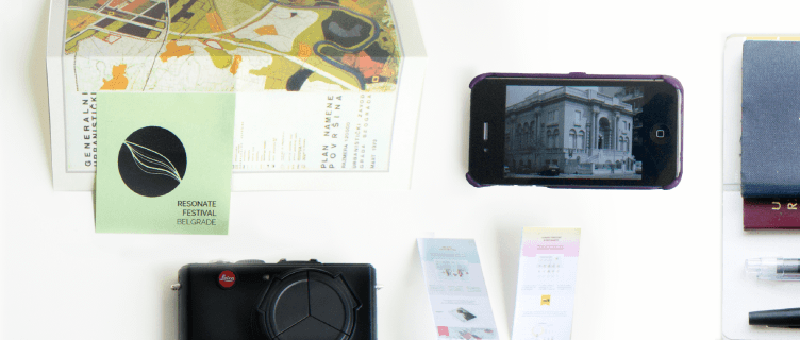

This week, our Friday Inspiration is already off schedule--because we're all heading to Belgrade to enjoy [Resonate 2014](http://resonate.io/2014/). READMORE The schedule is intimidating with a wealth of amazing speakers. Here are just a few of the sessions we're excited about:

[Cedric Kiefer](http://www.onformative.com/) literally wrote [the book](http://www.generative-gestaltung.de/) on generative design, which has earned a place in the esteemed The Artificial library.

The "Ways of Seeing" panel will doubtless include Pablo Garcia discussing the [NeoLucida](http://neolucida.com/). Ours is mostly a conversation piece today, but it has fermented some interesting ideas for prototyping ambient AR.

Giorgia Lupi is half of [Accuraat](http://www.accurat.it/), who engage in serious information design. Their data narratives express complexity well beyond the cheap infographics of today's fashion, and ask to be _read_ rather than _glanced_. We hope to learn about their techniques for managing attention.

The "Generative Strategies" panel in particular has very interesting participants:

[Greg J. Smith](http://serialconsign.com/) inspires us through the [Creative Applications Network](http://www.creativeapplications.net/) and we're looking forward to our first [HOLO Magazine](http://holo-magazine.com/) this month.

[Benedikt Groß](http://benedikt-gross.de/) generates very thoughtful work and describes it eloquently. It often involves cartography, and who doesn't love maps?

Luna Maurer is of [Studio Moniker](http://studiomoniker.com/), who has an incredible portoflio of work to discuss with interesting social implications (and they're just on the other side of Amsterdam).

[Karsten Schmidt](http://postspectacular.com/) has been a leader in generative art and helped popularize the use of physics simulation with [toxiclibs](http://toxiclibs.org/). We're curious what he's been up to lately with Google DevArt, which has generated no small amount of controversy in the digital arts community.

We're also looking forward to seeing friends who don't often find themselves in the same part of the world. If you'd like to meet while we're there, please <a href="#footer">reach out</a>.

Живели!
