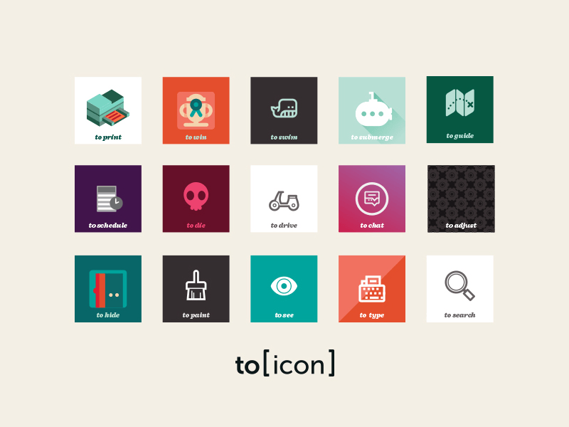
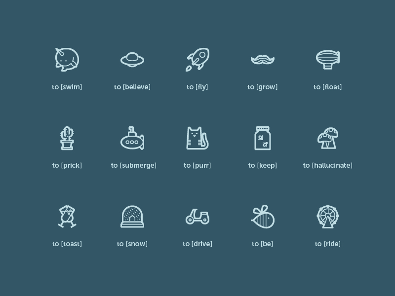
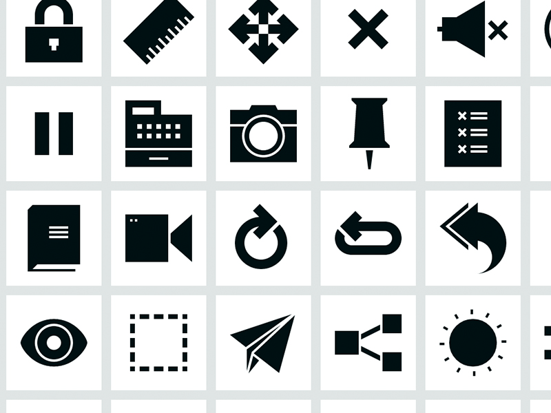
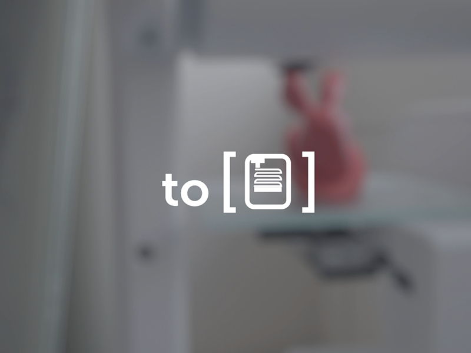

We've launched our first Kickstarter campaign, [to [icon] ](https://www.kickstarter.com/projects/gerwitz/to-icon). Unlike other icon design endeavours, to [icon] will be focusing solely on creating icons that are verbs. Tired of inconsistent icon sets, with strange artefacts, pixel misalignment and archaic metaphors, we decided to take matters into our own hands (and styluses).

To [icon] started because icons deserve our time. Just like letterforms, icon-forms should be carefully plotted with specific weights and styles; like letters, they should work together to communicate words and sentences and stories; and like a well-formed typeface, they should be legible even at the smallest sizes.
 
With support from our backers we aim to create a place for verb iconography to have a home. Shaking up the icon field, by finally champion the somewhat neglected, all-elusive verb icon. Creating sets with over 100 icons each, and brutally stringent quality assurance cycles. Even the most ambitious set will be ready to use in any device, scale or project. And once kickstarted, they will all be free to use.

The sample icons from the Blueprint series includes moustaches, cats and snow globes. Just because you are serious about design doesn't mean you can't have fun with it.

The Sharp corner set by Artificial founder Shannon E. Thomas has over 120 icons which is a great baseline for any project.

We want to [icon] to play a part in increasing the number of beautifully designed icons available for everyone to use, for free.

