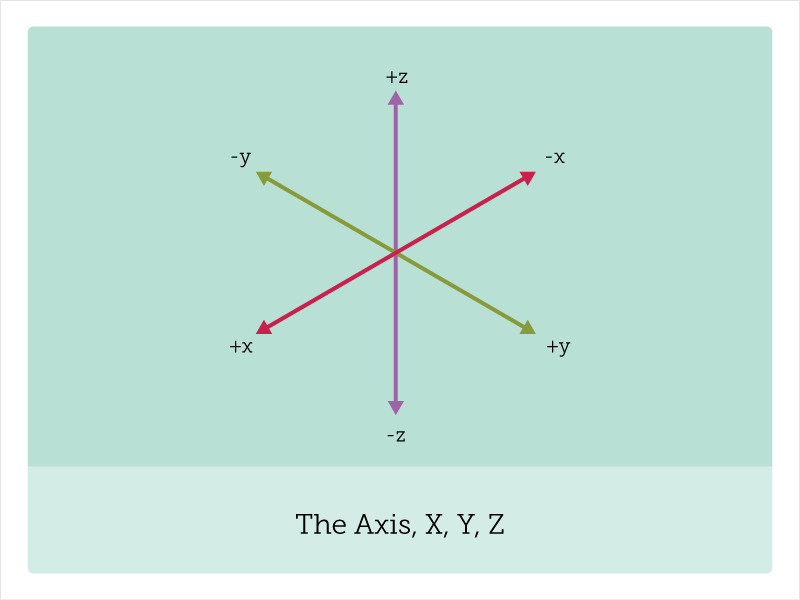
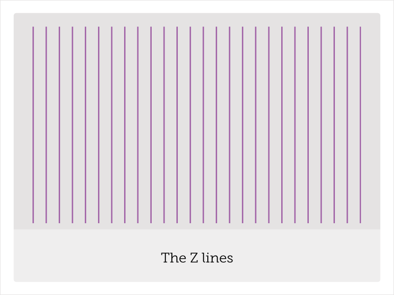
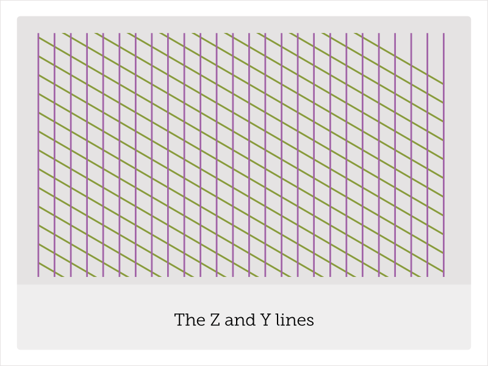
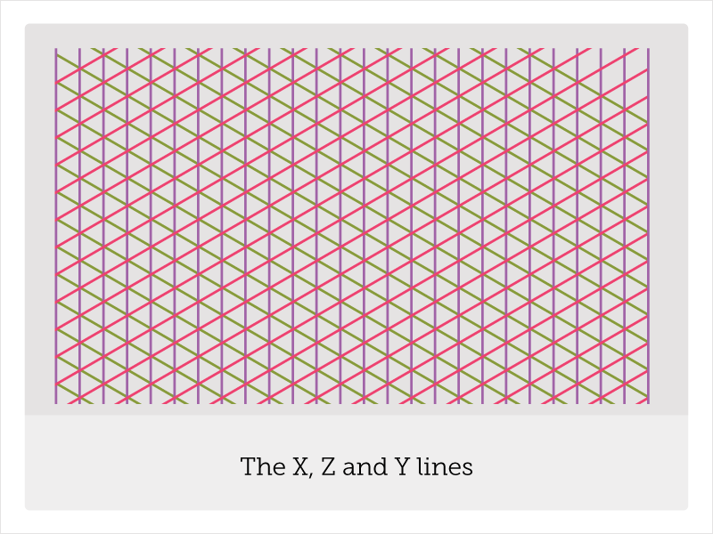
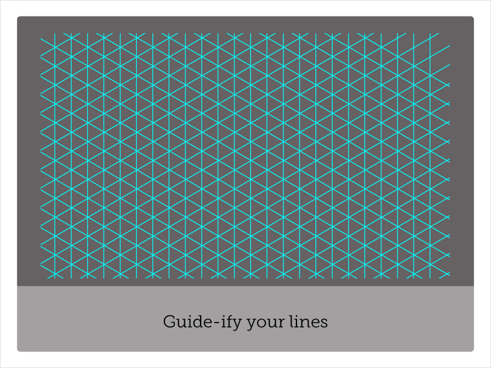
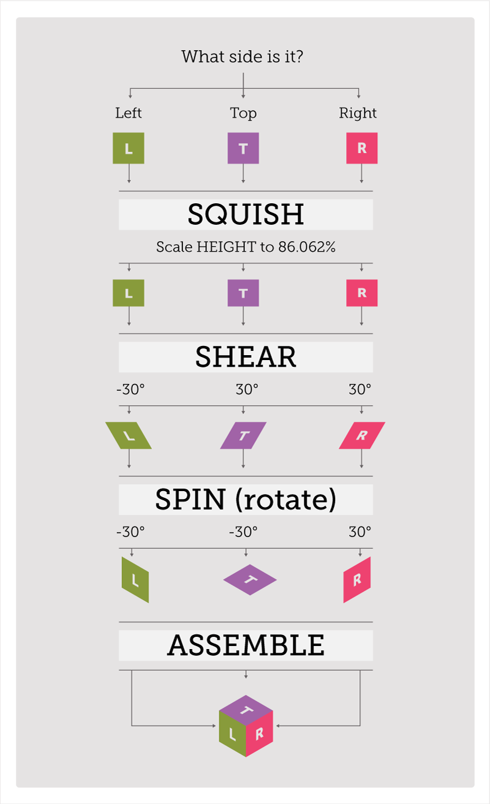
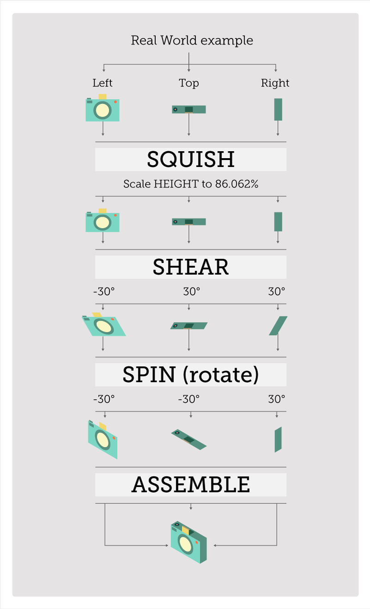
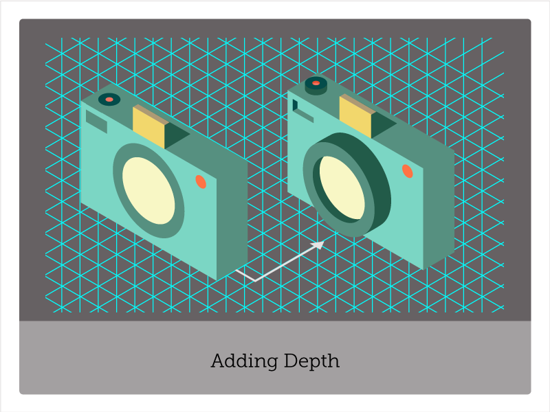

To celebrate all of your support for our first Kickstarter,&nbsp;[to&nbsp;[icon]](http://toicon.com/), we've decided to share with you some of the techniques behind the icons.READMORE In this case we will study the methods behind the all-demanding Isometric icon. The goal of this tutorial is to introduce you to the basics of isometric sketching in Illustrator CC (without the fancy 3D extrusion features).

By the end of the tutorial you should:
<ol>
<li>Know some fundamentals about isometric drawing</li>
<li>Be able to set up an isomeric grid on art boards</li>
<li>Be able to make kick ass isometric cubes</li>
<li>Be a able to extrude and cutaway details </li>
</ol>

# Know Thy Axis
If you didn't know it already, to really get into the isometric sketching you will have to deal with the X, Y, and Z axis. Anything drawn on your isometric grid, which is at 60 degree angles to itself, will not really have a front face or bottom face. What this means is that whatever you choose to sketch will have at least two sides visible in addition to the top face. Note that even if the object is hollow or has no top you might be dealing with an object that has 4 to 5 sides partially visible.

# 1. Some Prep
Just for my own peace of mind. Start off strong with some .ai hygiene. Start a new layer and label it `guides`.

# 2. Make the Z lines
Make your Z axis first. Draw a line and, using transform, align it to a full pixel value on the X and Y.
Now with a simple Option-Shift-D you can drag to duplicate it. Once you have your first copy you can &#8984;-D to repeat that until you get as many verticals as you need to cover your artboard.
Keep it clean, so Group them, Ctrl or &#8984;-G.

Tip: If you want to align your lines further to a specific value after that, say 20px, select all of your Z axis lines and in the Align panel select align to selection, click on the first line you made, and enter “20px” in Distribute Spacing. To set it, hit the horizontal distribute button.

# 3. Make the Y lines
Duplicate your freshly made Z lines--copy, paste basically. I'm not going to give you the shortcuts for that.
Rotate them 60 degrees, and adjust the length to cover the artboard.
These will soon be your Y-axis guides. I’ve trimmed these, but you can leave them as they are. What's important is that they are there.

# 4. Make the X lines
Duplicate your Y axis lines. Copy and Paste these in place &#8984;-Shift-V.
While they are still fresh and still  selected, then go to Transform > Reflect > Horizontal.
These will be your X-axis guides. I’ve trimmed these, but you can leave them as they are.
You may have to nudge re-align them (Shift move up or down) to make the proper isometric box pattern.

Tip: If you want to apply these to multiple artboards like I did, Copy and Paste on all artboards (&#8984;-Shift-Option-V).

# 5. Convert to Guides
Ready? Ok. Select all your lines and go to View > Guides > Make Guides.
Your lines should go cyan, and officially be guides.
Now if you press &#8984; and ; together, those guys should toggle on/off.
Now you can start building things, and snapping to them.

I use guides mostly for extruding and double checking my alignment.
If you have aligned your original lines, with a bit of luck with Snap to Grid and Snap to Point on, you can sketch straight on top. You may need to double check that your spacing between the guides and your grid match.

# 6. Sketching
As I mentioned before anything you will draw in an isometric view will have a left, right, and top face. So you will have to design all three sides, if not more.

I tend to make these all at the same time. Making sure the heights and widths line up. I usually start with the left view (my front) and then duplicate that and resize to make sure everything lines up.

Then I squish, skew, and spin all of the sides to make them isometric. Take a look at the examples.

Tip: Option-drag of the main shapes makes sure the values match up across the different sides.

Open question to the crowd: has anyone suceeded with building Isometric Actions in Illustrator? The ones I've attempted only work if all or your heights, depths and  widths are consistent, meaning one longer edge and all is lost.  The actions don’t seem to like re-calculating percentages on case-by-case basis, meaning it messed everything up pretty fast with a range of sizes. I think it's the percentage that throws it off. Does anyone have a work around for this?

# 6. Adding Depth (a.k.a. making it sexy)
Adding depth is unfortunately a bit hit and miss at the beginning, but a bit of practice goes a long way.

My technique is to copy and paste in place (&#8984;-Shift-V) parts I want to extrude or embelish. Then I move the copied object forward or back using the 60 degree angle guides. I then use Pathfinder to Boolean ‘unite’ or ‘minus front’ to create protrusions or cutaway holes.

Have a look at the video for how I deal with cylinders and round amorphous shapes. The last step is adding color for some pop.

<iframe src="//player.vimeo.com/video/92717750" width="800" height="451" frameborder="0" webkitallowfullscreen mozallowfullscreen allowfullscreen></iframe>
