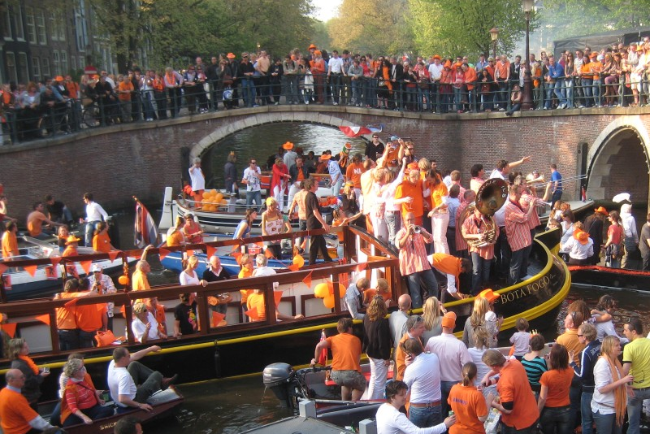

For those not in the Netherlands, you may be curious as to why we’re inspired by orange this week. It’s because we’re preparing to join the sea of orange that hits the streets on Saturday, when people from all over the Netherlands rush the streets and canals of Amsterdam to celebrate King Willem-Alexander’s birthday. Formerly known as Queen's Day, King’s Day (Koningsdag) is basically one massive block party complete with beer, boats, parties, festivals, yard sales, and of course, lots of orange. 

#Why the Dutch wear orange
Yes, our flag is red, white, and blue, but the colour orange comes from The House of Orange-Nassau and is used throughout holidays and sporting events to express national pride. The Dutch national football team is even nicknamed Oranje. [More fun on the Dutch and their favourite color.](http://stuffdutchpeoplelike.com/2010/11/30/no-7-orange/)

#Orange in other cultures
The Dutch aren’t the only ones who value the colour orange. In India, orange and saffron are used prominently throughout religions such as Hinduism, Buddhism, and Sikhism. Even within one country, a colour can mean different things when linked to religion, further emphasising the importance of colour choice and significance in art and design. No longer will “it just looks nice” be an excuse for colour selection! [Learn more about orange in India.](http://sbdsisaikat.wordpress.com/2013/08/01/religious-significance-and-meaning-of-the-color-orange-saffron/)

#Natural Dyes
How can you achieve the colour orange naturally? If you’ve ever eaten a pomegranate, you’ll know they stain quite easily. But when making natural dyes, this quality is perfect. The fruit is a red / magenta colour, but when the entire fruit is used as a dye, the results can range from warm brown tones all the way to brighter orange canary colours. Extract the fruit’s rich colours by cracking open its shell and soaking them in water for a few days or weeks until you get the saturation you desire. Start soaking them ahead of time to get a homemade natural orange outfit for next King’s Day!
[Get the recipe.](http://www.folkfibers.com/blogs/news/7363630-natural-dyes-pomegranates)

#Kronings Poster
A great infographic by Marco Berends shows the crowns of the Royal companies throughout the Netherlands combined into one very Dutch poster. Really makes you start noticing how many crowns are used in logos. How many do you recognise? [Check out the poster.](http://www.creativereview.co.uk/feed/april-2013/30/dutch-crowns)

#Orange on Orange on Orange
Lastly, we leave you with Shannon’s very orange Pinterest board. Orange typography, orange posters, orange products, orange books–you name it. The board was carefully curated to include only the most creative and beautiful designs. If this doesn’t fulfil your orange requirement for the week, then you’re just insatiable! [Get your orange on.](http://www.pinterest.com/shannonethomas/orange/)

Geniet van Koningsdag! _(Enjoy King’s Day!)_
