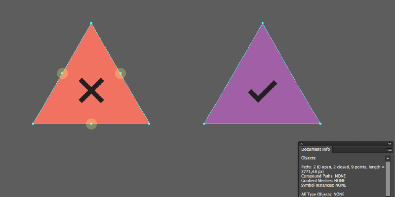
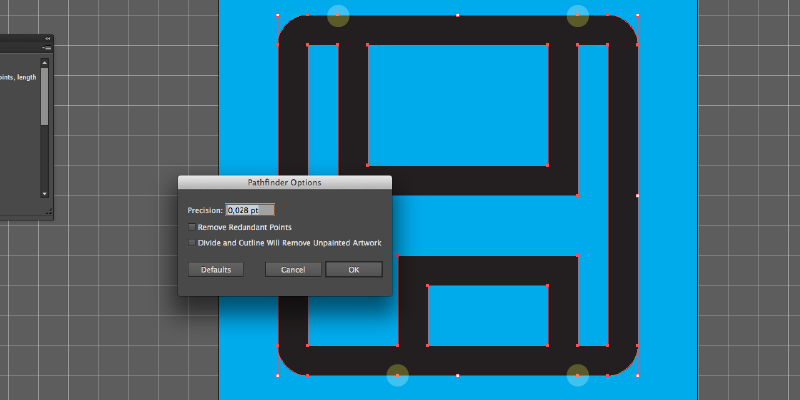
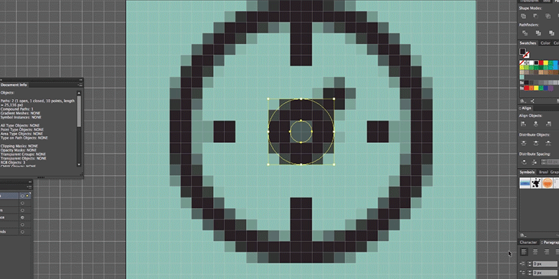
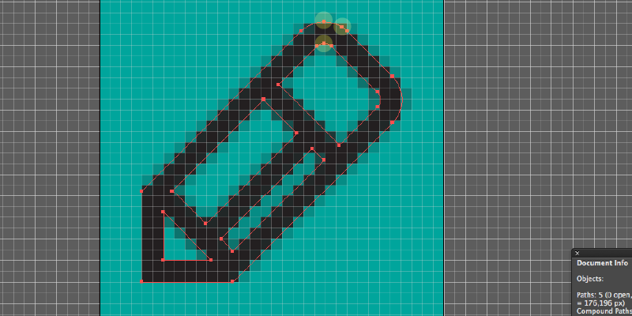

Dear Adobe Illustrator,
I am writing this open letter as a close friend. Over the last decade we have spent so much time together that I think I know you better than I know myself. I understand your strengths, your quirks, and perhaps brutally, I know your limitations. I feel your pain: especially while I'm trying to do a sexy blended drop shadow, gaussian blur in-one with a crazy clipping mask and a 20% opaque stroke. I just lost the attention of non-designers. In any event, that's not what we need to talk about today. I'm sorry that I have to say this, but I'm fairly sure if it won't be me no one else will. Here at the Artificial you have been our crutch to make pixel-precise, scalable icons for [to [icon]](http://toicon.com/).

I hate to break it it you, but for those pixel perfect icons, you kinda suck right now, and most of it seems to be glitches that fuel paranoia, and waste my time it seems.

#The 6 pointed triange

Why do you have to make me work this hard? 
You can do drawing a 3 sided triangle in Polygon shape mode, why are you pretending you can't do to it in Star mode? Removing those extra points off a few hundred icons could have been time better spent re-watching True facts about the Octopus and squirming.

#Point-crazed pathfinder 

Honestly, I do not even know what 0,028 pt stands for or why it is that seen as relevant default value for pathfinder operations in a vector program? For the pain pathfinder has caused me because of this 0,028 pt it warrants a mention.

Have you ever added two shapes in Pathfinder after putting in the effort of snapping objects to a grid, a pixel or even aligning those suckers to each other, only to have your straight line becomes littered by points? Oh I have. Well the secret is hidden in pathfinder defaults, if you go to options in the Pathfinder palette, you will most likely find precision is set at 0,028pt, and Remove Redundant points is unchecked. You know what you have to do after you see that! Never again Pathfinder...

#Ghost Pixel

It's there, it's not there, it's having an existential crisis. I see it, I zoom in it's staring me in the face. I pan it off the screen its gone, I zoom out it's bag. We loop through this a few times. I give up. You're toying with me. Cruel move.

#Pixel Poop

Thats when that sadistic ghost pixel actually chases you around your screen. Also known as reverse pack man in the office. O.k fine, might be just me. Great way to make a designer paranoid.

#Strange Stroking

Somehow the symmetry of anchor points is not symmetrical if you outline a stroke that's curve and on a diagonal.  Luckily in icon's that never happen. Right? I know you are trying to be smart here, Illustrator, but I don't know why one side of a symmetrical shape gets double the points. Why do you do this to me? 

So thats the rant part concluded. Here are some constructive tips for wrangling those anchor points.

#Pro tips and work arounds

So I have been doing QA of icons lately and I have found that there are a few ways of wrangling your crazed anchor points. Step one of course is knowing how many there are. 

Document Info palette

Its a bit hidden but if you open your Document Info palette in Illustrator, go to you menu in the palette an select Object, you will suddenly see the following for any object/objects you have selected. Number of paths, if they are open or closed, anchor points, and the length of the path (for when you are creating a sting sculpture and need to know that sort of thing?)

How do minimise those pesky anchor points (especially on curves)

A) Simplify tool, If there is a lot and accuracy isnt a huge deal, Object> Path> Simplify, and tinker with the settings for the right level of fidelity.

B) Smooth tool, under the Pencil control lets you redraw the shape with less points, again, not pixel precise

C) A Plug-in called [Pathscribe](http://www.astutegraphics.com/software/vectorscribe/), now, it is a shame this isn't in illustrator by default, however it does it, Pathscribe, managed to  brute force anchor points into curves. When it comes to recreating curves with minimal anchor points, it's great. It doesn't replace a good designer, but can clean up an pathfinder massacre in a few clicks, if you figure out the UI.

D) Redraw it. It'll be probably better now anyway.