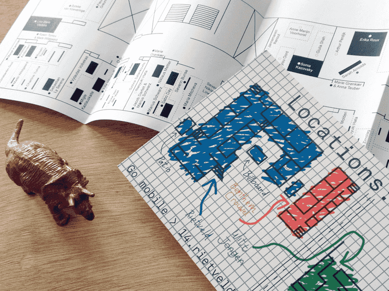

Last week, three of the Netherlands’ finest design institutions handed diplomas to a fresh batch of talent. READMOREThe newly graduated students of the Sandberg Instituut, The Gerrit Rietveld Academie, and Werkplaats Typografie showcased the results of their studies before moving to the next chapter of their careers. I found that the exhibitions were an explicit summation of each school’s approach and specialties, and there was a lot to be inspired by.

# The Sandberg Instituut: Dialetheia
The [Sandberg Instituut](http://sandberg.nl/) is the graduate program at the Gerrit Rietveld Academie, known for their use of media and dedication to experimental design. This year's "think tank for visual strategies" was comprised of nine graduates from around Europe. The show entitled “Dialetheia”, meaning something that is simultaneously true and not true, was exhibited in the back of Tolhuistuin at Framer Framed. 

The work utilised digital media to express their societal commentaries but was often juxtaposed with the use of traditional media to bring the work back into the physical realm. Objects ranging from a sticker-collaged scooter to large printed tapestries invited viewers to get up close and personal with the work. 

# The Gerrit Rietveld Academie Design Department
Back at [The Rietveld Academie](http://www.gerritrietveldacademie.nl/en/), the bachelor students displayed a surprisingly different body of work considering the programs’ relationship. The Rietveld's design work was rooted more in the fine arts than in digital media–the work shown generally demonstrated more confidence with experimentation in print and editorial projects than with digital media. Conceptually, the collection of work seemed to revolve more around emotive notions as opposed to the direct social commentaries that its sister school produced. 

On the opening night, it was helpful that the designers tended to float near their work ready to explain their concepts, but due to the highly research based nature of their projects, thesis statements were definitely missed.

# Werkplaats Typografie: End of the Year Show 2014
Coming all the way from Arnhem, the [Werkplaats Typografie](http://www.werkplaatstypografie.org/) students had their “End of the Year” / “Year of the End” show at De Ateliers. The Werkplaats is a graphic design masters program associated with the ArtEX Institute of the Arts, and was founded by Karel Martens and Wigger Bierma in 1998. The institution is internationally known for their diligence, as all client work requires a "high level of personal motivation and responsibility”. 

This self-driven approach shapes the student work uniquely; each student’s style shows through their whole body of work, despite the fact that the exhibition stemmed from the same initial conversation and the same set of questions. (“How can a book become a work and how can a work become a book? When is music inscribed into language? What colours do letters have and how can invisible forces surface on our bodies?”)

# The value of personal work
Unfortunately, my time at each show was limited to an hour--not nearly enough time to delve deep into the exceptional work shown. My biggest takeway from them all was the reminder that experiment is good, and crazy can also be beautiful. As a student, you have much more time and freedom to try out absurd ideas and refine them into a polished style later. In the working world, obstacles like turn around times, client opinions, and "best practices" can sometimes stand in the way of discovery. The work I saw last week reaffirms my belief in the need for personal projects and a space to design judgement free. Most of the student's work is available online through their respective school's site. So if you haven't seen them yet, get in there, connect with your inner student, and start brainstorming your next personal project.