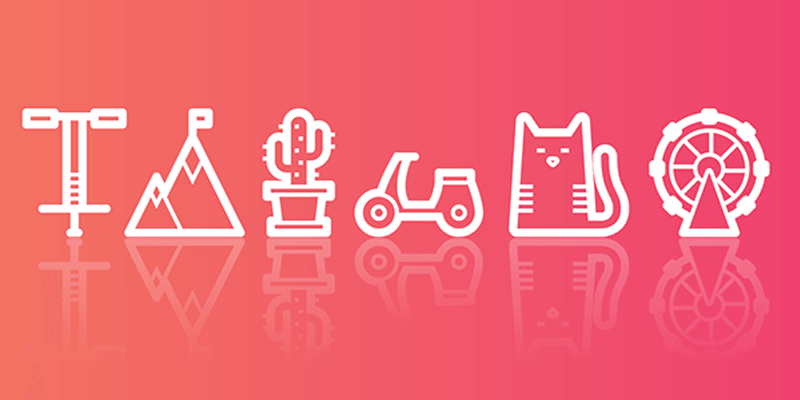
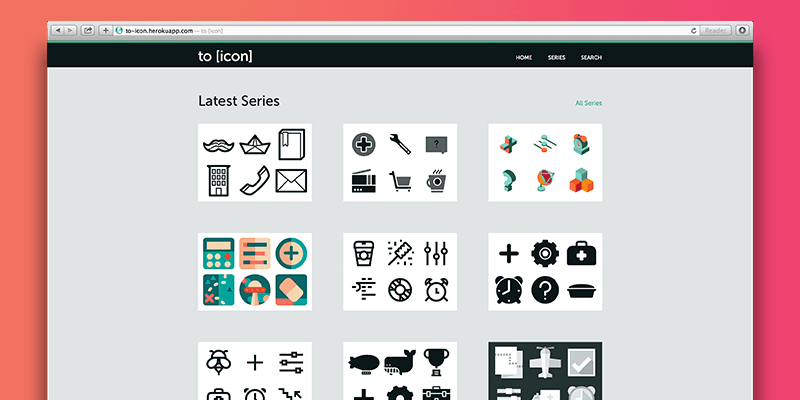
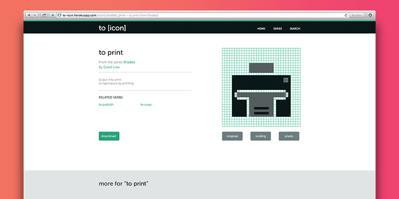

We’re excited to announce that to [icon] is now in beta! Our Kickstarter backers now have access to preview and test the site in progressREADMORE as we continue to refine the site design, fix some bugs, and of course, craft more icons for our ever-growing database. But for those who missed the Kickstarter, we’ve got a teaser here for those curious and waiting.

All of our icons have been quadruple checked, twice over. Each icon is pixel-fitted for sharp rendering even in 32px squares. Even the sharpest vectors end up as pixels someday, and ours will be prepared for their moment.

We aimed for launching with 6 complete sets, but thanks to our backers, we're able to launch with 9 full sets of 100 icons each. We've got flat icons, outlined icons, isometric icons, colored icons, you name it. More in development too.

Our pixel preview feature allows you to check our work and determine if the icon fits your project. You can also view the icons in three sizes before downloading the svg.

Stay tuned for to [icon]'s full launch, coming soon!