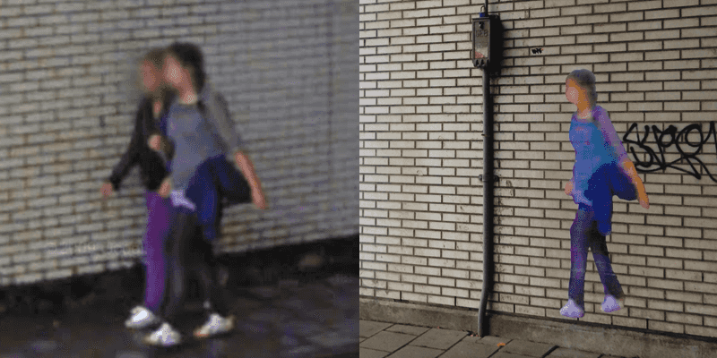

Let’s take our eyes off the screen and into the environment. This week we’re looking at art in our environment. READMOREStreet art has evolved a great deal and become has more innovative and expressive. Bansky is no longer the only name that comes to mind when talking street art–now we’ve got more creative and bold artists hitting cities world wide. They’re creating some beautiful and thoughtful projects, and here are our favourites.

# East Side Gallery
The East Side Gallery is one of the most famous destinations in Berlin and one of the first places that come to mind when discussing street art. I’m glad to say I’ve been able to check this off my list last month–it’s truly a different experience standing alongside the large murals that seem to stretch on forever. It is the longest piece of the Berlin Wall still intact, and also the largest open-air gallery in the world. Featuring 105 paintings from artists across the globe, the wall has become a symbol of hope, friendship, and freedom. It was painted in 1990 and 40 pieces were restored in 2009. [View the East Side Gallery online.](http://www.eastsidegallery-berlin.de/data/eng/index-eng.htm) 

# Street Ghosts
This project uses life-sized cutouts of people captured by Google's street view and posts them where the photo was originally taken. Last year, we spotted one right around the corner of our office under the train rails.

 
More than an interesting display of contemporary art, Street Ghosts is a commentary on copyright statuses and privacy. "As the publicly accessible pictures are of individuals taken without their permission, I reversed the act: I took the pictures of individuals without Google’s permission and posted them on public walls. In doing so, I highlight the viability of this sort of medium as an artistic material ready to comment and shake our society.” [Has a street ghost appeared in your city?](http://streetghosts.net/)

# Big Bang Big Boom
Italian artist Blu combines stop motion and street art in his incredibly complex videos. His street art makes use of more than flat surfaces–he employs physical objects in the environment and brings new life to them. His video Big Bang Big Boom, is “A short unscientific story about evolution and his consequences”. I especially love the minimal soundtrack–a perfect accompaniment to this absorbing story. [Watch the video.](https://www.youtube.com/watch?v=sMoKcsN8wM8)

# Reverse Graffiti
Reverse graffiti has blown up fast in the past few years. Artists, social commentators, and advertisers have all taken advantage of “clean tagging” and utilised this medium with varying degrees of success. An interview with Paul Curtis (Moose), the inventor of reverse graffiti, reveals that he discovered this method while working as a dishwasher in a local restaurant. Now, he works around Leeds and London, cleaning walls with his power washer for brands such of Smirnoff and organisations such as Greenpeace. [Read the interview.](http://theactivesoul.wordpress.com/2013/08/11/interview-with-moose-the-inventor-of-reverse-graffiti/)

# Yarn Bombing by Nespoon
Street art is more than just paint cans, stencils and markers. Polish artist NeSpoon uses yarn as her medium of choice. Yarn-bombing is yet another trend that has hit the streets, but NeSpoon’s work is hardly on the same page as the typical crochet around a stoplight. Her intricate patterns and soft floating forms are beautifully delicate  and fantastical as suspended web-like installations, but are just as inspiring on her stencils or ceramics.[She her installations.](https://www.behance.net/gallery/13293299/Installations-2013)

# EyeWriter
Eyewriter is a bit of an old project, but still very relevant and inspiring. Members of the Free Art and Technology (FAT), OpenFrameworks, the Graffiti Research Lab, and The Ebeling Group communities teamed up in order to create a smart but cheap device for TEMPT1 (a Los Angeles based graffiti artist, publisher and activist) to give him the ability to continue his work despite being mostly paralysed. [See the gallery of TEMPT1’s Eyetags.](http://eyewriter.org/images/)

Gelukkig vrijdag! _(Happy Friday!)_