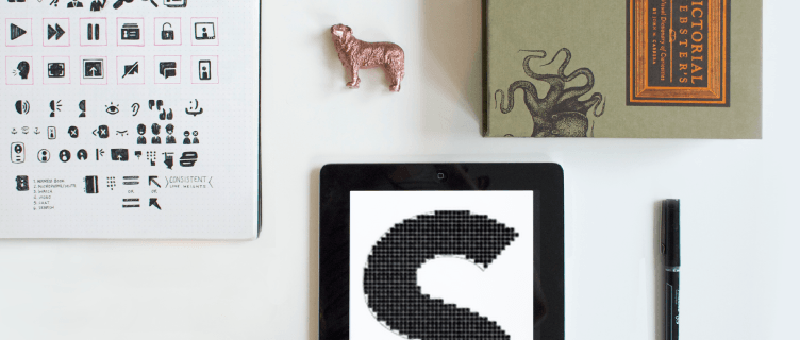

Our first Friday Inspiration theme is icons, celebrating the launch of our first Kickstarter,&nbsp;[to&nbsp;[icon]](http://toicon.com/). READMORE Our day to day work revolves around larger scale client projects, but we take joy in perfecting the little things as well. 

# Pixel Fitting
With the advancement of retina screens and expansion of platforms, well-designed icons are becoming increasingly essential to designers and technologists. Dustin Curtis, shares his insights on pixel perfection, a theory we abided by when designing our action icons. [Learn more about pixel fitting.](http://dcurt.is/pixel-fitting)

# The Pictorial Webster’s
The idea of icons has been around for centuries, and we looked back to the 19th century for some inspiration. The Pictorial Webster’s is a visual dictionary filled with meticulously designed engravings, and we geeked out over the making of this particular edition. [Watch the process of this fine press edition.](http://vimeo.com/5228616)

# Gerd Arntz
Woodcuts were also an early form of icon making. Gerd Arntz, a German Modernist created part of the 4000+ pictogram collection ‘Wiener Methode der Bildstatistik’, later dubbed the Isotype visual language. What makes Arntz' work particularly interesting is the constructivist, soviet styling, and the subject areas symbolising key data from industry, demographics, politics and economy. [See a collection of his isotypes.](http://www.gerdarntz.org/isotype)

# Macintosh’s Menu Command Key
Some icons are harder to identify than others. Ever wondered why the menu command key looks like a unusual flower? [Its origin has a fun little story behind it.](http://www.folklore.org/StoryView.py?project=Macintosh&story=Swedish_Campground.txt)

# Emoji Language
Although they may not be aesthetically pleasing, emojis have become a powerful form of visual communication. Apple is currently working with the Unicode Consortium to include more diversity in their character set. A trivial but interesting interpretation of the popular song “Drunk in Love” by Beyonce created using only iMessage emoji is a fun example of how this specific type of icon has become its own recognisable language. [Watch it here.](http://www.policymic.com/articles/84377/drunk-in-love-emoji-video-is-pretty-much-exactly-what-it-feels-like-to-drunk-text)

# to [icon]
Searching for noun-based icons reveals pages of results, while searching for verbs reveals little more than bad clipart. To [icon] seeks to provide the world with the underrepresented genre of icons, exploring how we visualize the less-tangible verb. With a passion for detail and consistency, The Artificial has created series of icons that not only communicate, but also delight and inspire. [Help us share our work with the world.](https://www.kickstarter.com/projects/gerwitz/to-icon/)

Gelukkig vrijdag! _(Happy Friday!)_
