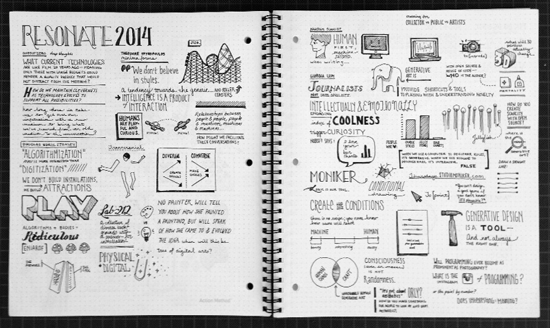

This year’s Resonate was no less full of inspiring projects than last year’s, with a refreshing amount of variety in the projects themselves. READMORE I attended the usual talks on data visualization and interactive installations. Popular were themes of play and curiosity, and many artists spoke about blurring lines between physical and digital.

While I always find inspiration in hearing artists talk about their processes, this year I found myself more inspired by the questions that the speakers implicitly asked through their work. I’ve outlined a few below:

What current technologies are like film of 20 years ago (meaning only those with large budgets can render a quality product that doesn’t distract from the message)?

How do we maintain cleverness as technology evolves to support all possibility? We used to use all kinds of tricks to fool the eye, now we have CG. Does this make us more or less creative?

How long does it take us to get over our infatuation with a new medium to bring what we’ve learned from old media to the conversation? When do we stop designing to the tool and start designing for humanity?

No painter will tell you about the strokes she made to create a painting. When will “new-media” artists stop talking about the medium and focus more on the content behind designs/artworks?

How do you create the scarcity desired by the art world while maintaining open source?

Does sharing a tool impart authorship?

Is there an Instagram of programming? Can and should programming ever become as accessible as photography? What benefits and/or troubles would this introduce to the programming community?

I’m off to wonder some more about these questions. If you have any thoughts, share with us on [twitter](http://www.twitter.com/veryartificial) or [facebook](http://facebook.com/veryartificial).
