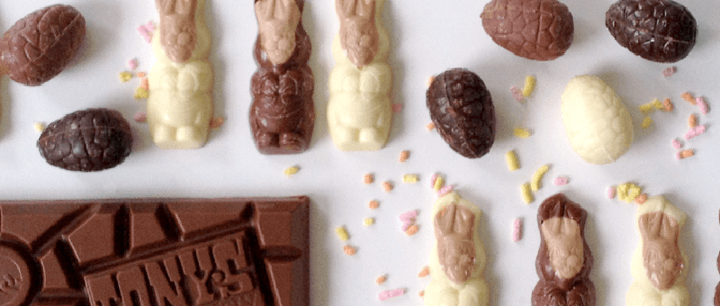

Chocolate in all shapes and colors has been integrated into Easter traditions since the 19th century, when the famous chocolate egg started being mass produced. READMORE Chocolate got its place in this holiday because of the many people who give up chocolate or sweets for Lent, and are finally able to relieve their cravings on Easter Sunday. 

I personally don’t have much of a sweet tooth, but I’ll definitely be indulging in a chocolate egg (or three…) this weekend.

# Zero Gravity Chocolate Art
A behind the scenes look at how NAM, a Tokyo-based collective of art firms, created its chocolate gravity defying photographs without Photoshop. They really nailed the magical feeling of indulging in rich chocolate. [Go behind the scenes.](http://www.thisiscolossal.com/2012/04/gravity-defying-photography-for-chocolate-trail-2012-by-nam/)

# Building with Chocolate
Last year, Alex Jordan at Princeton University created the world’s first functional structure built entirely out of chocolate. It weighed over 400kg. [See his work.](http://formfindinglab.princeton.edu/people/alex-jourdan/)

# Chocolate Bunny
Chocolate inspires us all in different ways. Dutch artists Lernert and Sander played with different ways of melting a chocolate bunny in this intimate and slightly eerie video for KRO-television. [Watch the video.](http://vimeo.com/13906163)

# Geometric Chocolate
French chocolatier Daniel Mercier concocted a collection of beautiful handmade geometric chocolates inspired by kaleidoscopes. [See the results.](https://www.youtube.com/watch?v=o1XubO1MWKg)

# Cadbury Cream Eggs
A great chocolate egg advertisement that stuck in our heads several years later. Such a shame a better quality version of these ads aren’t available. [Watch a compilation.](https://www.youtube.com/watch?v=PBz5WiNYeFM)

# Tony’s Chocolonely
Our neighbors produce some great chocolate, and have an even greater story. They aim to make all chocolate 100% slave free by exposing the abuses of the international cocoa trade. It's definitely made us loyal fans. [Learn about their mission.](http://www.tonyschocolonely.com/en/our-mission/the-road-to-100-slave-free/)

# Chocography
Dutch designer Rosa de Jong’s project Chocography involves creating custom molds based on classic typefaces, then filling them with chocolate. She has chocolate letters set in Helvetica, Rockwell and Baskerville. [It’s a beautiful process.](https://www.behance.net/gallery/Chocography/6257491)

# 3D Printed Chocolate Molds
Want to make your own molded chocolate? Makerbot provides a handy instructional guide on how to 3D print then cast your own silicone chocolate molds. Just make sure you send some sample chocolates to our office. [See the tutorial.](http://www.makerbot.com/tutorials/making-chocolate-molds/)

# Hershey with 3D Systems 
Hershey has teamed up with 3D Systems to mainstream 3D printing and plan to produce 3D printed confectionary treats. [Read the article.](http://blogs.wsj.com/corporate-intelligence/2014/01/16/coming-soon-to-3d-printing-chocolate-bars/)

Vrolijk Pasen! _(Happy Easter!)_

