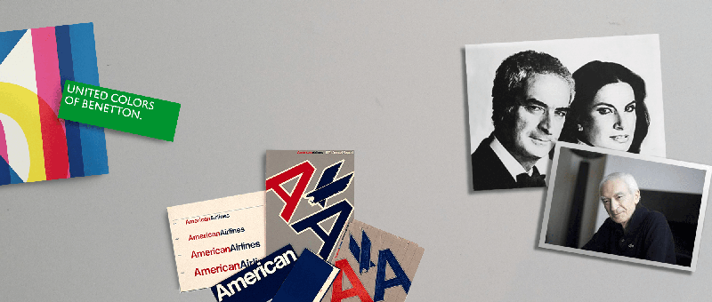
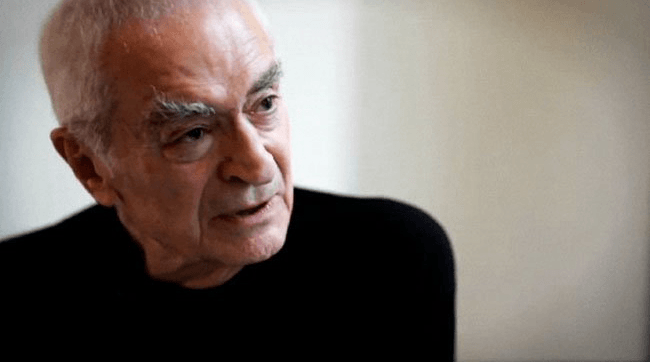

Massimo Vignelli, a renowned modernist, designer, and teacher, passed away at the age of 83  this past Tuesday. READMORE As one of the true masters in design history, his teachings and work have inspired thousands and will continue for generations to&nbsp;come.   

Along with an expansive collection of remarkable identity, product, architectural, and editorial design, Vignelli has left us with some wonderful words of wisdom. "If you can design one thing, you can design everything" is perhaps his most memorable quote. These are words that have influenced many practices, including our own. We’ve learned that when you leave behind the idea of specialising within design, it broadens your horizons and opens up new pathways for learning.  

This week we pay tribute to Massimo Vignelli's memory with a collection of his most inspiring quotes.   

> One of the great advantages of being so concentrated on your work is that it is all there is. Everything I do comes into this and enriches me. Everything, even every book I read, enriches me.
>
> --Massimo Vignelli in <cite>[How to Think Like a Great Graphic Designer](https://www.goodreads.com/book/show/426289.How_to_Think_Like_a_Great_Graphic_Designer)</cite> by Debbie Millman

> Quality is when you know that you have reached a high level in your work, when it really sings, when it touches you, when it responds. Quality is a level of intellectual elegance that is unmatched in other forms. When you see that there is no more vulgarity in it, you’ve got the sense of quality.
>
> --Massimo Vignelli in [an interview with <cite>Eye Magazine</cite>](http://www.eyemagazine.com/feature/article/reputations-massimo-vignelli), 2012

> If you do it right, it will last forever.
>
> --Massimo Vignelli

> There are three investigations in design. The first is the search for structure. Its reward is discipline. The second is the search for specificity. This yields appropriateness. Finally, we search for fun, and we create ambiguity. 
>
> --Massimo Vignelli in <cite>[AIGA Graphic Design 4](http://www.aiga.org/medalist-massimoandlellavignelli/)</cite>, 1983

> The life of a designer is a life of fight: fight against the ugliness. Just like a doctor fights against disease. For us, the visual disease is what we have around, and what we try to do is to cure it somehow, with design.
>
> --Massimo Vignelli in the film <cite>Helvetica</cite>, 2007

> Love is a cake that comes in layers. The top layer is the most appealing one. This is the one you see first. Then you cut into it and you see many different layers. They’re all beautiful, but some are sweeter than others.
>
> --Massimo Vignelli in <cite>[How to Think Like a Great Graphic Designer](https://www.goodreads.com/book/show/426289.How_to_Think_Like_a_Great_Graphic_Designer)</cite> by Debbie Millman

> Everything has its own order. You can't take a piece of music and scramble the notes. You can't take a piece of writing and scramble the words. You can't take a space and scramble the chairs around.
>
> --Massimo and Lella Vignelli in <cite>[AIGA Graphic Design 4](http://www.aiga.org/medalist-massimoandlellavignelli/)</cite>, 1983

Blij zijn! _(Enjoy!)_

Header image credits:
www.vignelli.com,
www.aiga.org,
www.observatory.designobserver.com,
www.scuoladesign.com,
www.metropolismag.com
