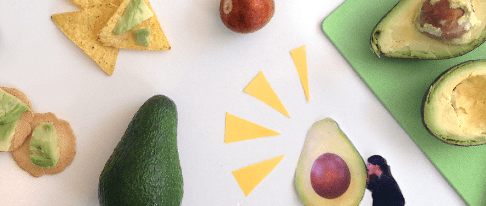

What exclaims you’re ready for summer more than a perfectly ripe avocado? READMORE Maybe a lot of things, but for an office of avocado enthusiasts, avocado and summer are practically synonymous. For a fruit that needs no further introduction, we hereby present to you some of our greatest avocado finds. They’ll spark your creativity in the kitchen, in the garden, and perhaps even in your work. Fun fact, The Netherlands is the 2nd largest importer of the avocado after the US. Got some great avocado recipes? Come on over for coffee time!

# Avocado Varieties
This one's a bit of a prerequisite. Yes, there are more varieties of avocados than "black" or "green". Many more, in fact. They come in all shapes and sizes, but the most common is by far the Hass avocado which accounts for 80% of all avocados in the world. [Find out when they're in season.](http://www.foodrepublic.com/2012/10/18/know-your-avocado-varieties-and-when-theyre-season)

# Avocado Recipes
This compilation has been sitting in my bookmarks for months now. There's more to avocados than guacamole, and I'm slowly making my way through the list (although I don't think I'm brave enough to test out the 'Avocado Banana Smoothie'). Be warned, they contain mouth-watering, irresistible photos. [Start cooking.](http://www.buzzfeed.com/tashweenali/super-easy-avocado-recipes)

# 20 Ways to Use Avocado Seeds
For the extreme avocado buffs. If you truly love something, you love every part of it, right? Here are some interesting ways to integrate avocado seeds into your daily life. [Get inspired.](http://www.squidoo.com/avocado-seed)

# Growing an Avocado Tree
It's a 12 year process to get from pit to a ripened fruit. Start saving those pits and make a nice decade-long project out of it! These instructions provide two methods for avocado tree growing. If you've got that dedication, I'm impressed. [See the steps.](http://www.instructables.com/id/Another-Growing-an-Avocado-12-years-in-the-making/)

# Avocado Go Green
Naturally, animating and anthropomorphising the foods you love is the way to go. Arnold Worldwide created a clever animated spot for Avocados of Mexico to show the versatility of the delicious fruit. [Go avocado, go!](http://vimeo.com/78830727)

Eet smakelijk! _(Bon appétit!)_