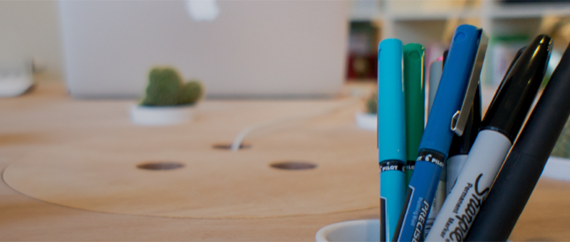

Collaboration is at the core of what we do—after all, we are better together than as individuals.READMORE We’re looking for a tech-savvy designer to join our team and help us create beautiful digital products and services that delight our clients and their customers.

We are too small and close-knit for formal titles, but hope our next addition will have some "senior-level" experience working with clients and managing a creative process.

#  Desired Skills and Experience

- 3+ years of experience working with design teams
- approach problems with questions before seeking solutions
- possess both the desire and the organizational ability to collaborate with other team members, clients, development partners, etc.
- communicate clearly, directly, and kindly
- enjoy working both strategically and tactically to create genuine experiences for brands and delightful interactions for users
- possess a clear understanding of various platforms (iOS, Android, web) and how to design to their patterns
- have a deep and integrated (interaction + visual) understanding and appreciation of design systems – including interaction models, spatial metaphors, etc.
- be able to consider many design solutions and rationalize the best solution for the context

Know someone perfect for the position? We'd love to hear from them! [Drop us a line](mailto:careers@theartificial.nl) or apply via [LinkedIn](https://www.linkedin.com/jobs2/view/11097140).