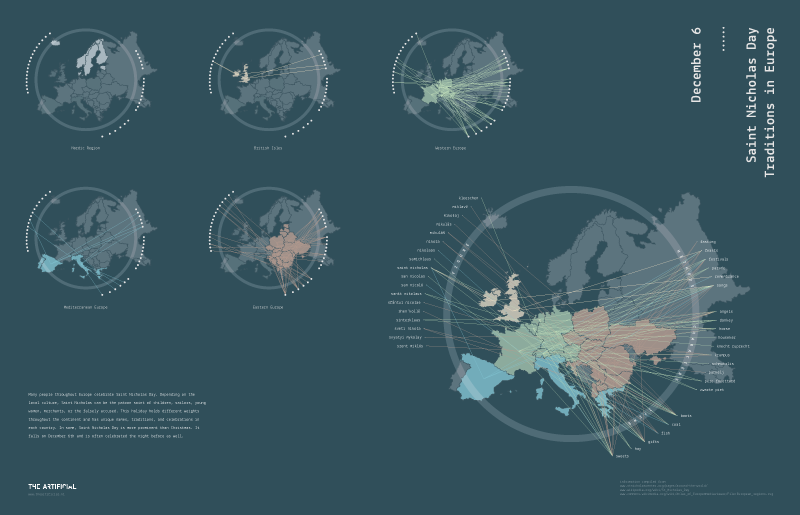
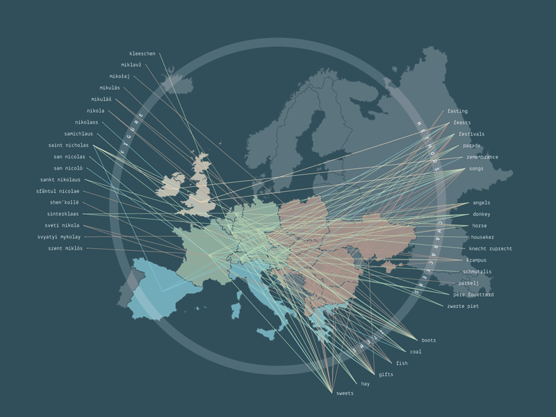
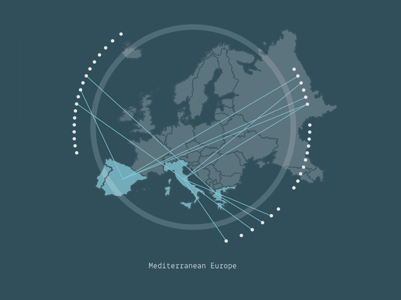

Happy Sinterklaas! READMORE As an American in Europe experiencing my first Sinterklaas or Saint Nicholas Day, you can imagine how baffled I was before learning the story behind the Dutch Zwarte Pieten. Learning about Saint Nicholas Day became a more complicated task than expected. Depending on the local culture, Saint Nicholas can be the patron saint of children, sailors, young women, merchants, or the falsely accused. This holiday holds different weights throughout Europe and has unique names, traditions, and celebrations in each country. In some, Saint Nicholas Day is more prominent than Christmas. It falls on December 6th and is often celebrated the night before as well. I created a visualisation that separates Europe in to five regions and shows how each culture celebrates December 6th.

[Click to enlarge](12-05-stnicholasday/holidayviz-lg.png)

Every culture celebrates in a different way and under a different name.

Detail of Mediterranean Europe data map 

Want to learn more? [The Saint Nicholas Center](https://www.stnicholascenter.org/pages/around-the-world/) has a wealth of knowledge that I used to develop the visualisation. They sort customs by country and delve deep into the origins and meanings behind all the celebrations.

