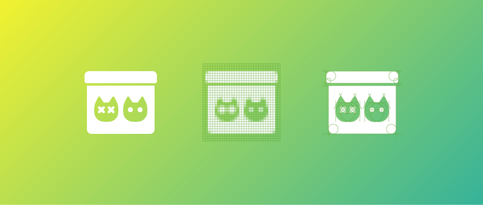

Here is the story of [Puchi Puchi’s](http://www.toicon.com/series/puchi-puchi) [to doubt](http://www.toicon.com/icons/puchi-puchi_doubt), which was a commissioned by one of our Kickstarter backers, Dominick Cancilla.

When I started on this one, my mind went first to the [movie](http://www.imdb.com/title/tt0918927/) with Meryl Streep and Philip Seymour Hoffman. The film (which is great, though not entirely appropriate for iconic representation) led me down the path of religious metaphors. Here, the opposite of doubt is faith, which has some [obvious iconic interpretations](http://www.toicon.com/icons/lines-and-angles_resurrect); however, no such obvious symbols exist for doubt.

I cleared my mind of that first impression, but couldn’t seem to find any other metaphor that would translate. I tried a Google image search, which only provided images of question marks, emoji-like images of confused faces, and the band No Doubt. For a fleeting second, I thought of simply drawing a question mark within a person’s head.

But I didn’t want to disappoint Dominick with a too-literal clip-art-style icon. I raised the question to the studio. And someone (probably Hans) gave me just what I needed: a metaphor with a cat.

Schrödinger’s cat is a [thought experiment](http://en.wikipedia.org/wiki/Schrödinger's_cat) in which a cat within a box exists simultaneously in two quantum states, alive and dead, until we open the box and see the actual result. It was devised by Erwin Schrödinger, and, like other cats, has found quite a bit of [love on the interwebs](http://theoatmeal.com/comics/cats_schrodinger).

From here, the design was easy: one box (with a closed lid) and two cats. It only took a few rounds of tweaking to get the expressions (or [states](http://en.wikipedia.org/wiki/Cat_state)) of the cat just right, and it was ready to publish. It’s not your traditional icon, but we’re looking forward to seeing it in use!

Have you released to [doubt] or any of our other icons into the wild? [Let us know!](mailto:collaborate@theartificial.nl)
