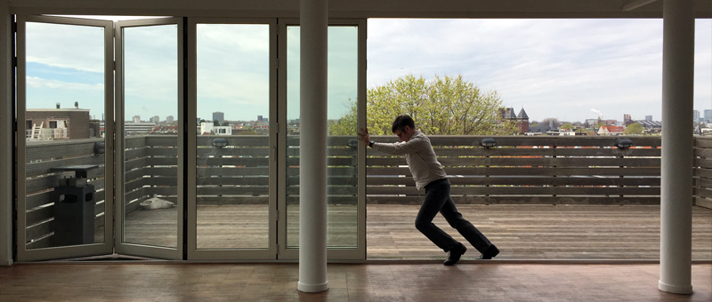

We are only 16 days away to a weekend at OFFF Barcelona, an annual conference featuring innovative designers and artists from around the world. We’ve started filling in our schedule with the OFFF15 app. Here’s a few artists we’re excited to see.

# Atelier
[Atelier](http://www.lawebdelatelier.com/en) is a design and visual arts education center based in Barcelona. This year’s class of 11 students were the creatives behind OFFF’s “Finally Fucking Fifteen” campaign. The students will be presenting their year’s work to kick off the conference.

# Joshua Davis
New York based designer and technologist [Joshua Davis](http://www.joshuadavis.com/) has been working with OFFF since its inception 15 years ago. This year, he will be creating the “best chill-out experience” at OFFF 2015. I’m not entirely sure what this will entail, but after seeing his work with Diplo, Kanye West, and Deadmau5, I’m definitely adding that to my must-see list. 

# Dogstudio
If their session is as entertaining as their studio’s site, I’ll be impressed. [Dogstudio](http://www.dogstudio.be/) is a Belgian digital agency that needless to say, creates beautiful web experiences. But they’ve also got a humorous approach to presenting themselves that makes their boastful attitude quite charming. 

# Onesize
[Onesize](http://onesize.nl/) is an Amsterdam based studio famous for their experimental motion graphic work. This year, they worked with James White to produce the OFFF Main Titles. We’re looking forward to learning more about their approach and collaboration on this open-ended project.

# Foreign Policy
[Foreign policy's](http://foreignpolicydesign.com) work has a soft delicate feeling that has always appealed to me. They’ve created some beautiful and clever systems for their wide range of clients. I’m especially interested in hearing their methodology with branding and getting some insights into what the design culture is like in Singapore.

Also heading to OFFF? [Shoot us a tweet](https://twitter.com/veryartificial) and we’ll see you soon!
