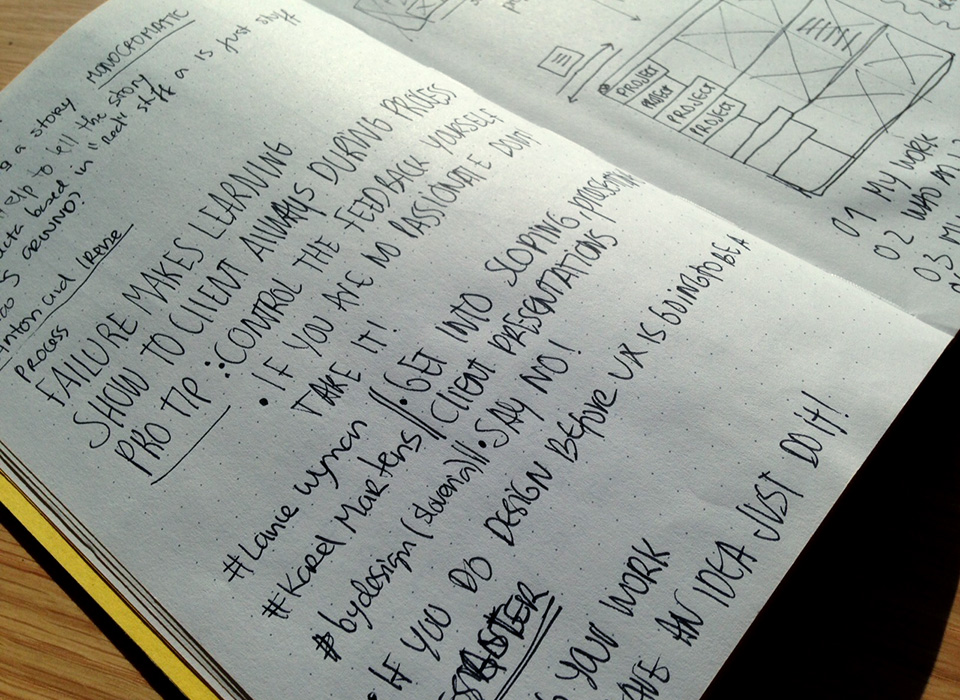

# In English

**I want to be inspired!**

Last time I was at OFFF, it was in 2009 in Lisbon. At that time I was overwhelmed with all the projects I saw as well as the amazing presentations. So this year my expectations were high.

**Show me passion**

My first impression was not related to the work itself, but to the way speakers presented it. Watching the presentations made me think about the way we present our work, and how that can be inspiring for others or not. I saw interesting work being shown without any excitement, making me lose interest. At some point I questioned myself: how could this relationship between the work and the designer be fair to both?

On the other hand, I saw passion in some presentations, such as Robert Hodgin, Hush, Jon Burgerman, and Anton & Irene that really got me excited about what I was seeing. These presentations were not so related to the work itself, but more about the approach towards it, the enthusiasm, and the excitement showing the process.

**Show me your process**

It’s interesting to see how different the process is for each one of the speakers, and how they explore and experiment to achieve different results. Most of all, it is important to understand that the point we start is often far away from the end result – if there is such thing as an end result in design.

**Show me your tools**

The processes used to create are as different as the tools. I noticed that more and more, we only use digital tools when we really have too. Working in paper, thinking outside of the screen, using all kinds of materials, and experimenting with different objects are inevitably a strong part of the process, leading us to different results. We should not be afraid to experiment and try new things – they will lead us a step further.

**Show me your failures**

Exploring means trying. It means failure and success. A strong point that stuck in my mind is the importance of failure. Failure is good, it’s part of the process, and it reveals that we are trying. It should be embraced and accepted, and hopefully it lead us in to a new direction.

**Show me beauty**

Last but not least: Stefan Sagmeister. He was my favourite speaker, not because he is a famous designer, but because he makes a point through his presentations. He wants the audience to think. I saw him in Lisbon in 2009, and at the time his point was about being truthful to yourself as a designer and being happy with what you were doing. This time, he questioned us about beauty.

His point was based on this global trend of form following function. He present some modernist architecture examples, and asked us how they differ from one another. In fact, they all looked the same! Nothing set them apart. When presented with a museum and a industrial building, the audience couldn’t determine which was what, and that says it all, right?

Stefan Sagmeister didn’t present his work or his process like the other speakers. He presented a point of view and challenged us to think about it – and this was the moment where I felt truly inspired.

# Em Português
**Inspirem-me!**

A última vez que estive no OFFF, foi em Lisboa, 2009. Nessa altura fiquei fascinada com as apresentações, os projetos e toda atmosfera da conferência, por isso este ano as minhas expectativas estavam altas.

**Mostrem-me paixão**

A primeira impressão que tive não foi propriamente relacionada com os projetos em si mas sim com a maneira como eles são apresentados. A paixão com que defendemos o nosso trabalho ou o explicamos aos outros pode e deve ser inspiradora, se não o é há uma questão que se levanta -  o quão justa é esta relação entre designer e o seu trabalho?

Vi algumas apresentações em que os projetos pareciam ser bastante interessantes mas pelo simples fato de o orador não mostrar dinamismo ou cativar de alguma forma a audiência rapidamente perdi o foco e a atenção. Por outro lado consegui ver paixão em algumas apresentações tais como as de: Robert Hodgin, Hush, Jon Burgerman e Anton & Irene que me conquistaram não tanto pelo trabalho em si mas pelo entusiasmo com que o mostraram.

**Mostrem-me o processo**

É muito interessante perceber o quão diferentes são os processos criativos de cada designer. Os métodos para criar são tão diferentes quanto únicos. A ideia de exploração e experimentação é um ponto fundamental e é importante perceber que a ideia inicial é muitas vezes diferente do resultado a que chegamos no final - se é que existe um “resultado final” em design.

**Mostrem-me as ferramentas**

Os processos utilizados para criar são tão diferentes quanto as ferramentas utilizadas. O que notei é que cada vez mais nos afastamos das ferramentas digitais no processo inicial e apenas as utilizamos quando de fato temos de o fazer. Pensar fora do ecrã, usar papel, explorar diferentes materias e usar objetos diferentes são inevitavelmente uma forte parte do processo que nos leva a resultados bastante diferentes. Não devemos ter medo de experimentar e tentar novas abordagens, fazê-lo só nos leva a dar mais um passo à frente.

**Mostrem-me as falhas**

Explorar significa experimentar novas coisas. Significa falhar e ser bem sucedido. Este é um ponto muito importante para mim, a ideia de falhar. Falhar é bom, faz parte do processo e só revela que estamos a tentar fazer qualquer coisa de novo, deve ser encarado naturalmente. Aceitar a falha ou o erro levar-nos-á inevitavelmente a novos caminhos.

**Mostrem-me beleza**

Por fim, mas não menos importante Stefan Sagmeister. O meu orador favorito, não porque é um famoso designer mas porque as suas apresentações têm um objetivo, um significado mais profundo do que simplesmente mostrar o seu trabalho. Ele quer que a audiência pense, que reflita. Quando o vi em Lisboa em 2009 ele falou sobre como devemos ser fiéis a nós próprios enquanto designers e como isso se deve refletir na nossa felicidade, desta vez ele questionou-nos sobre a beleza.

Stefan Sagmeister mostrou como vivemos numa época onde a forma segue a função. Mostrou algumas imagens de edificios modernos e questionou se a audiência era capaz de os distinguir. Na verdade os edificíos eram todos bastante parecidos. Nada neles era único, nenhum elemento era caracteristico ou distinto. Ao colocar lado a lado uma imagem de um museu e de um edificio industrial não houve maioria da resposta correcta e isso diz tudo, certo?

Stefan Sagmeister não apresentou o seu trabalho ou processo como todos os outros, ele apresentou o seu ponto de vista e desafiou-nos a refletir sobre isso e este foi o momento, onde me senti verdadeiramente inspirada.
