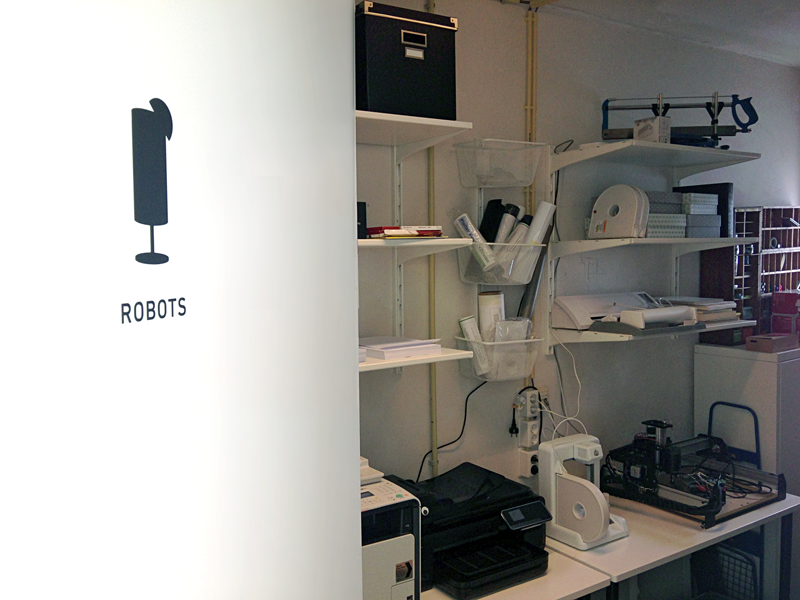

As a digital product agency, we work very closely with our technology. Our laptops, phones, and devices are used every day, but this week we’re dedicating some time to focus on the robots hiding in our robot room.

(Yes, we literally have a robot room.)

Our newest addition is our laser printer—no more ink-soaked printouts!

Hans spent some time on upgrading our CNC machine from a Shapeoko to the new X-Carve, while I battled with our Silhouette Cameo vinyl cutter to get some way finding signs for our office.

In addition to playing with our new robots, we also experimented with new 3D software at 3D Hub’s Fusion360 workshop. The CAD cloud-based software will hopefully boost our confidence when working with our 3D printer.

Looking forward to some more cutting, printing, and building in the office!
