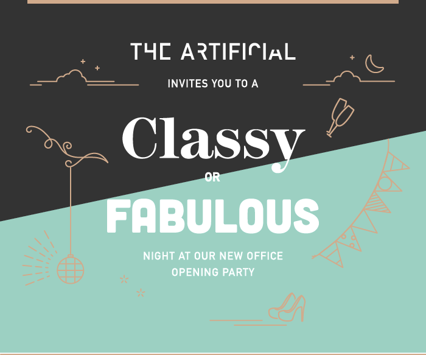
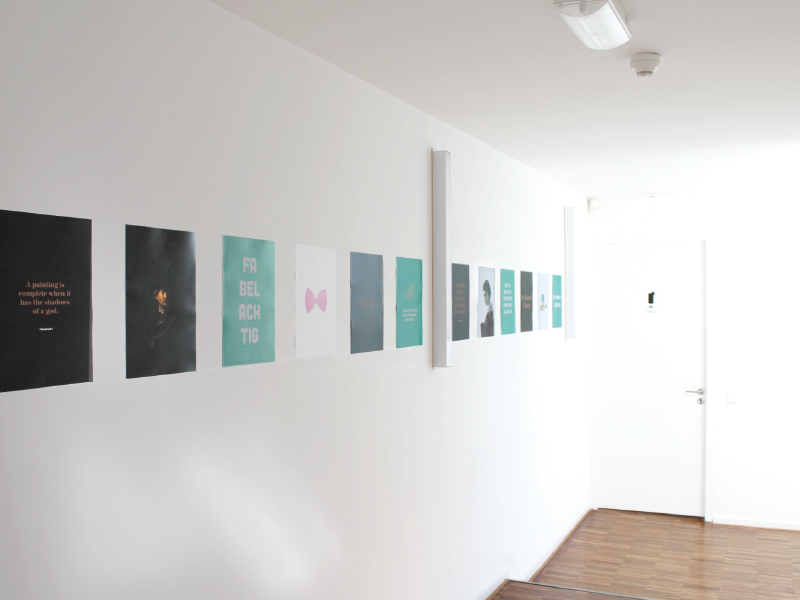
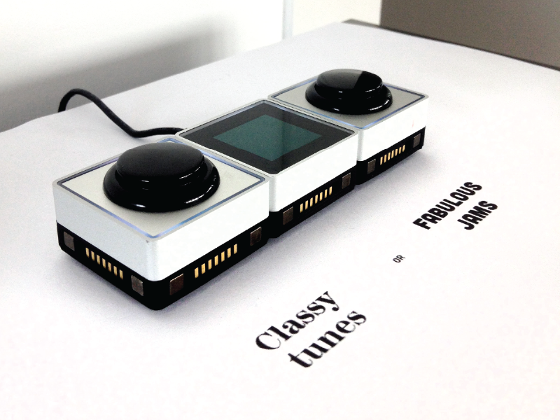
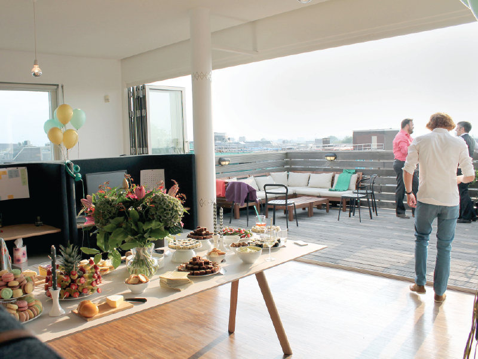
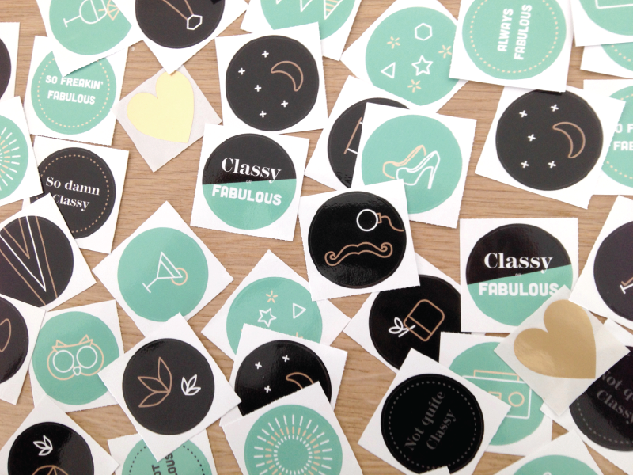
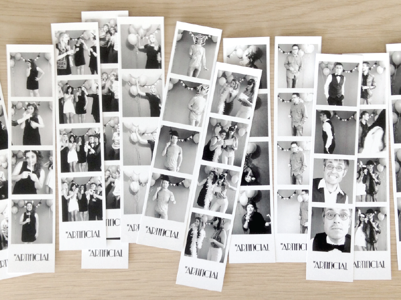

We have finally settled into our second space! The desks are in, the kitchen is finished, and the roof deck was ready for guests. It's exciting going from a small garage to a rooftop office right in the heart of the city. Naturally, people started badgering us for an office warming party. 

So, we delivered. And of course, no Artificial party can be on-brand without a well-considered theme that was extensible to even the drinks and the outfits. The theme needed to define us and allow us to showcase some of our other talents. So, we invited clients and friends to join us for a Classy or Fabulous evening. 

The project allowed us to play with media that we don’t typically use for our digital product clients. We experimented with [Palette Gear](http://palettegear.com/), a Kickstarter we’re proud to back, to allow guests to DJ the party. We fought with our Silhouette vinyl cutter, testing out different types of material and cuts to really make the space feel branded. We worked with printed materials, lining our walls with Classy or Fabulous posters. 

To tie the whole theme together, we used a strict color and type scheme throughout all our materials. Playful line drawings were used as icons, backgrounds, and images in collateral materials.

We have literally [thousands of photos](https://www.facebook.com/veryartificial/videos/895219510552978/) from our photo booth! If you dropped by our photo booth, [shoot us an email](mailto:carol@theartificial.nl) and we'll send you your most fabulous shots! 

Thanks to all who attended and helped us make this both a Classy and Fabulous night!