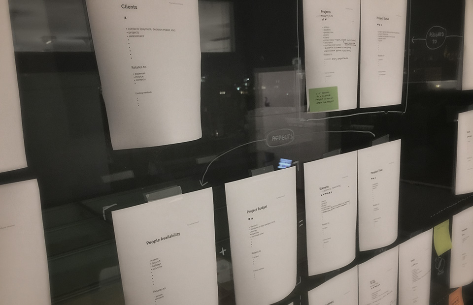
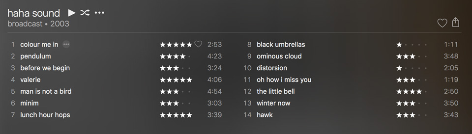
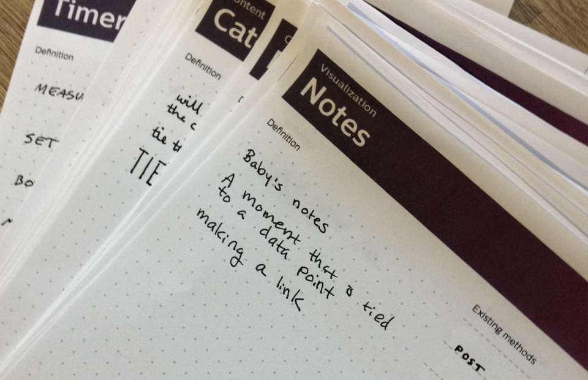
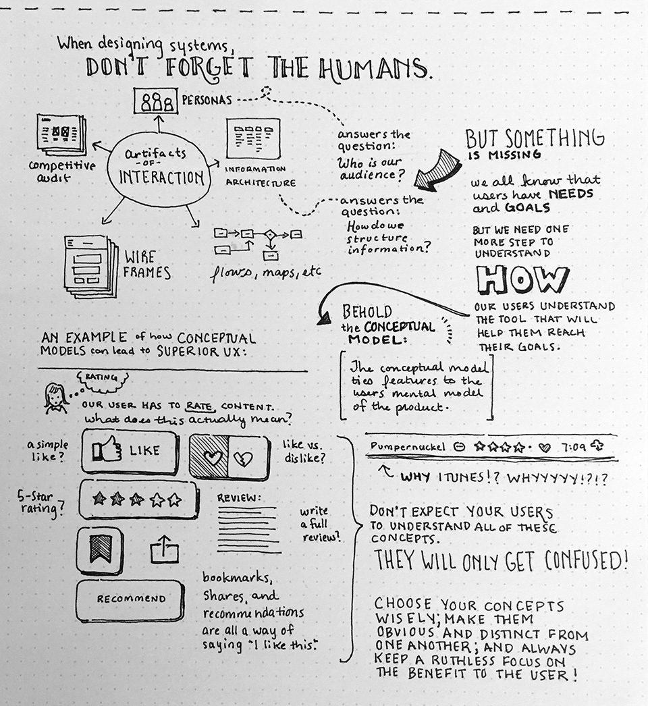

Designers love systems. We love creating architectures to organize features, wireframes to provide access to functionality, and flows to provide a sense of navigation. We create guidelines and principles to ensure consistency across screens, platforms, and versions. We document transitions, we inventory the competition, and we define our audience.

We go through these processes to meticulously plan every detail of a design, only to be surprised when usability tests reveal that users can't understand the application, or to find that in production our favorite features are neglected.

When getting into the guts of designing technical systems, what can we do to remember the humans?

*The Conceptual Model keeps our users front of mind in a process that often ends up driven by busness needs or technical constraints.*

The Conceptual Model goes beyond lists of user needs and goals. It gets into the details of what the user understands from other experiences (both digital and beyond), and it looks at how the relationships between different concepts can be optimized to reduce the cognitive load on the user. A simplicity-seeking approach encourages the combination of concepts that are similar to each other and the elimination of concepts that don't have strong relationships with others.

# The Conceptual Model meets iTunes

*Do I heart or star this song? How many stars equal a heart?*

Let's look at iTunes for an example of how the Conceptual Model might be used to create a more coherent user experience. The screenshot below shows that it's possible to rate music in one of two ways. The user can either rate using stars or can *heart* it. The star ratings are only available for music in the user's library, while hearts are available on all items. It's possible to star-rate or heart albums or songs, but some views only offer partial options. A Conceptual Model might have saved the trouble of asking users to understand two concepts serving the same purpose. Or perhaps these two concepts serve very important purposes, in which case the design should be explicit in helping the user to understand when to use one or the other feature.

The consideration doesn't stop there! It's important to also consider what other methods users have to rate content. Facebook uses *likes* while others have expanded *heart* to also include *broken heart*. Perhaps though, the most telling rating is the playcount, but this lacks the explicitness of a rating. Then there are reviews, bookmarks, shares, recommendations, and so on. The system might have an algorithm that can easily take all of these metrics into consideration. Worse, the product might have a manager that sees a user for every feature. Here the Conceptual Model not only provides a tool for synthesis, it also serves as a means of alignment behind the goals of simplicity and comprehensibility.

# Beware of novelty.

Perhaps more important than serving as a tool to assess the *how* of a feature, the Conceptual Model reduces the chances of creating an app whose novelty results in uselessness. Most users enjoy the tickle of a clever bit of interaction or an occasional punny icon, but an app full of unique features is bound to create confusion.

*Conceptual Model cards should have the name of the concept, a place for familiar concepts, and a place to draw or write notes. Make sure to have some blanks – new concepts always arise!*

In The Artificial's practice, we print cards for the different concepts we expect a user to understand and note where we can find inspiration in analogous experiences versus where we expect the user to learn something new. *New* has two possibilities. The first and most likely is the addition of cognitive load. The second, and far rarer, is brand opportunity. Everyone wanted to copy Path's floating navigation button while many complain about Google's floating action button. In this case, the novelty was *interesting* and made an otherwise forgettable app worth talking about (to designers at least).

So how can app product managers and designers differentiate in a saturated market without overwhelming their users? It makes sense that limiting to concepts that users are already familiar with *limits innovation*. Yes and no. Nobody wants to create an experience that fails because it's "before its time." If you have a game-changing concept, introduce it slowly. While a user might balk at foreign concepts, slowly introducing new ideas via familiar concepts will help change what your user considers *foreign*. Twitter has a history of changing the way we message. Consider the hashtag or the at-reply. It seems natural that Slack would use these features and oddly antiquated that email does not.

# Don't forget the humans.

When designing systems, don't forget the humans. Using the Conceptual Model helps align business needs and development costs with users' expectations. It doesn't matter if you're a startup trying to balance differentiation with familiar or if you're a large corporation trying managing a robust ecosystem of features – the Conceptual Model will help you to build a better, more usable, and even more joyful product.

