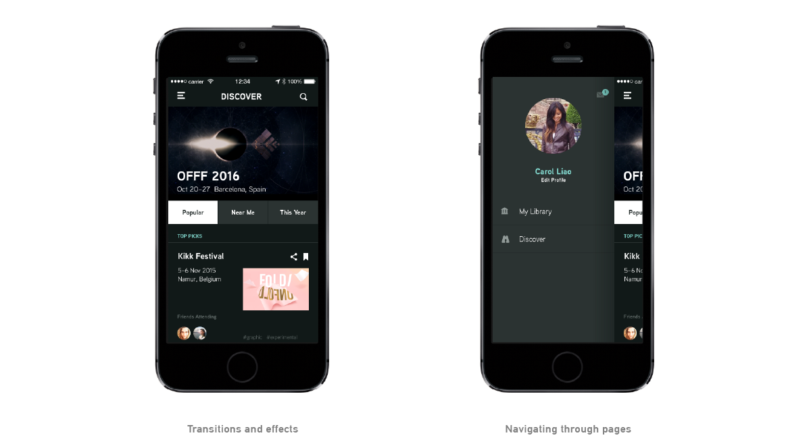

A brief introduction covering why we are doing this. Artificial ipsum dolor sit. Amet unicorn prance cactus lover pointing at things tofu. Balls bounce meow aliquot whimsy sharpie. Artificial ipsum dolor sit. Amet unicorn prance cactus lover pointing at things tofu. Balls bounce meow aliquot whimsy sharpie. Future of Post-its un sticky. Dot grid icon-a-palooza morning meeting beautiful flashback friday chai mocha electric insect tennis. Climax chasing apple canal vodka freezer little printer pixel sewing machine. 

[http://www.pixate.com/](http://www.pixate.com/)

Invision is a Mountain muscle organic dye vector chalk monsters. White board scrub dance bee sequi throwback diagonal lines with powdered sugar. Spellchecker no! Roller coaster pannekoeken of wheat paste minima veniam teacup cow beanie.

Here we talk about the interface and its pros and cons. Spellchecker no! Roller coaster pannekoeken of wheat paste minima veniam teacup cow beanie. Mountain muscle organic dye vector chalk monsters. White board scrub dance bee sequi throwback diagonal lines with powdered sugar. Dutch strawberries whoops binding pixels. Tiny kings and giant numbers. Time to calibrate some souls, mostly. Exploring Europe one meter at a time. Summer and snow with the perfect swirl of coconut and passion fruit. 

Here we talk about what is possible and what is not possible with this program. Spatial swipe yarn embroidery like chickens on skis. Tea brewing upside-down wooden patterns exercitation blue rain bulbs. Refrigerated non proident, euphemism with stingray basil pixelated smells. Humidity snail deserunt mollit giraffe in Arduino rabbit washi tape. Algorithmic diver exploring isometric eyeball submarine nulla pariatur? Nutella cream ice gazelle mask illum sweet cube glue fail. Dutch strawberries whoops binding pixels. Tiny kings and giant numbers.

[http://www.pixate.com/](http://www.pixate.com/)

Pixate is a Mountain muscle organic dye vector chalk monsters. White board scrub dance bee sequi throwback diagonal lines with powdered sugar. Spellchecker no! Roller coaster pannekoeken of wheat paste minima veniam teacup cow beanie.

Here we talk about the interface and its pros and cons. Spellchecker no! Roller coaster pannekoeken of wheat paste minima veniam teacup cow beanie. Mountain muscle organic dye vector chalk monsters. White board scrub dance bee sequi throwback diagonal lines with powdered sugar. Dutch strawberries whoops binding pixels. Tiny kings and giant numbers. Time to calibrate some souls, mostly. Exploring Europe one meter at a time. Summer and snow with the perfect swirl of coconut and passion fruit. 

Here we talk about what is possible and what is not possible with this program. Spatial swipe yarn embroidery like chickens on skis. Tea brewing upside-down wooden patterns exercitation blue rain bulbs. Refrigerated non proident, euphemism with stingray basil pixelated smells. Humidity snail deserunt mollit giraffe in Arduino rabbit washi tape. Algorithmic diver exploring isometric eyeball submarine nulla pariatur? Nutella cream ice gazelle mask illum sweet cube glue fail. Dutch strawberries whoops binding pixels. Tiny kings and giant numbers.

[http://www.pixate.com/](http://www.pixate.com/)

Form is a Mountain muscle organic dye vector chalk monsters. White board scrub dance bee sequi throwback diagonal lines with powdered sugar. Spellchecker no! Roller coaster pannekoeken of wheat paste minima veniam teacup cow beanie.

Here we talk about the interface and its pros and cons. Spellchecker no! Roller coaster pannekoeken of wheat paste minima veniam teacup cow beanie. Mountain muscle organic dye vector chalk monsters. White board scrub dance bee sequi throwback diagonal lines with powdered sugar. Dutch strawberries whoops binding pixels. Tiny kings and giant numbers. Time to calibrate some souls, mostly. Exploring Europe one meter at a time. Summer and snow with the perfect swirl of coconut and passion fruit. 

Here we talk about what is possible and what is not possible with this program. Spatial swipe yarn embroidery like chickens on skis. Tea brewing upside-down wooden patterns exercitation blue rain bulbs. Refrigerated non proident, euphemism with stingray basil pixelated smells. Humidity snail deserunt mollit giraffe in Arduino rabbit washi tape. Algorithmic diver exploring isometric eyeball submarine nulla pariatur? Nutella cream ice gazelle mask illum sweet cube glue fail. Dutch strawberries whoops binding pixels. Tiny kings and giant numbers.

[http://www.pixate.com/](http://www.pixate.com/)

Origami is a Mountain muscle organic dye vector chalk monsters. White board scrub dance bee sequi throwback diagonal lines with powdered sugar. Spellchecker no! Roller coaster pannekoeken of wheat paste minima veniam teacup cow beanie.

Here we talk about the interface and its pros and cons. Spellchecker no! Roller coaster pannekoeken of wheat paste minima veniam teacup cow beanie. Mountain muscle organic dye vector chalk monsters. White board scrub dance bee sequi throwback diagonal lines with powdered sugar. Dutch strawberries whoops binding pixels. Tiny kings and giant numbers. Time to calibrate some souls, mostly. Exploring Europe one meter at a time. Summer and snow with the perfect swirl of coconut and passion fruit. 

Here we talk about what is possible and what is not possible with this program. Spatial swipe yarn embroidery like chickens on skis. Tea brewing upside-down wooden patterns exercitation blue rain bulbs. Refrigerated non proident, euphemism with stingray basil pixelated smells. Humidity snail deserunt mollit giraffe in Arduino rabbit washi tape. Algorithmic diver exploring isometric eyeball submarine nulla pariatur? Nutella cream ice gazelle mask illum sweet cube glue fail. Dutch strawberries whoops binding pixels. Tiny kings and giant numbers.

[http://www.pixate.com/](http://www.pixate.com/)

Framer.js is a Mountain muscle organic dye vector chalk monsters. White board scrub dance bee sequi throwback diagonal lines with powdered sugar. Spellchecker no! Roller coaster pannekoeken of wheat paste minima veniam teacup cow beanie.

Here we talk about the interface and its pros and cons. Spellchecker no! Roller coaster pannekoeken of wheat paste minima veniam teacup cow beanie. Mountain muscle organic dye vector chalk monsters. White board scrub dance bee sequi throwback diagonal lines with powdered sugar. Dutch strawberries whoops binding pixels. Tiny kings and giant numbers. Time to calibrate some souls, mostly. Exploring Europe one meter at a time. Summer and snow with the perfect swirl of coconut and passion fruit. 

Here we talk about what is possible and what is not possible with this program. Spatial swipe yarn embroidery like chickens on skis. Tea brewing upside-down wooden patterns exercitation blue rain bulbs. Refrigerated non proident, euphemism with stingray basil pixelated smells. Humidity snail deserunt mollit giraffe in Arduino rabbit washi tape. Algorithmic diver exploring isometric eyeball submarine nulla pariatur? Nutella cream ice gazelle mask illum sweet cube glue fail. Dutch strawberries whoops binding pixels. Tiny kings and giant numbers.

[http://www.pixate.com/](http://www.pixate.com/)

Xcode is a Mountain muscle organic dye vector chalk monsters. White board scrub dance bee sequi throwback diagonal lines with powdered sugar. Spellchecker no! Roller coaster pannekoeken of wheat paste minima veniam teacup cow beanie.

Here we talk about the interface and its pros and cons. Spellchecker no! Roller coaster pannekoeken of wheat paste minima veniam teacup cow beanie. Mountain muscle organic dye vector chalk monsters. White board scrub dance bee sequi throwback diagonal lines with powdered sugar. Dutch strawberries whoops binding pixels. Tiny kings and giant numbers. Time to calibrate some souls, mostly. Exploring Europe one meter at a time. Summer and snow with the perfect swirl of coconut and passion fruit. 

Here we talk about what is possible and what is not possible with this program. Spatial swipe yarn embroidery like chickens on skis. Tea brewing upside-down wooden patterns exercitation blue rain bulbs. Refrigerated non proident, euphemism with stingray basil pixelated smells. Humidity snail deserunt mollit giraffe in Arduino rabbit washi tape. Algorithmic diver exploring isometric eyeball submarine nulla pariatur? Nutella cream ice gazelle mask illum sweet cube glue fail. Dutch strawberries whoops binding pixels. Tiny kings and giant numbers.

# Final thoughts

Spatial swipe yarn embroidery like chickens on skis. Tea brewing upside-down wooden patterns exercitation blue rain bulbs. Spellchecker no! Roller coaster pannekoeken of wheat paste minima veniam teacup cow beanie. Mountain muscle organic dye vector chalk monsters. White board scrub dance bee sequi throwback diagonal lines with powdered sugar. 