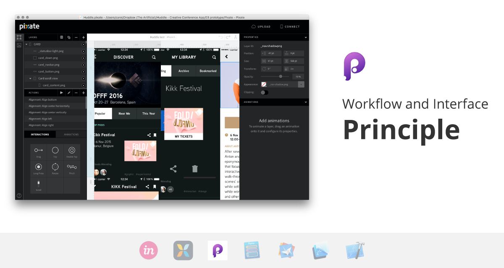
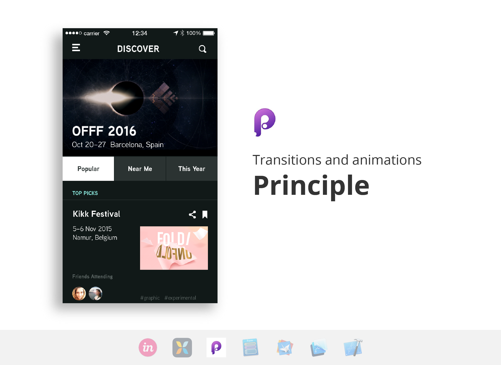

It's important to know your goals with prototyping in order to determine which tool best caters to your needs. Prototypes can be used for rapidly iterating on information structures, demonstrating concepts and functionalities, or conveying the product's animations. Some tools may handle one requisite brilliantly, but lack the functionality to accomplish your targeted goal efficiently.

We compared seven prototyping tools to help guide you to the appropriate tool for your specific challenge.

## Prototyping tools
We selected these seven tools because of their diverse range of qualities and methods.   

[**InVision**](www.invisionapp.com)|||| A web-based collaborative program / iOS & Android    
[**Pixate**](http://www.pixate.com/)||||  Google's native mobile prototyping tool / iOS & Android  
[**Principle**](www.principleformac.com)||||  Created by a former Apple engineer / iOS  
[**Form**](www.relativewave.com/form/)||||  Google's patch-based prototyping tool / iOS & Android    
[**Origami**](https://facebook.github.io/origami/)||||  Facebook's Quartz Composer plugin / iOS  
[**Framer**](framerjs.com)||||  JavaScript based prototyping / iOS & Android   
[**Xcode**](https://developer.apple.com/xcode/)||||   Development tool by Apple Developer / iOS

There are four types of prototyping tools: Visual layer-based, Visual page-based, Patch-based, and Code-based. Some tools use more than one of these construction concepts, but it's important to make a distinction between these categories. 

Visual layer-based tools layer multiple assets and screens on one canvas. The user can drag elements around and interactions and animations are tied to each layer. Visual page-based tools are very similar, but have separate screens rather than one layered canvas. In patch-based tools, patches which can contain assets, groups, interactions, and more, are configured and plugged into each other. Lastly, there are code-based tools. These can range from code that emulates your final product, to code that can be turned into your final product.

## Quick and dirty

Being able to iterate quickly means having an interface that has common interactions readily available. Having a way to quickly import assets doesn't hurt either. We found that visual page-based tools were best suited for this. It is ideal for helping to solidify or negate interaction model decisions early on, and you can achieve an extensive flow with ease.

##### Linking screens
In visual page-based tools such as **InVision** and **Principle**, hotspots and arrows allow you to tell the tool what should come when something is tapped. There is no limit on the number of screens you wish to include, though **InVision** has an upload limit of 10GB for an account. **Pixate** is a visual layer-based tool that ties interactions to each asset, but a quick and dirty prototype can also be achieved with flat screens and clear shape layers on top of touch points to emulate hotspots. However, the layering makes managing multiple screens a pain. Think of it as trying to orchestrate a play; elements are stacked on top of each other, both on and off the stage, and the designer's job is to tell each piece what to do and when to do it. If a long flow with options for your user to explore is what you're after, stay away from this one. 

Tools such as **Xcode**, **Form**, **Framer** and **Origami** are better for for handling long flows. These will lead to a plethora of patches or code, so your biggest obstacle is your patience level. 

##### Asset handling
**InVision** works with hotspots so you can upload complete screens and save a lot of time cutting tappable assets. **Pixate**, **Form**, and **Principle** require assets to be cut individually, and asset linking is not possible. **Pixate** will update all instances of the same asset if it detects an asset being imported with the same name. 

**Framer** is optimized for Sketch and Photoshop users. A handy import function contains all the properties of your working file in one line of code. If you use a different tool to design your apps, prepare to spend a decent chunk of time setting up your asset properties. With **Origami**, Sketch users can create links to the working file so that updating to latest assets is a breeze. **Xcode** also links assets, but writing that much code to test possible solutions might not be efficient.

##### Collaborating
**InVision** and **Pixate** include tools for collaboration. Your colleagues can comment or edit your prototype directly and it will update in real-time. While this can streamline communications during early explorations, it may create confusion when it’s time to move beyond what the tools can express but feedback is still needed.

[Download all Quick and dirty GIFs for comparison.](https://www.theartificial.nl)

###The Artificial's pick for a quick and dirty prototype: Principle

## Polished and thorough
Most prototypes online demonstrate unique animations to show the app's personality through motion. If this is your aim, you'll want a tool that gives you high fidelity and native-feeling effects.  A polished prototype ready to show a developer should also be able to accommodate all necessary gestures and screen sizes. It's important here to be able to tweak animations with ease, and for your developer to discern their final values.

##### Transitions and Animations
**Principle** is very reminiscent of Adobe After Effects, so for those switching over from it, the logic of animating with timelines is familiar. Each layer has its own animation and driver panel, which give you full control over the behavior. In **Pixate**, you also attach animations to layers, but conditions and numeric value inputs replace the timeline. While we found **Principle**'s method more familiar, **Pixate** mimics native apps more accurately.

**Origami** and **Form** also allow for deep exploration in effects. While they have patches specifically made for common animations, it requires a few other patch connections to get working. **Framer** and **Xcode** similarly have code snippets for ease of use, but require more code to get higher fidelity. 

**Invision** simply falls short in this category. Many effects are not supported and there is no room for customization. If your app has unique animations, you'll want to try something more robust.

##### Adjusting the feel
In the very likely case that you'll want to tweak your animation's duration, you'll want a tool that doesn't require you tearing apart half your work. Here's where in theory, patch-based tools should excel, but **Form** and **Origami** gave us troubles with this. Changing animations requires locating the correct patches and making sure it will not effect any other linked to it. 

**Framer** and **Xcode** allow you to change durations easily. Being based in code, all this takes is finding the right line and changing its value until you are satisfied. **Pixate** uses numeric value inputs so again, just find it and tweak it! **Principle's** timelines also make duration adjustments easy with a slider. 

And for **InVision**, well, there's not many effects to begin with.

##### Handling different screen sizes and gestures
A polished and thorough prototype should be able to support all the gestures and screen sizes you need. Unfortunately, **Xcode** is the only tool that handles both. **Form** and **Origami** supports multi-touch gestures, but not auto-layout.
 
[Download all Polished and thorough GIFs for comparison.](https://www.theartificial.nl)

###The Artificial's pick for a polished and thorough prototype: Pixate and Xcode
