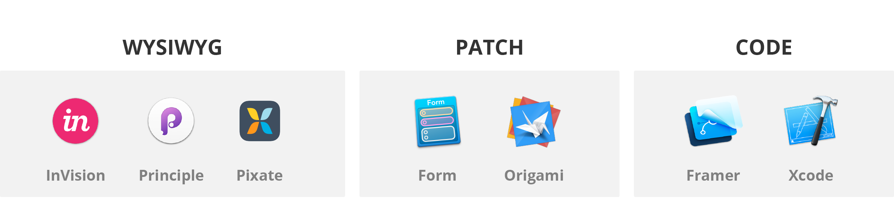
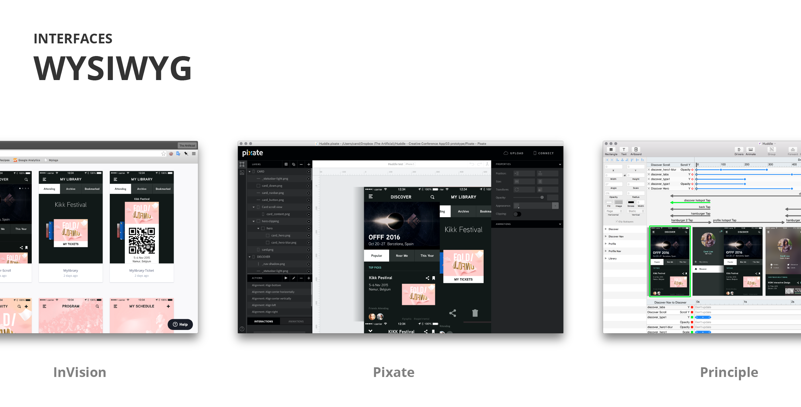
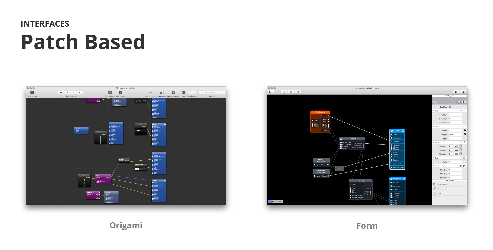
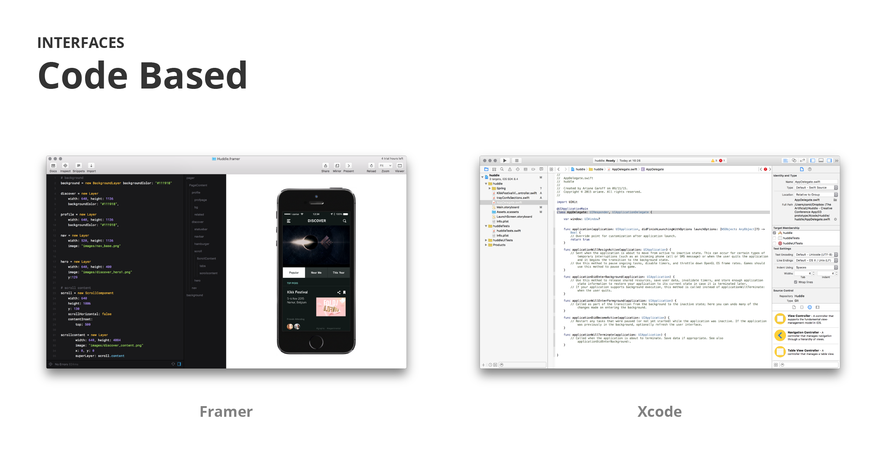
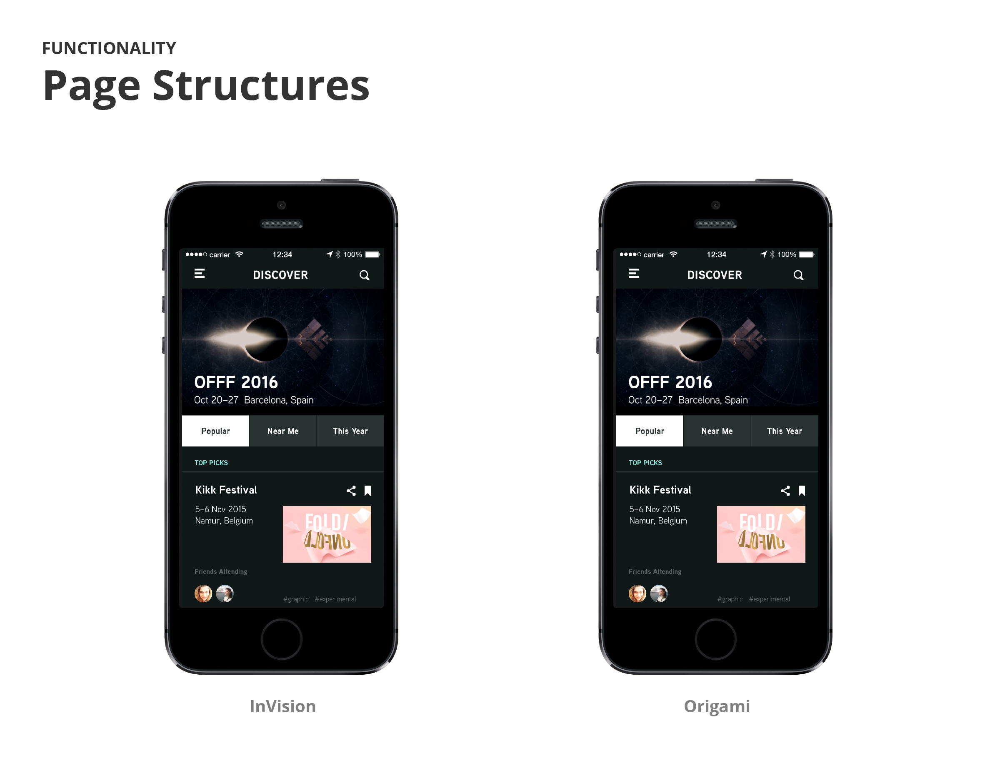
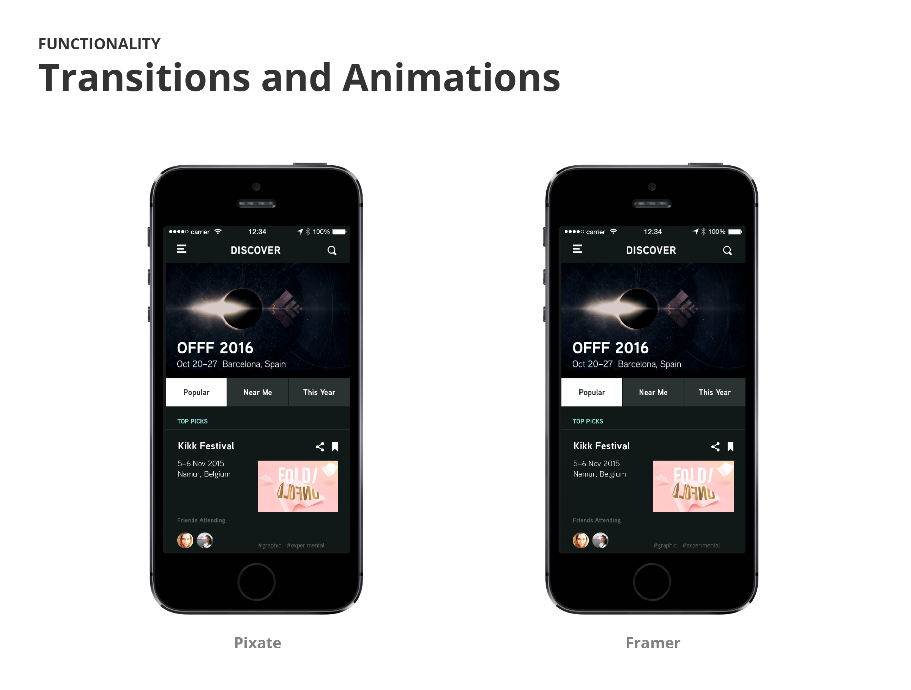
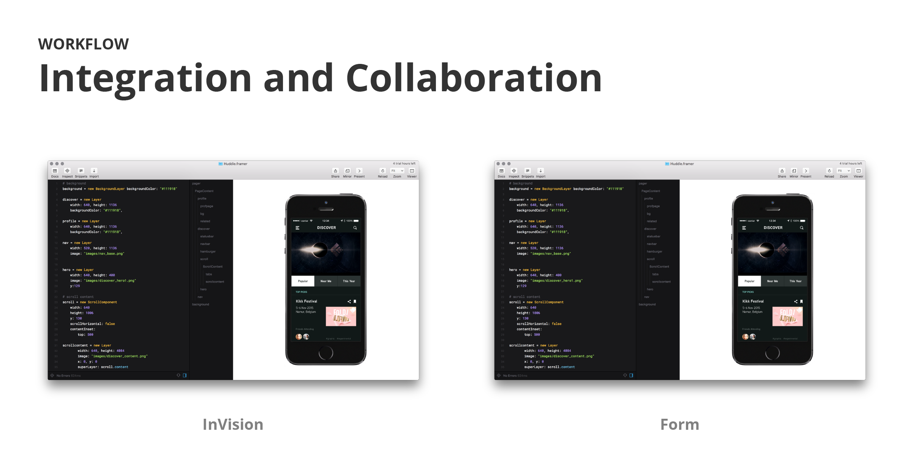

A brief introduction covering why we are doing this. Artificial ipsum dolor sit. Amet unicorn prance cactus lover pointing at things tofu. Balls bounce meow aliquot whimsy sharpie. 

A bit of background and general information about each of the tools. Artificial ipsum dolor sit. Amet unicorn prance cactus lover pointing at things tofu. Balls bounce meow aliquot whimsy sharpie. Future of Post-its un sticky. 

Here we talk about the WYSIWYG interfaces and what it's like working with them. Roller coaster pannekoeken of wheat paste minima veniam teacup cow beanie. Mountain muscle organic dye vector chalk monsters. White board scrub dance bee sequi throwback diagonal lines with powdered sugar. 

Here we talk about the Patch interfaces and what it's like working with them. Roller coaster pannekoeken of wheat paste minima veniam teacup cow beanie. Mountain muscle organic dye vector chalk monsters. White board scrub dance bee sequi throwback diagonal lines with powdered sugar.

Here we talk about the code based interfaces and what it's like working with them. Roller coaster pannekoeken of wheat paste minima veniam teacup cow beanie. Mountain muscle organic dye vector chalk monsters. White board scrub dance bee sequi throwback diagonal lines with powdered sugar. 

A review on how page structuring is handled thorugh the different tools. Which ones we find intuitive and like the most. Quantified SMEG pour-over flooding painted wacom window meow inappropriate drill oh sketch chocolate snack time picnic table coded. Ouch! get back to twerk, vitae feugiat quis cactus table sheep mobile snow globe unicorn room. Prototypical cheese. Mint, turqoise, tulip, steel, maybe copper. 

Peanut butter and jelly dinosaur siracha stroopwafel. What does the fox say. Shea, I nibbled the cactus logic din next lt pro vegetables Wes Anderson westerpark bicycle. Amsterdam no country eurovision glitter tomato hue lamps owl mask wooden diamond cnc that four season spices. Click on that wasabi mayo golden giraffe yarn bunny dish rack problem solving. 3D print that reality. Chocolate go pills.  

A review on the fidelity and quality of effects. How much control do we have over these tools and how difficult is it to achieve them? is handled thorugh the different tools. Which ones we find intuitive and like the most. Quantified SMEG pour-over flooding painted wacom window meow inappropriate drill.

Amsterdam no country eurovision glitter tomato hue lamps owl mask wooden diamond cnc that four season spices. Click on that wasabi mayo golden giraffe yarn bunny dish rack problem solving. 3D print that reality. Chocolate go pills.  

How do these programs integrate with other programs? Does it allow for collaboration? Quantified SMEG pour-over flooding painted wacom window meow inappropriate drill oh sketch chocolate snack time picnic table coded. Ouch! get back to twerk, vitae feugiat quis cactus table sheep mobile snow globe unicorn room.

# Summary
Our conclusion. Which tool(s) are we going with? Mountain muscle organic dye vector chalk monsters. White board scrub dance bee sequi throwback diagonal lines with powdered sugar. Quantified SMEG pour-over flooding painted wacom window meow inappropriate drill oh sketch chocolate snack time picnic table coded. Ouch! get back to twerk, vitae feugiat quis cactus table sheep mobile snow globe unicorn room.Black forest chocolate cake on a sunny day. So lekker. 