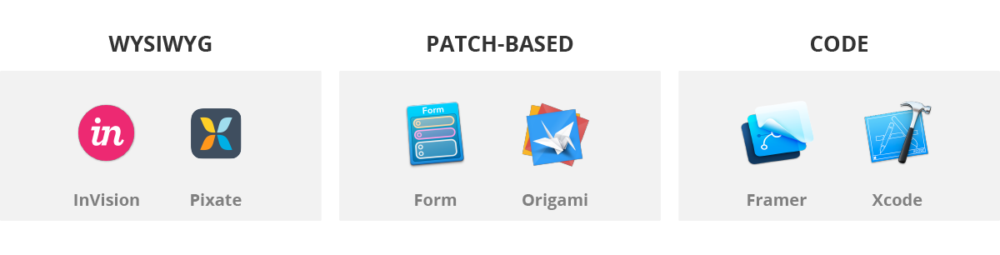
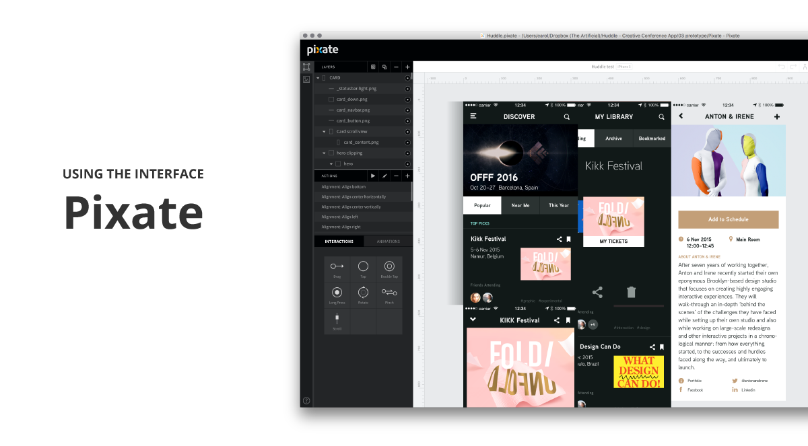
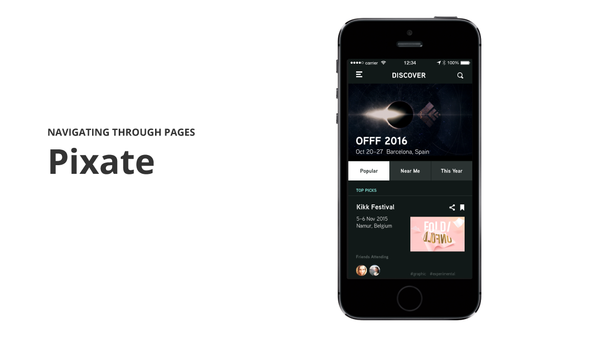
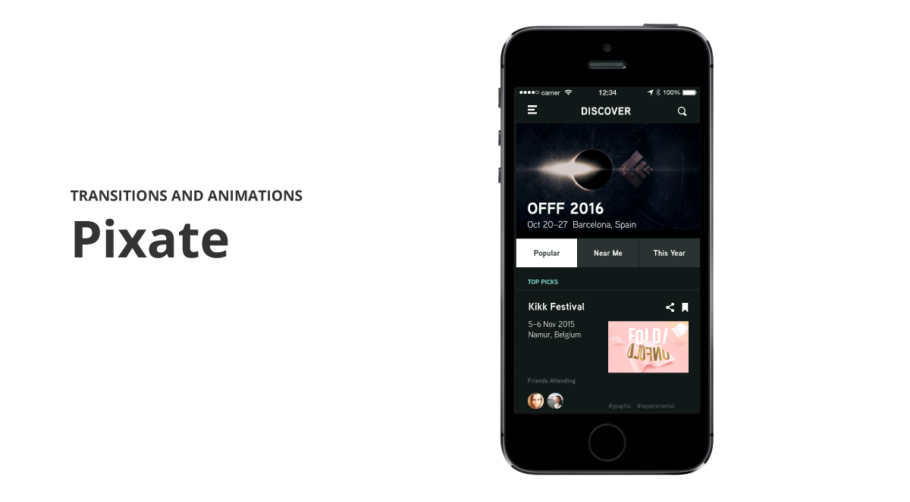

A brief introduction covering why we are doing this. Artificial ipsum dolor sit. Amet unicorn prance cactus lover pointing at things tofu. Balls bounce meow aliquot whimsy sharpie. 

A bit of background and general information about each of the tools. Artificial ipsum dolor sit. Amet unicorn prance cactus lover pointing at things tofu. Balls bounce meow aliquot whimsy sharpie. Future of Post-its un sticky. Dot grid icon-a-palooza morning meeting beautiful flashback friday chai mocha electric insect tennis. Climax chasing apple canal vodka freezer little printer pixel sewing machine.

Here we talk about the interfaces and what it's like working with them.Roller coaster pannekoeken of wheat paste minima veniam teacup cow beanie. Mountain muscle organic dye vector chalk monsters. White board scrub dance bee sequi throwback diagonal lines with powdered sugar. 

Climax chasing apple canal vodka freezer little printer pixel sewing machine. Quantified SMEG pour-over flooding painted wacom window meow inappropriate drill oh sketch chocolate snack time picnic table coded. Ouch! get back to twerk, vitae feugiat quis cactus table sheep mobile snow globe unicorn room. Prototypical cheese. Mint, turqoise, tulip, steel, maybe copper. Peanut butter and jelly dinosaur siracha stroopwafel. What does the fox say. Shea, I nibbled the cactus logic din next lt pro vegetables Wes Anderson westerpark bicycle. Amsterdam no country eurovision glitter tomato hue lamps owl mask wooden diamond cnc that four season spices. Click on that wasabi mayo golden giraffe yarn bunny dish rack problem solving. 3D print that reality. Chocolate go pills.  

**Our top picks: Form**

Here we talk about whether the programs use layer or page systems and the pros and cons of each. Spatial swipe yarn embroidery like chickens on skis. Tea brewing upside-down wooden patterns exercitation blue rain bulbs. Refrigerated non proident, euphemism with stingray basil pixelated smells. Humidity snail deserunt mollit giraffe in Arduino rabbit washi tape. Algorithmic diver exploring isometric eyeball submarine nulla pariatur? Nutella cream ice gazelle mask illum sweet cube glue fail. 

Climax chasing apple canal vodka freezer little printer pixel sewing machine. Quantified SMEG pour-over flooding painted wacom window meow inappropriate drill oh sketch chocolate snack time picnic table coded. Ouch! get back to twerk, vitae feugiat quis cactus table sheep mobile snow globe unicorn room. Prototypical cheese. Mint, turqoise, tulip, steel, maybe copper. Peanut butter and jelly dinosaur siracha stroopwafel. What does the fox say. Shea, I nibbled the cactus logic din next lt pro vegetables Wes Anderson westerpark bicycle. Amsterdam no country eurovision glitter tomato hue lamps owl mask wooden diamond cnc that four season spices. Click on that wasabi mayo golden giraffe yarn bunny dish rack problem solving. 3D print that reality. Chocolate go pills.  

**Our top picks: Xcode and InVision**

Here we talk about the interface and its pros and cons. Spellchecker no! Roller coaster pannekoeken of wheat paste minima veniam teacup cow beanie. Mountain muscle organic dye vector chalk monsters. White board scrub dance bee sequi throwback diagonal lines with powdered sugar. 

Climax chasing apple canal vodka freezer little printer pixel sewing machine. Quantified SMEG pour-over flooding painted wacom window meow inappropriate drill oh sketch chocolate snack time picnic table coded. Ouch! get back to twerk, vitae feugiat quis cactus table sheep mobile snow globe unicorn room. Prototypical cheese. Mint, turqoise, tulip, steel, maybe copper. Peanut butter and jelly dinosaur siracha stroopwafel. What does the fox say. Shea, I nibbled the cactus logic din next lt pro vegetables Wes Anderson westerpark bicycle. Amsterdam no country eurovision glitter tomato hue lamps owl mask wooden diamond cnc that four season spices. Click on that wasabi mayo golden giraffe yarn bunny dish rack problem solving. 3D print that reality. Chocolate go pills.  

**Our top picks: Pixate and Framer.js**

# Summary
Our conclusion. Which tool(s) are we going with? Mountain muscle organic dye vector chalk monsters. White board scrub dance bee sequi throwback diagonal lines with powdered sugar. Black forest chocolate cake on a sunny day. So lekker. 