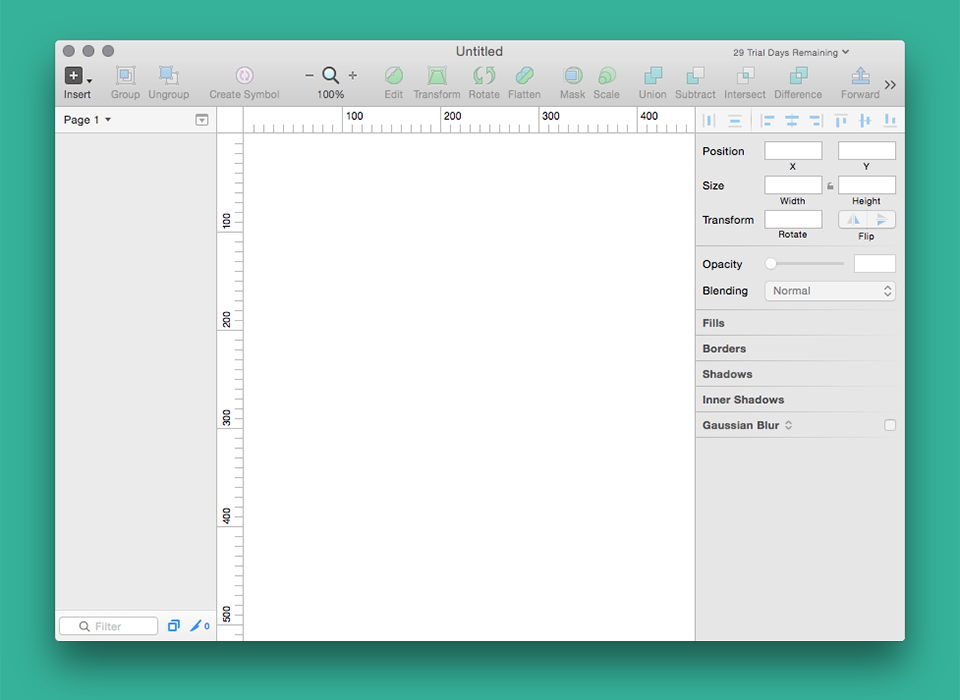
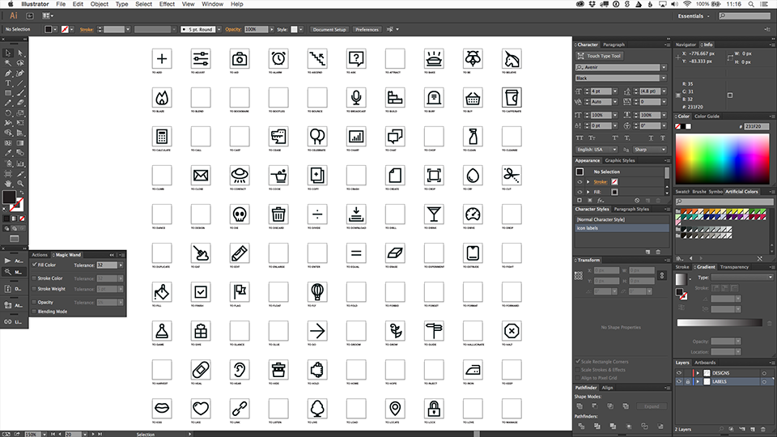

## About The Artificial
At The Artificial we create beautiful and intuitive designs by organizing information and exploring possibilities—two modes of thought that are in constant conflict and harmony with each other. Elsewhere, processes or even roles break these two general ways of thinking apart; however, we believe minds and methodologies that mash up order and chaos yield better results.

## Our Tools
We currently find that Adobe Illustrator provides a workflow that allows us to achieve this balance. For exploration, it pairs a vast tool set with a large canvas. For organization, we use palettes, symbols, and paste-in-place, but mostly we rely on a good deal of self-discipline and communication. 

Of course we’d like our tools to better support our minds in keeping things organized. We’d love to see an Adobe Illustrator with an infinite canvas and unlimited artboards, with symbols that work cross-document, and with grids that can be adjusted at a finer level than top-level preferences. Linking could be improved by giving artboards unique identifiers (names) rather than numbers, and PDF saves would be better if we had more control over layers and artboards in the process. Sure, there are coping mechanisms (scripts) for many of these pain points, but they take up the precious brainspace we’d rather be using to push our designs to be that much better.

Last week, we branched out from our Adobe safe-place and tried the increasingly popular Sketch. While a first look at the interface had us questioning if it was really a tool for designers, the infinite canvas, unlimited artboards, pages, and per-artboard grids gave us hope.

*A general first impression: Am I in keynote? Where are my colors and typography? And what of my overstuffed toolbox? This doesn’t feel creative.*

## Why The Artificial will not be moving to Sketch
There was a general frustration period of getting used to the new keyboard shortcuts, and a lot of cursing as v behaved as the pen tool instead of a selection tool. But keyboard shortcuts are easy to relearn, and adapting didn't take long. But one thing we couldn’t shake was the feeling that the tool had a point of view. We all felt the pressure to design flat, boxy interfaces without exploration. 

Can an interface promote exploration? Absolutely. This is what Adobe’s toolset does so well. Designers are confronted with more tools and palettes than they could ever use, and every designer has his or her preferences. In the same way that designers’ desks vary wildly, designers’ palettes and tool preferences vary as well.

This was the first thing that shocked me about Sketch’s interface. Everything feels hidden in a way that makes it feel like decisions need to be made before being drawn. Key elements like color and typography feel applied rather than considered through experimentation.

*In some organizations it’s easy to tell what role a designer plays by which palettes he or she uses. At The Artificial, our palettes tend to be in a constant state of flux as we switch from icon design to information design to typographic layouts to UI design and so on.*

## A few small changes could go a long way
While Sketch might be too constraining for The Artificial, I do understand Sketch’s role in others' workflows. Here’s a quick inventory of what we were missing.

**The eyedropper tool**

Illustrator’s eyedropper tool (especially when combined with the wand tool) is one of the most powerful tools of visual design. It’s easy to quickly try on new colors, gradients, type styles and so on within seconds. I tried coping, but quickly became frustrated with the lack of a true swatch palette when I tried to create a linear gradient from two flat colors I’d saved.

**Direct selection of multiple layers**

As a UI designer who switched from Photoshop to Illustrator almost three years ago, the in-your-face layer-based approach to the interface was a surprising flashback. Even more of a surprise was that direct selection only worked on one layer at a time. Being able to direct-select an area (multiple elements) in illustrator enables us to explore and find the perfect sizes, spacings, and proportions of elements.

**Drawing with the vector point tool**

The vector point tool let us down in two ways: the undo was unpredictable and the individual points didn't pixel snap. When trying to reproduce some of our designs from to [icon], we found that a single undo would often erase multiple anchor points. When trying to achieve pixel perfection on complex forms, we found manually entering the x, y coordinates to be cumbersome. Coming from Illustrator, it was an unpleasant surprise that even nudging in pixel preview mode didn’t result in pixel-aligned points.

In summary, I look forward to Sketch’s evolution, and hope that Adobe Illustrator finds inspiration in some of the more endearing features.
