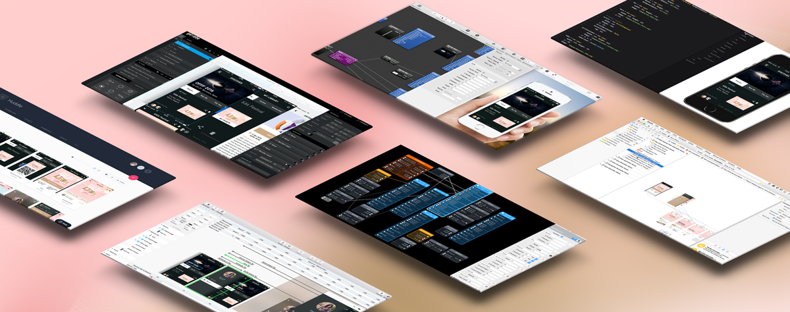
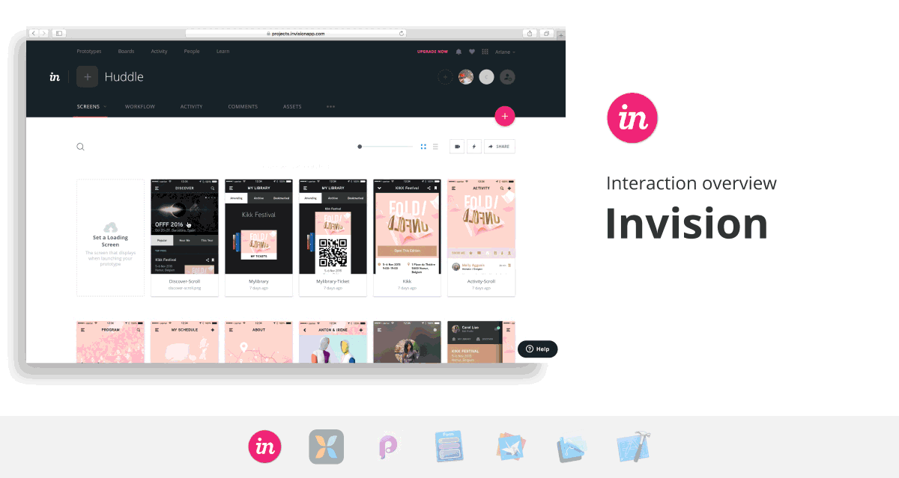

_Update: see [part 2](/blog/2016/05/04/prototyping2.html) for consideration of 7 more tools._

It's important to know your goals with prototyping in order to determine which tool best caters to your needs. Prototypes can be used for clarifying interaction models, demonstrating concepts and functionalities, or presenting the product's animations. Some tools may handle one requisite brilliantly, but lack the functionality to accomplish your targeted goal efficiently.

We compared seven prototyping tools to help guide you to the appropriate tool for your specific challenge.

## Prototyping tools

We selected these seven tools because of their diverse range of qualities and methods.     

 | [**InVision**](http://www.invisionapp.com/)| A web-based collaborative program  
 | [**Pixate**](http://www.pixate.com/)| Google's native mobile prototyping tool
 | [**Principle**](http://www.principleformac.com/)| Created by a former Apple engineer  
 | [**Form**](http://www.relativewave.com/form/)| Google's patch-based prototyping tool  
 | [**Origami**](https://facebook.github.io/origami/)| Facebook's Quartz Composer plugin
 | [**Framer**](http://www.framerjs.com/)| JavaScript based prototyping
 | [**Xcode**](https://developer.apple.com/xcode/)| Development tool by Apple Developer

Adobe is also working on their own prototyping tool called [Comet](http://landing.adobe.com/en/na/products/creative-cloud/comet/229818-notifyme.html). A preview will be released in 2016, and we're looking forward to seeing how it will benefit Illustrator and Photoshop users.

From our seven tools, we've discerned four types of tools: Visual layer-based, Visual page-based, Patch-based, and Code-based. Some tools are a hybrid of two or more of these construction concepts, but it's helpful to know generally what to expect in the interfaces.

Visual layer-based tools layer multiple assets and screens on one canvas. The user can drag elements around and interactions and animations are tied to each layer. Visual page-based tools are very similar, but have separate screens rather than one densely layered canvas. In patch-based tools, webs of patches contain assets, interactions, and more. These are configured and then connected to each other with nodes. Lastly, there are code-based tools. These can range from code that emulates your final product, to code that can be turned into your final product.

## Interaction overview

When clarifying interaction models, quick iterations are often necessary to solidify decisions. For this, you'll need an interface that has common interactions readily available. Your assets will likely be updated frequently through the early stages of your project, so how efficiently your tool handles assets can save a lot of time.

##### Linking screens

In visual page-based tools such as **InVision**, screens can be linked with hotspots that allow you to tell the tool what should come when an action is performed. **InVision** allows for time saving hotspot templates, so you won't need to reformat frequently used interactions. There is no limit on the number of screens you wish to include, though it has an upload limit of 10GB for an account. **Principle** is another visual page-based tool. We found the visualization of arrows pointing to subsequent screens helpful for at-a-glance edits.

**Xcode** uses storyboards to help you visualize and manage your screens and their segues in a flow diagram. View controllers are your visual screen content areas, and can be managed directly in the storyboard via the editor, or through its corresponding code sheet.

**Pixate** is a visual layer-based tool that ties interactions to each asset, which can be time-consuming to set up. If quick iterations are your goal, you can use transparent shape layers to emulate hotspots. However, the layering makes managing multiple screens difficult. Think of it as trying to orchestrate a play; elements are stacked on top of each other, both on and off the stage, and the designer's job is to direct each piece at the appropriate time. If you have a long flow or want your user to be able to freely explore in your prototype, you'll appreciate a more manageable interface.

Tools such as **Form**, **Framer** and **Origami** are slightly better suited for handling long flows. You have more control over how things are organized, though it will still lead to a plethora of patches or code. Your biggest obstacle is your patience level.

##### Asset handling

Since **InVision** works with hotspots, you can upload complete screens and save a lot of time cutting tappable assets.

**Pixate**, **Form**, and **Principle** require assets to be cut individually, and reimported if changed. **Pixate** will ask if you want to update all instances of the same asset if it detects an a file being imported under the same name. While the setup of cutting unlinkable assets may be arduous, these tools yield more fruitful results than **InVision** if you wish to refine your prototype.

**Framer** also links assets and the setup process is optimized for Sketch and Photoshop users. A handy import function contains all the properties of your working file in one line of code. If you use a different tool to design your apps, prepare to spend a decent chunk of time setting up your asset properties.  

With **Origami**, Sketch users can create links to the working file, so updating to latest assets is a breeze.

**Xcode** also links assets, and their visual editing interface helps makes the process more approachable. Assets can be dragged and dropped into the appropriate screens, and you can also use native assets that can be customized within the editor. Using native assets is beneficial because you can use Auto Layout to specify scaling behavior across multiple screens, rather than using simple scale-up options from the other tools. The downside is the difficulty in doing truly custom controls, as Xcode's default options are limited.

##### Assisting with collaboration

**Origami** has export options that allow you to send code snippets to your developers. With **Xcode**, your developer can work directly with your file itself. Using version control, you can always recall your original prototype incase instructions were interpreted differently.

**InVision** and **Pixate** include management, commenting, and feedback features for collaboration within the tool. While this can streamline communications during early explorations, it may create confusion when it’s time to move beyond what the tools can express, but feedback is still needed.

[Download all GIFs in the Interaction overview for comparison.](11-23-prototyping/InteractionOverview.zip)

### The Artificial's pick for an Interaction overview prototype: Principle

## Aesthetic detail

A lot of the prototypes you'll see showcased online demonstrate unique animations to show the app's personality through motion. When you are at this stage of your project, you'll want a tool that gives you high fidelity and native-feeling effects. If your aim is for a prototype ready to show a developer, then it should also be able to accommodate all necessary gestures and screen sizes. It's important to be able to tweak animations with ease, and for your developer to discern their final values.

##### Animating

**Principle** is very reminiscent of Adobe After Effects, so for those switching over from it, the logic of animating with timelines is familiar. Each layer has its own animation and driver panel, which give you full control over the behavior. In **Pixate**, you also attach animations to layers, but conditions and numeric value inputs replace the timeline. While we found **Principle**'s method more familiar, **Pixate** mimics native apps more accurately.

**Origami** and **Form** also allow for deep exploration in effects. While they have patches specifically made for common animations, it requires a few other patch connections to get working. **Framer** similarly has code snippets for ease of use, but requires more code to get higher fidelity.

**Xcode** has a few native effects and transitions that can be used without writing any code, but unique animations not included in their presets requires you to code from scratch. The benefit here is, of course, that your transitions will be a default that users expect, which you want when doing standard things like switching pages, invoking the keyboard, or bringing up an action sheet.

**InVision** cruelly lacks effects. While transition animations are available, nothing custom can be made. If your app has unique animations, you'll want to try something more robust, at least until they launch [Motion](http://blog.invisionapp.com/motion-prototype-animation/).

##### Adjusting the feel

In the very likely case that you'll want to tweak your animations, you'll want a tool that doesn't require you tearing apart half your work. Luckily, all the tools we tried that handled animations provided easy ways to do so.

In **Xcode**, a transition's durations and effect intensities can be adjusted precisely through code sheets. In some cases (such as imported libraries of animations), you can also tweak parameters thanks to the editor.

**Pixate** uses numeric value inputs, and **Principle** uses sliders to adjust the timeline.

**Framer's** animations can be changed in the code.

With **Form** and **Origami**, effects are tied to patches, so they can be adjusted individually.

In **InVision**, there are limited, but easy to adjust options for transitions between screens.

##### Handling different screen sizes and gestures

A polished and thorough prototype should be able to support all the gestures and screen sizes you need.

**InVision**, **Pixate**, **Principle**, and **Framer** do not support multi-touch gestures and you'll need to create a new prototype to show how your product handles different screen sizes.

**Xcode** helps with designing for different screen sizes by using Auto Layout to manage your alignments and positions relative to their containers or other elements. The effect is that elements reformat optimally based on the screen size, rather than simply scaling up.

**Form** and **Origami** also support multi-touch gestures, and you can set properties by attaching mathematical and conditional patches instead of assigning fixed values to your layer patch. While this requires different patching strategies, it eliminates the need to build separate prototypes.

[Download all GIFs in Aesthetic detail for comparison.](11-23-prototyping/AestheticDetails.zip)

###The Artificial's pick for an Aesthetic detail prototype: Pixate and Xcode

## Making a decision

We avoided categorizing these tools into "good vs. bad" or "easy vs. difficult" because they all have strengths and we all have different goals with our prototypes. This comparison was intended to give you a better idea of capabilities, but nothing replaces hands-on experience. All of these tools are either free or have a free trial period, so try a handful out yourself. For our workflow, we have decided to use a combination of Principle and Pixate, at least until we can test out Adobe Comet. If you've found another prototyping tool to love, please share your thoughts with us on [Twitter](https://twitter.com/veryartificial).

_Update: see [part 2](/blog/2016/05/04/prototyping2.html) for consideration of 7 more tools._
