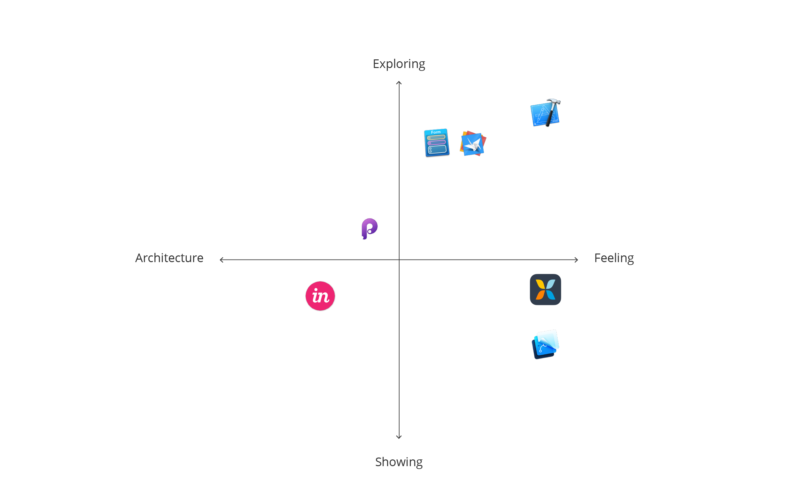
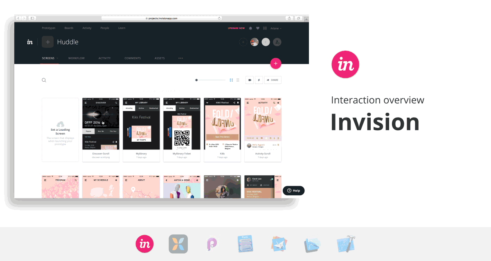

Why part 2 (5 lines)

## Prototyping tools

We selected seven more tools to complete [**our first review**](http://theartificial.nl/blog/2015/11/23/prototyping.html) of a diverse range of tools.    

 | [**Adobe XD**](http://www.adobe.com/products/experience-design.html)|  xxx
| [**Axure RP**](http://www.axure.com/)|xxx
 | [**Figma**](https://www.figma.com/)|
 | [**Flinto for Mac**](https://www.flinto.com/)|  xxx
| [**Hype**](http://tumult.com/hype/)|xxx
 | [**Justinmind**](http://www.justinmind.com/)| xxx
 | [**Proto.io**](https://proto.io/)|xxx

xxx

## Interaction overview

xxx

##### Linking screens

xxx **InVision**

##### Asset handling

xxx

##### Assisting with collaboration

xxx

[Download all GIFs in the Interaction overview for comparison.](2015-11-23-prototyping/InteractionOverview.zip)

### The Artificial's pick for a Interaction overview prototypes: Principle

## Aesthetic detail

xxx

##### Animating

xxx
[Motion](http://blog.invisionapp.com/motion-prototype-animation/).

##### Adjusting the feel

xxx

[Download all GIFs in Aesthetic detail for comparison.](2015-11-23-prototyping/AestheticDetails.zip)

###The Artificial's pick for an Aesthetic detail prototype: Pixate and Xcode

## Making a decision

xxx If you've found another prototyping tool to love, please share your thoughts with us on [Twitter](https://twitter.com/veryartificial).
