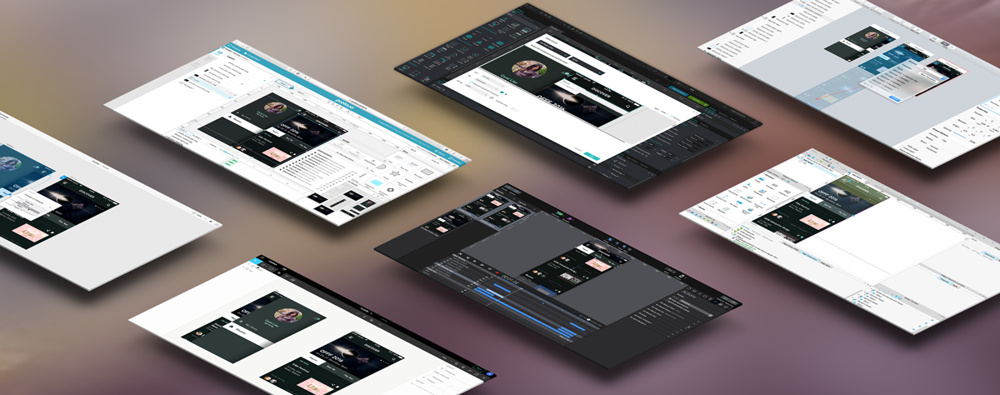
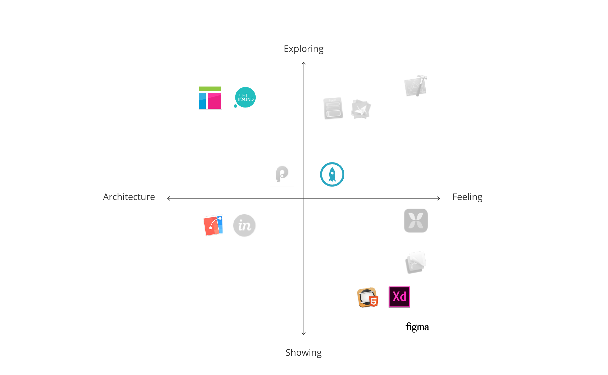

As Paul Gubbay, vice president of Creative Cloud product management at Adobe, [put it](http://www.adobe.com/news-room/pressreleases/201603/031416AdobeExperienceDesignPreviewLaunch.html) “Designers have been waiting for the right UX tool to simplify app and web experience design.” As we mentioned in [**Selecting the optimal prototyping tool (part 1)**](/blog/2015/11/23/prototyping.html), when it comes to prototyping, there is not (yet) one right tool that unanimously reaches designers’ hearts. Indeed each prototyping tool is born in a particular environment and developed with a specific angle. Before picking a tool, you should determine your prototyping goals. You might choose different tools if you are trying to clarify an interaction model versus focusing on presenting the product's animation.

We had the pleasure of being a part of the Adobe XD prerelease program. Seeing the feature requests and conversations of such a vocal design community got us excited to do a follow up on our original post.

## Prototyping tools

We compared seven more tools to help guide you to the appropriate tool for your specific challenge.

| [**Axure RP**](http://www.axure.com/)|prototype application inspired by the Miscrosoft Office Suite
 | [**Figma**](https://www.figma.com/)|collaborative online design tool (Preview released in Dec 2015)
 | [**Flinto for Mac**](https://www.flinto.com/)|prototyping for Sketch users
| [**Hype**](http://tumult.com/hype/)|HTML5 based tool from Tumult
 | [**Justinmind**](http://www.justinmind.com/)|collaborative web and app prototyping
 | [**Proto.io**](https://proto.io/)|mobile prototyping
 | [**Adobe XD**](http://www.adobe.com/products/experience-design.html)| Adobe prototyping software (Preview released in March 2016)

In [Part 1](/blog/2015/11/23/prototyping.html), we discerned four types of tools: layer-based, page-based, patch-based, and code-based. It is helpful to have a general idea of what to expect from these interfaces, even if their construction concepts can be mixed together. The above set of prototyping tools are mainly page-based interfaces with hints of layers, patches, and code.

## Interaction overview

If the prototyping tool smoothly handles iterations, intuitively manages assets, and enables easy collaboration with your team, it will probably save you a lot of time. These are the aspects we focused on for our interaction overview.

##### Linking screens

One of the tools we tested in this round, **Figma (Preview)**, doesn't allow for the linking of screens. Instead, it focuses on drawing UI rather than prototyping it. We believe that Figma provides a viable alternative to Illustrator or Photoshop, but a lack of integration will hold it back.

In the other tools we explored, you can connect individual elements to each other to build interactions. **Axure** and **Justinmind** are very powerful for building specific interactions thanks to elaborate condition settings. They are both data-driven prototyping tools. They use variables to create precise and personalized interactions.

**Axure** has the major disadvantage of not showing all of your composition's layers hierarchy. Stacks of animated layers, called dynamic panels, may give you a serious headache to select or to organize.

**Proto.io** uses both pages and states to help you keep your project organized.

In **Flinto** and **Adobe XD (Preview)**, you drag wires between screens to define links and transitions. These visual connections are an easy way to create a mental image of a short app flow, but more complex products may look messy and confusing if lots of interactions are added to the screens. We found that prototyping with **Adobe XD (Preview)** suffers because of the limited interactions available. For instance, when prototyping a short [**Huddle**](/huddle/) sequence, the single interaction we were able to perform is a slide animation between two screens from left to right.

##### Asset handling

Building a prototype raises asset-related questions. Would you like to be able to draw your prototype elements from scratch within the tool, or would you rather import your designs from external software? How often are your assets recurring in your sequence?

On one hand, if you are interested in drawing your elements within the tool, you should consider **Justinmind**, **Proto.io**, **Adobe XD (Preview)** and, above all **Figma (Preview)**. **Figma (Preview)**, a browser-based editor, surprised us with its fast and smooth vector handling. Indeed, it brings a new vision of how drawing and editing paths can be achieved more naturally. Indeed, **Figma (Preview)** is buildt on ‘vector networks’ which offer lots of flexibility and control. You can edit paths with new ways of splitting and recombining. Path bending also becomes easier with two possible manipulation: control handles, familiar to adobe user, or direct drag on the curve.

On the other hand, if you are used to creating your screens with other software, such as Adobe Illustrator or Sketch, you should have a closer look at **Proto.io**. The tool's seamless drag-and-drop-feature will easily help you import assets. If you are a Sketch addict, **Flinto** is for you. It lets you re-import your Sketch source file and your changes will update automatically! Hooray. Unfortunately for Adobe Illustrator users, there is no such functionality, and the copy and paste option results in pixelated images. So you'd better finalize your assets before importing.

**Justinmind** is the only tool that updates asset links automatically, saving you a lot of time.

Icing on the cake for **Axure**, **Figma (Preview)**, **Justinmind**, and **Proto.io** which have really handy ready-to-use resources for generic designs such as iOS or Android UI mobile elements.

##### Assisting with collaboration

Building and improving your prototype requires sharing work, collecting feedback, and collaborating with your team.

To test your prototype, most tools generate a link that you can share. **Axure** uses a cloud hosting solution called AxShare, but it gives you slow and flickering prototypes. Tools like **Justinmind**, **Flinto**, **Hype**, **Proto.io**, and **Axure** have a free mobile viewer app. You should just keep in mind that some prototypes' viewer apps give smoother results than others. **Justinmind's** viewer is glitchy and inconsistent with the desktop preview.

In **Figma** and **Proto.io**, users that have access to the project are able to add comments and create discussion threads to provide feedback. Some tools are going further by letting you work directly with your team on the same prototype. This is the case for **Axure** and **Justinmind**. **Justinmind** has another special feature of guidelines generation with Microsoft Word, and it supports HTML5 exports like **Hype**.

[Download all GIFs in the Interaction overview for comparison.](05-04-prototyping2/InteractionOverview.zip)

### The Artificial's pick for an Interaction overview prototype: **Flinto** and **Justinmind**.

## Aesthetic detail

Aesthetics details are important to help effectively communicate with developers or stakeholders. Your app has a unique feeling and you want to convey it through flowing animations, polished effects, and faithful adaptations across several devices and gestures. The tool should help you achieve your ideal prototype without constraining your design too much.

##### Animating

In **Figma (Preview)** and **Adobe XD (Preview)**, animations are almost non-existent for now, so there is very little to talk about regarding aesthetics details.

On the contrary, some other tools let you simply build animations and transitions. In fact, **Axure**, **Proto.io**, and **Flinto** animations feel native, and you are able to customize or create your own effects. For more experienced users, in **Axure** you can build effects by injecting code. In **Proto.io**, too many animations going on at once can be messy, and in **Flinto** some animations cannot occur simultaneously… bummer! But fortunately **Flinto** has other values. It lets you chose a name for your custom transition and re-use them in your prototype for consistency. It is very convenient if you’d like the same fancy animation to occur several time in the app.

As explained above in Interaction overview, **Justinmind** is powerful for building your navigation, but it is not your champion for animations.

##### Adjusting the feel

When you reach a point of satisfaction with your prototype but you noticed a slight bothering detail, you feel grateful if the tool allows you to make your tweak without sweating it out and breaking what’s in place. Fortunately, the creators of these seven tools implemented some functionalities to help you adjust the feel painlessly.

**Flinto** shows you curves representing speed and distance to ease the feel of an action, just like in Adobe After Effects.

**Hype** makes tiny changes tiresome because you have to adjust the timeline and hope that your adjustment doesn't affect later animations.

In **Proto.io**, it is quite difficult to find the right component to edit. Many animations are stacked on each other and can’t be combined, so each movement must be labeled explicitly. Moreover, your workflow is slowed down because saving and loading your changes take time, especially if you want to see results on a device.

**Axure**'s interface is text heavy and options are hidden in submenus that do not make it very easy to find what you are looking for. Luckily, **Axure**'s community has resources to share.

##### Handling different sizes and gestures

You would like your design to smoothly translate from a mobile, to a tablet, to a desktop… but today, most of tools constrain you to a single screen size. Some tools implemented parameters to let you incorporate a bit of flexibility. **Axure** has an adaptive view setting and **Hype** uses responsive layouts where you can specify breakpoints. **Proto.io** also supports changing orientations and allows fluid project duplication across devices. In **Justinmind** you can add conditions with window width for resizing. **Figma (Preview)** was again surprisingly smooth to use when handling adaptability. It uses constraints, layout grids, frames, and even nested frames that are able to scale. We found Figma's solutions promising, and we look forward to the addition of supporting interactions.

What is the point of putting effort into learning a prototyping tool if the prototype is not interactive? Otherwise you could just use a video editor such as After Effects for more effects possibilities. Instead you want users to be able to test it out, to feel it, to break it, to spot the incoherences, to enjoy the hero moments, and to acknowledge building up sequences. Unfortunately, in **Hype**, basic interactions such as scrolling can only be simulated with an animation. Unlike **Axure**, **Atomic**, **Flinto**, **Hype**, **Proto.io**, and **Adobe XD (Preview)**, which only propose a set of simple gestures, **Justinmind** incorporates some multi-touch gestures like pinch and rotate.

[Download all GIFs in Aesthetic detail for comparison.](05-04-prototyping2/AestheticDetails.zip)

###The Artificial's picks for an Aesthetic detail prototype: **Axure** and **Hype**.

## Making a decision

To put it in a nutshell, as mentioned in [Part 1 of this article](/blog/2015/11/23/prototyping.html), we avoided categorizing those seven prototyping tools with a binary vision of  “good vs. bad” or “easy vs. difficult” because they all have strengths that could satisfy different designers' primary objectives for specific projects. This post intends to broaden the scope and draw a more global image of the tools' capabilities. We hope you have a better idea of which tools you want to play with. If you've found another prototyping tool to love, please share your thoughts with us on [Twitter](https://twitter.com/veryartificial).
