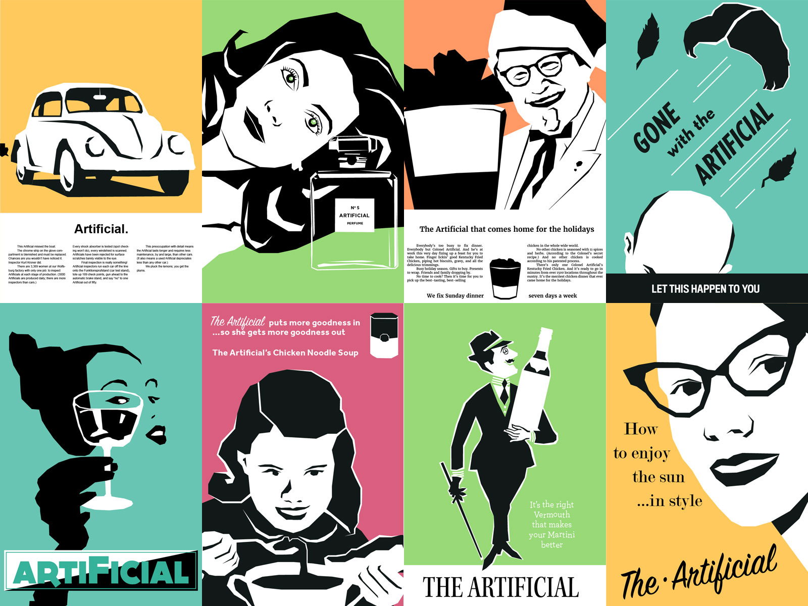
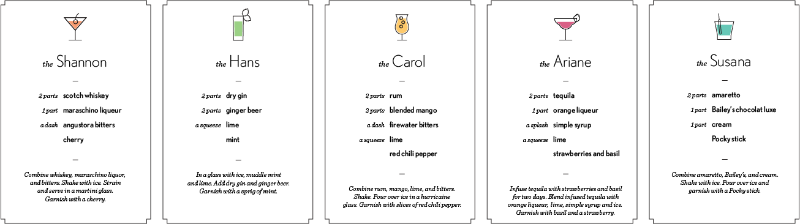
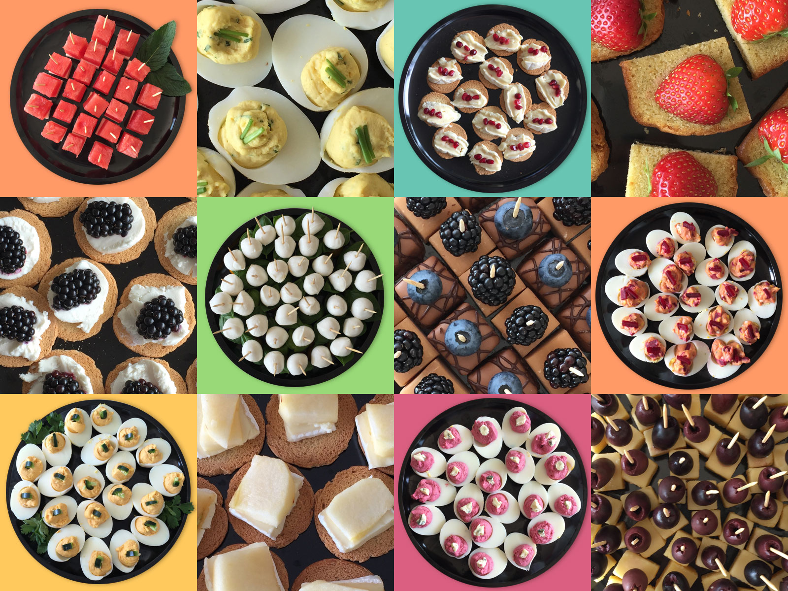
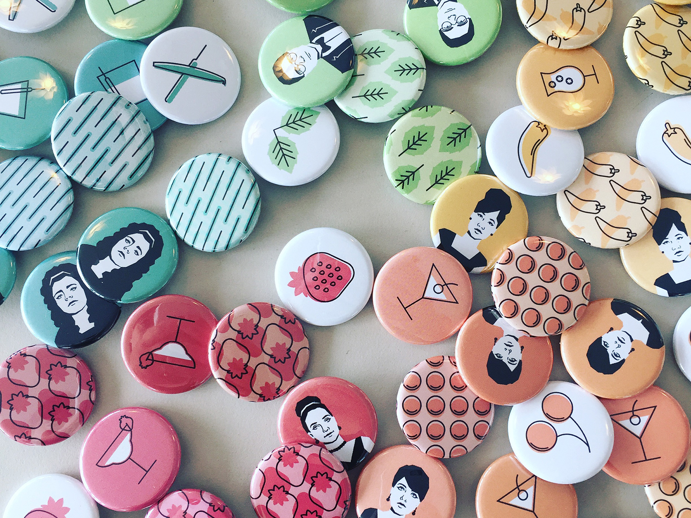
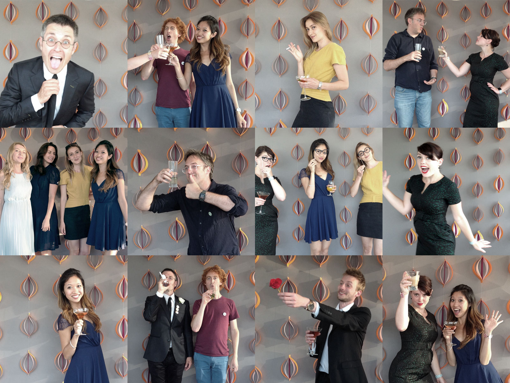

It's hard to believe that it's been almost a year since we [celebrated](/blog/2015/09/03/openingparty.html) moving into our new space. It's even harder to believe that The Artificial is already three years old. It seems like just yesterday that we were moving into our little garage with a handful of clients and small projects...

# Mad Women

We decided to celebrate by going back in time to Madison Avenue in the 1960s. This meant channeling our inner ad-women and creating some Artificial advertisements. Can you guess the original brands? 

# Eats and Drinks

No Artificial party would be complete without beautiful and delicious food and drink. For our third birthday, we created a cocktail for each of us, pre-mixed for easy consumption. As a takeaway, we created a recipe book for anyone wanting to recreate our concoctions at home. If you forgot to grab one, the recipes are below!

 

# Take Away

We also used our new button maker to create drink pins. Earned for trying the different drinks, it was easy to see which drinks were the biggest hits (and which drinkers were the thirstiest).

# Dressed to the Nines

With everyone dressed in their 1960s best, we had to have a photobooth. Our looks were completed with fake cigarettes, roses, and prop glasses.

Thank you everyone who celebrated our third birthday. We look forward to number four!
