Right after a scuba dive, I love to identify the fishes I encountered under the sea. For this purpose I downloaded a reference app called [**Fishes: East Pacific**](https://itunes.apple.com/us/app/fishes-east-pacific/id494644648?mt=8). Like an Herbarium collects plants, the app collects a database of specimens from the Pacific ocean with pictures and pieces of information. I find the app content rich, but the conceptual model is broken and the whole experience is not user-friendly. The project goals are to fix the inconsistencies across the app by clarifying the conceptual model, by simplifying the navigation, and by visually improving the look and feel. The concrete aim is to be able to find a fish without knowing its name, with fewer taps, and in a shorter amount of time.

This blogpost first dissects the original app to expose its issues and potential. In the second part, it proposes different fixes inspired by other existing apps.

#### I - App dissection

The current Fishes app conceptual model is unclear because feature definitions are mixed with each other. The information architecture suffers from the blurry concept definitions and becomes very repetitious. The interaction model is illogical and not intuitive. The spatial metaphor is currently working but would feel lighter by getting rid of superfluous elements. To find fishes, to read about them, and to bookmark them, this reference app offers two main functionalities: _search_ and _notebook_. The bad news is that there are a bunch of sub-functionalities complicating these tasks.

### Chaotic functionalities

 Lots of sub-functionalities parasitize the main task of looking for a fish. Searching for a fish is possible in the whole database or in the _diver subset_ group. I am still not sure what this last category means. Is the _diver subset_ only including fishes living in the range of depth of recreational diving? This division of the database is ambiguous.
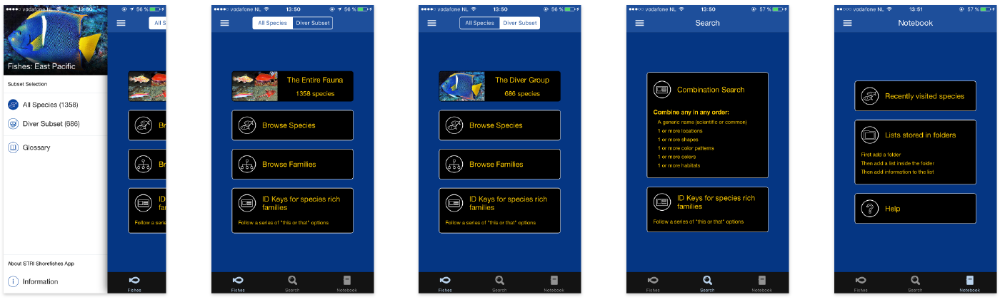 _current app - unclear functionalities_

Different options to find a fish:

-  _browse species_
-  _browse families_
-  use _ID keys for species rich families_
- _combination search_

If you _browse a species_, or if you _browse families_, you will get an endless list of fishes with their pictures and their names. If you opt for _ID keys_, you will have to choose between _Gobies (Gobiidae)_ and _Croakers (Sciaenidae)_, and then you will get…an endless list of fishes again! I just want to find the dazzling fish I met during my dive. I have no clue what those families are. Luckily, the _combination search_ offers more filters. I can refine my search with the fish name, location, shape, color, patten, or habitat. After selecting and filling filters, I get a reasonable list of fishes and I find the one I was looking for. Only two searches types are useful: by name (if you know the fish name or which family it belongs to), or by other criteria. Other search options should be removed.
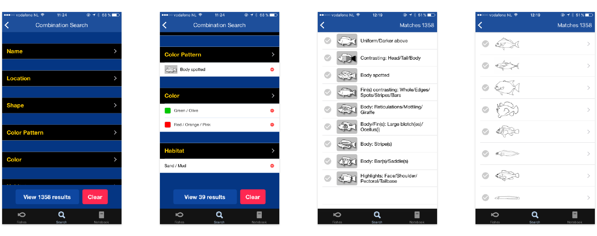 _current app - combination search_

The bookmark functionality is divided into _recently visited species_ and user's _folders_. To create your own collection of fishes, you need to go through tedious steps.  First you have to enter a folder title and save it. Then you get a message informing you that _your folder is empty_.

The notebook _Add a list_ button brings up three choices:

- _create an empty list_: creates an empty list, with a name, notes, date, and location. To add fishes, you will need to choose in the endless alphabetical list of fishes.
- _copy model list_: creates a list of fishes based on their location.
- _copy existing list_: duplicate an existing list.
To me, it makes little sense to create an empty list and then to go through the same tedious steps to find the fish I want to add to this list. What would be better is to be able to 'pin' a fish into my Notebooks directly from the fishes list or the fish card.

The main functionalities of the combination search and the notebook are not user-friendly. They are using vain groupings, and they present results in raw and massive lists. Sub-functionalities are adding steps to find a fish, and they make the experience unpleasant.
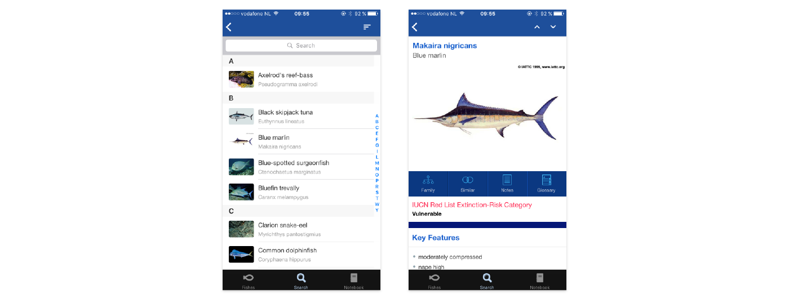 _current app - list of fishes and individual fish card_

### Labyrinthine architecture

Unclear definitions in the conceptual model create trouble for the information architecture. For instance _fishes_ should be the database including all fishes and their names, family, pictures, key features, category, description, measurement, and location. However, _Fishes_ is comprised of different ways (buttons) to look for a fish.  _Fishes_ and _search_ concepts are mixed up. They are so mixed up that you can find in both the same browse by _ID keys_ option. I believe the confusion makes the _fishes, search,_ and _notebook_ choices tabs menu irrelevant.  Search by name, _combination search_ , and _notebook_ are the core functionalities revolving around the fishes data-base. They respectively serve the most important tasks of the app: look for a fish knowing its name, look for a fish based on other criteria than name, bookmark a fish. _Combination search_ is currently lost in the the redundant structure under the search tab bar. It should be highlighted as it is the most interesting feature.

Another repetition occurs in the tab options in the navigation bar (_All Species_ or _Diver Subset_) and in the hamburger menu. The tray revealed by the hamburger becomes useless as it is just recalling the non-sense grouping of fishes.

The mental image I got the first time I opened the app was unclear. Almost every option leads to the same list of fishes. The navigation is sinuous and would really benefit from simplification.

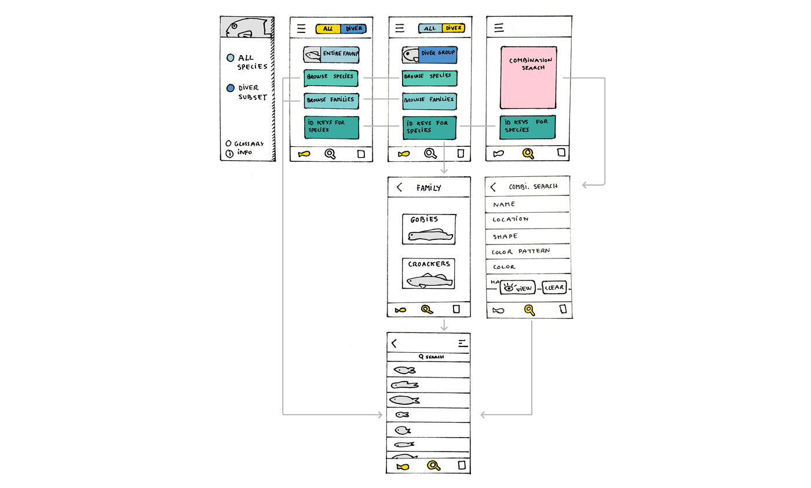 _current app - flow_

#### II - Solutions

 My original concern was to find that one fish I encountered during my dive among the 1358 species referenced without knowing its name. How do I improve the filter section and the navigation leading to it? To find solutions, I played the game of 'How would _________ (other apps below) fix the filter section and the architecture to help users finding fishes?' For instance, if Google search engine fixed it, the filter would be a search box in which you can type or dictate keywords (or even select options if the advanced search was used). If Apple's App Store fixed it, it would present curated fishes along with this week's most popular fishes.

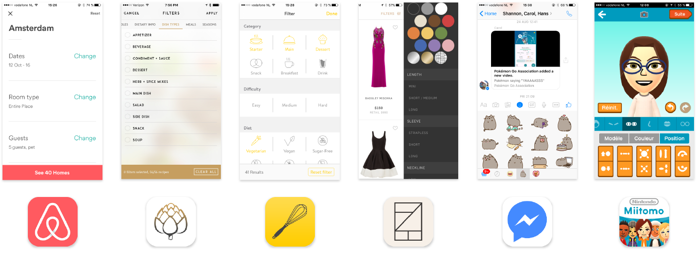
_The 6 apps I got inspiration from - Airbnb, Oh She Glows, Kitchen Stories, Rent the Runway, Facebook Messenger, and Miitomo_

### Independent filters and results

Independent filters and results consist of separating the filters and the results obtained in two different steps or areas. This solution gives space to user to really focus on the fish characteristics. The current Fishes app uses this model in which editing filters lives on its own page.

**Airbnb**

- pros: I love the negative space in the layout; some fresh air!
- cons: I imagine the long way (4 levels) required before I can tap on the correct locations.

_Air BnB inspired solution - one filter one page_

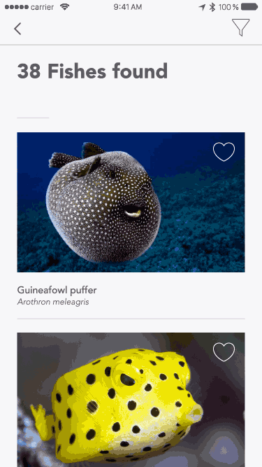{: .small-centered}

**Oh She Glows**

  - pros: 2 depth levels only! I also like imagining sliding horizontally and vertically on the same page to edit my filters.
  - cons: I am not sure the tap zones of the carousel are big enough to be comfortable. To be tested.

_Oh She Glows inspired solution - carousel and lists_

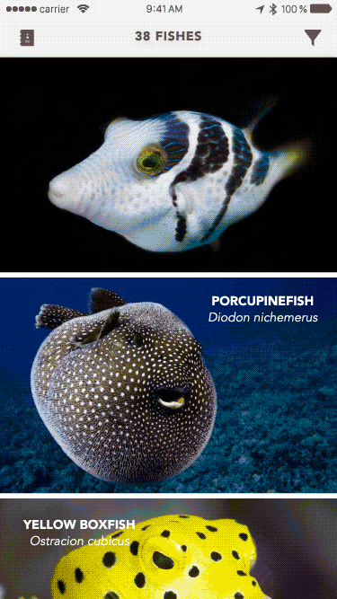{: .small-centered}
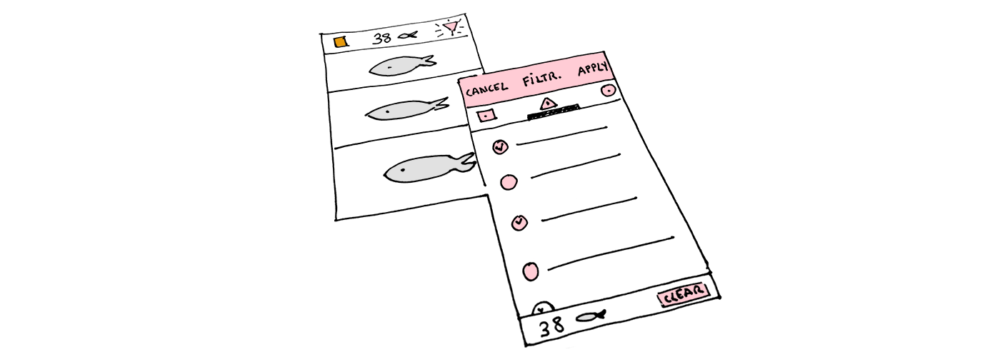

**kitchen Stories**

  - pros: Most filters can be reached within 2 levels, except for the long list, it comes to 3 levels. The apps feels scientific and reliable.
  - cons: I find it a bit inconsistent that long lists have a different treatment (sub lists opening in a new level).

_Kitchen Stories inspired solution - hybrid lists_

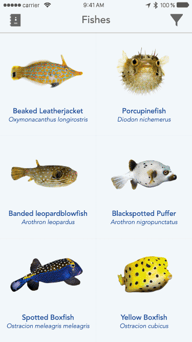{: .small-centered}
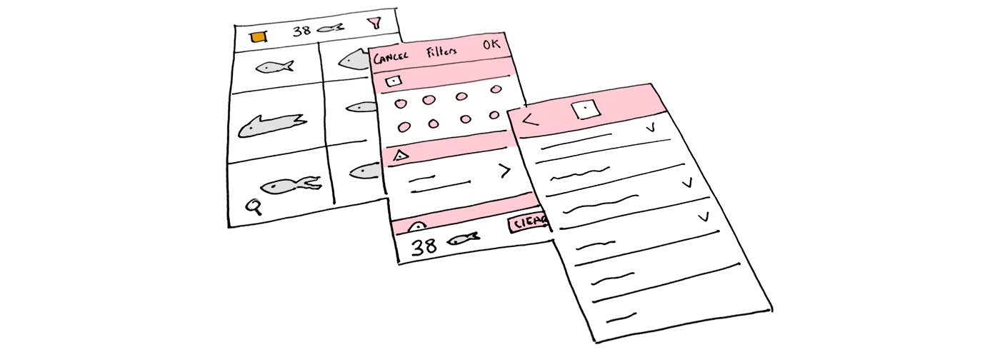

Independent filters live on a separate level of information, allowing a nice layout with lots of negative space to breathe. The issue is that users need more effort to find their fishes. Aside from requiring more taps, independent filters also require the model to be simple enough for them to enjoy the experience of navigating between the fish area and the filter area(s). My favorite option is **Oh She Glows** because of the few depth levels. I feel it's quite nice to be able to scroll horizontally to pick a filter and to scroll down vertically to tick all the applicable fields.

### Direct feedback filters

Direct feedback filters are combining the research zone with some results. It allows seeing in live time what you are editing. What if I tap on this button? Oh, no, my fish did not have a giraffe pattern on his body. In those solutions, results update simultaneously when filters are touched.

**Rent the Runway**

- pros: I love that filtering happens in a left tray within the same screen than the results. I imagine the good feeling of seeing new relevant fishes matching my new criteria. I also find filters funnier to use when they use icons or illustrations.
- cons: What if I only want to see fishes from Guadeloupe? It seems like a long scroll to the location section of the filters.

_Rent The Runway inspired solution - scrollable tray_

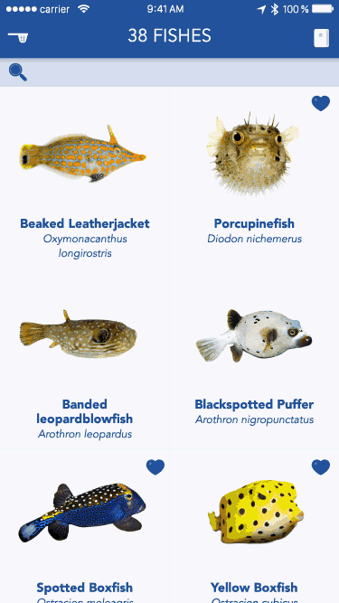{: .small-centered}

**Facebook messenger**

  - pros: A maximum of 3 depth level to reach the long lists filters is not too bad. I would love to use a fish identification based on a picture.
  - cons: long lists have a different treatment again (sub lists opening in a new level).

  _Facebook messenger inspired solution - keyboard_

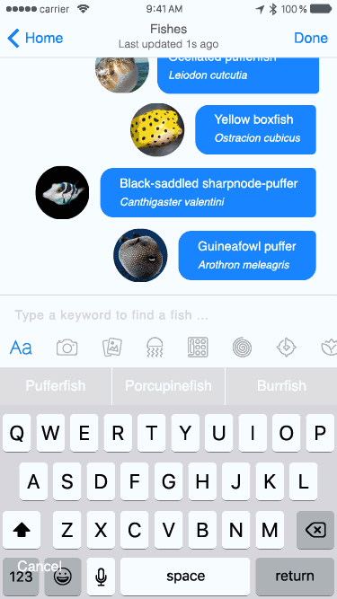{: .small-centered}

**Miitomo**

- pros: I would like to see my fish in 3D and I would love to build it from scratch!
- cons: I believe it takes while to draw the portrait of the fish. If the result is not the fish I was looking for, I already feel some frustration growing.

_Miitomo inspired solution - model your fish_

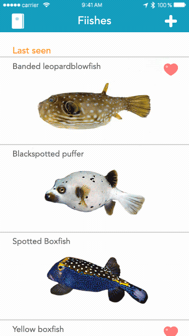{: .small-centered}
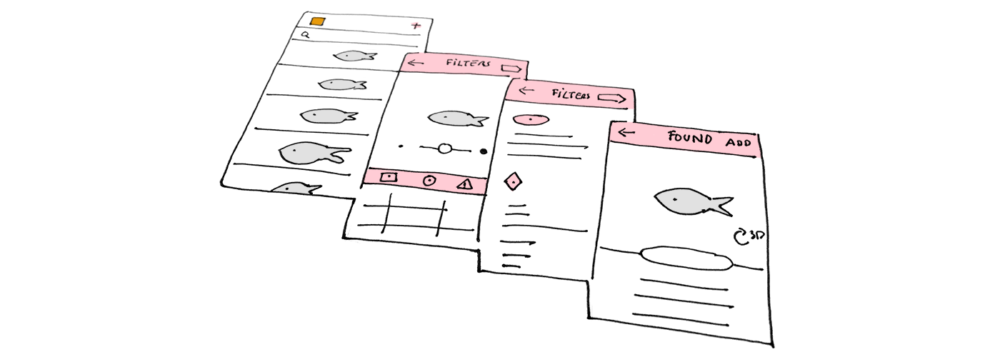

Direct feedback filters are either showing results as soon as filters are touched, either changing the appearance of the model fish. **Miitomo** fish creation from scratch seems as amusing as designing a Mii avatar; but I am not sure this solution is the most time efficient. I really love how simple **Rent The Runway** made the app. I also think it's quite useful to always see 3 matching fishes.

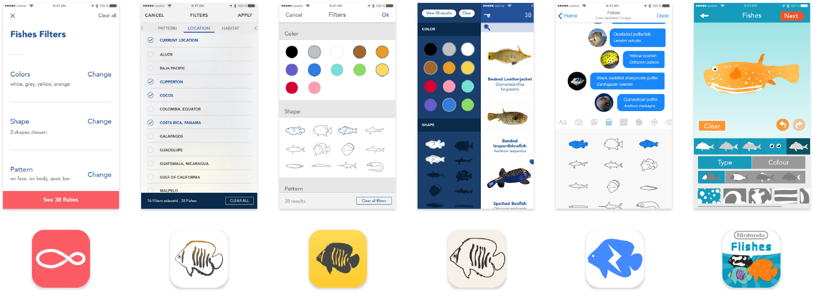

To put in a nutshell, _combination search_ filters are amazing search tools to help users finding a fish without knowing its name. Such filters could extend to most of other reference-style apps using images. For instance, the filter system would be helpful to find plants, minerals, animals, objects, or even people. Those six solutions inspired from existing apps are transferrable to other reference apps; however, they don't replace text-based search. My two favorite options are **Oh She Glows** and **Rent the runway**. I like both for having a reduced level of conceptual depth, thereby using clear spatial metaphors. **Rent the runway** is more playful and could seduce a broader range of users like kids. Which solution do you prefer, and why? Share your thoughts with us on [Twitter](https://twitter.com/veryartificial).
