The Apple Watch is a beautiful and powerful piece of hardware accompanied by incredibly useful software. Now running software on its third iteration, it’s time to make the beauty of the software match that of the hardware.

WatchOS 3 brought some changes to the familiar interface. Most notably, Glances and Friends were removed and the Dock was introduced. WatchOS 3 also made it possible to switch between multiple watch faces. We redesigned the interaction of multiple watch faces (and complications) as an exercise. This is an overview of our results.

## Beautiful alone, imperfect together

There is no doubt that Apple Watch faces are [beautifully designed](https://www.wired.com/2015/04/apple-watch-design/). The details of each face are painstakingly considered and executed with the utmost care; however, with the introduction of multiple watch faces in the new WatchOS, it is obvious that the watch faces were designed to be perfect when standing alone, not when viewed with others.

Looking first at the digital faces, the time itself jumps a few pixels up and then a few more back down when switching between the Photo, Motion, Astronomy, and Activity watch faces. Only the Activity watch face offers the long-format time (in a notably non-standard version of SF Compact), while only the Photo and Photo Album faces allow the user to switch the time between top and bottom layouts.

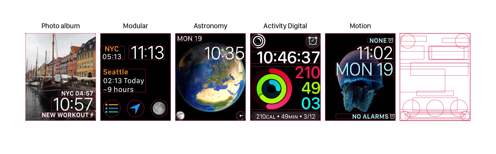

The analog faces have somewhat more consistency, but still the ring of numbers bounces up and down while the allowed complications vary (somewhat unpredictably) per watch face. In addition, the Chronograph and and Activity watch faces have unique inner elements; Color offers a monogram option; Simple, Utility, and Chronograph allow for the date within the face and Activity requires it.

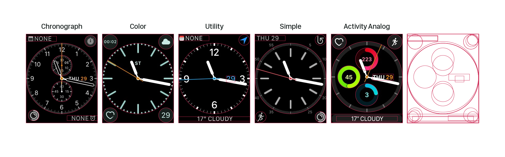

## Unifying the Grid

At a glance, the different watch faces have more in common than not. The digital faces all have the time in large type positioned with the baseline about 33% from the top of the screen. We started here, and then created variations across faces for top and bottom text placement and consistent complication arrangement. In the case of Activity, we found that by treating the activity visualization as a complication, a similar layout could be created with the Modular watch face.

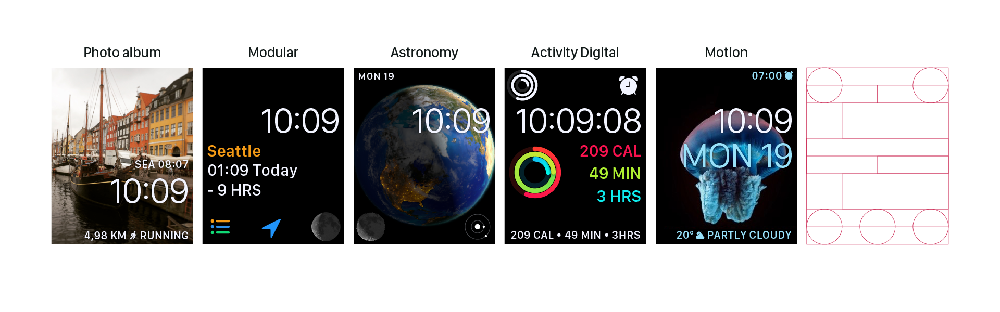

Getting the analog watch faces on the same grid was simple compared to the digital faces. Here, however, we took on the additional challenge of making the Activity and Chronograph features into complications that could be used across all faces. We also shared the monogram and date complications across all analog faces.

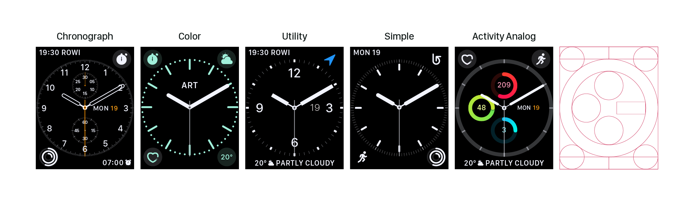

To avoid locking a user in a world of either digital or analog, we aligned the two grids. Ten rows of 39px or 34px (depending on screen size) create a vertical rhythm across faces, with the complications fitting nicely into the corners across all. Now the user wanting the date always in the top left can do so across all faces without any format changes or jumps.

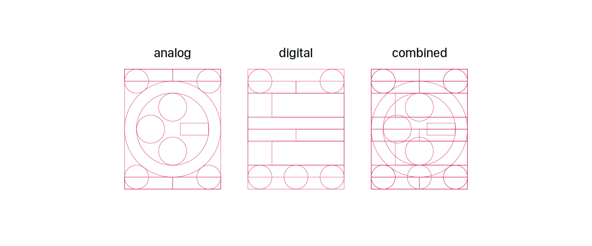

## Freeing complications

With the current WatchOS, choose a watch face and you’re also making decisions about the complications you can use on that watch face. Apple currently has [six non-interchangeable complications](https://developer.apple.com/watchos/human-interface-guidelines/app-components/): Circular, Modular large, Modular small, Utilitarian small, Utilitarian large, and Extra large. Many of the complication types bear the names of the faces they match – though their use extends beyond only those faces.

Many additional complication-like details fall outside the realm of complications. Items like Date and Monogram have special treatments that are inconsistent across the watch and phone customization interfaces; activity is considered so special it has both a unique digital and analog face devoted to it; and chronograph has its own face as well.

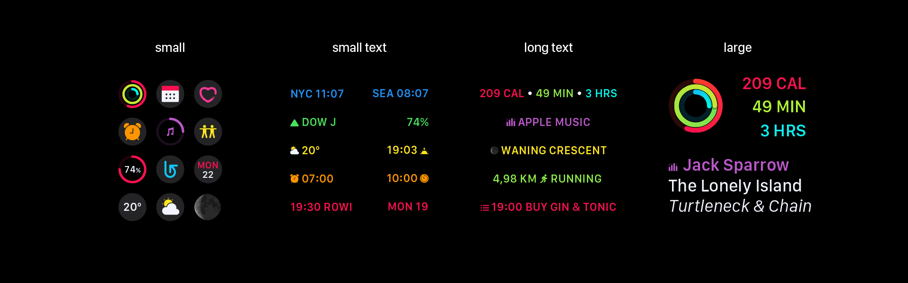

We simplified Apple’s six types of complications into only four: small, small text, long text, and large. With this system, the complication-like visualization from the Activity digital face is treated as a large complication.

To further simplify watch face customization, small and small text are often interchangeable, providing several visualization options for the same information. These complications behave in much the same way as the existing WatchOS complications when it comes to color customization.

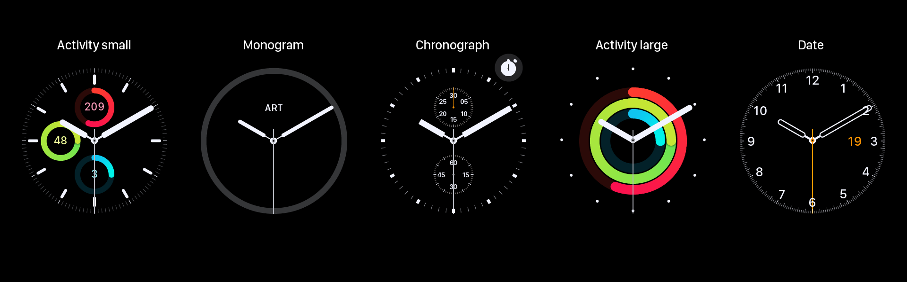

From here, we extended the complication to include all complication-like details from the analog faces. This resulted in a fifth type of complication available (only on analog faces): the inner complication. This means rather than having watch faces specific to Chronograph and Activity, these are complications available across watch faces. It also means the monograms and dates are available across faces.

## Adding new styles

The strong overall grid established a system for faces and complications. We took this grid a step further, using it to create a radial grid to be used across the design of analog watch faces. We used this grid to align numbers and tick marks, creating uniformity across the seven radial faces.

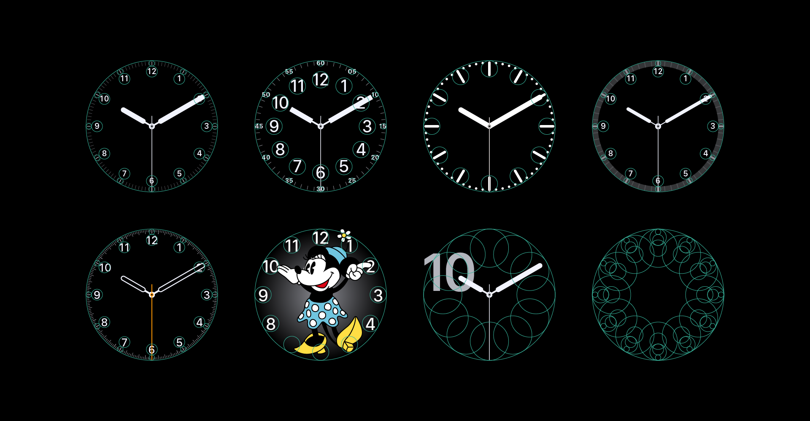

Having established this strong multi-grid system, we looked for where we might push the existing styles, starting with the hands. With the exception of Mickey (and Minnie) and Chronograph, the analog watch faces all used the same hands, often in styles conflicting with the ring of numbers. We then redesigned the analog faces in multiple layers from the hands up.

Faces like Utility and Simple had multiple levels of complexity, while other faces like Color and Activity had only a single option. We opted to give all of the analog faces (except Mickey, Minnie, and Numerals) similar levels of complexity, focusing not only on the build-up within the individual watch faces, but also on the variety provided across watch faces. For example, Classic offers only hands at the simplest level, Sport has a non-segmented ring, Bold and Dots provide stylized tick marks, and Chrono offers only numbers. Similarly, each watch face takes a different yet appropriate twist on complexity.

Finally, the old names no longer made sense, especially with the relegation of activity and chronograph elements to complications, so we renamed the faces to be more visual-oriented.

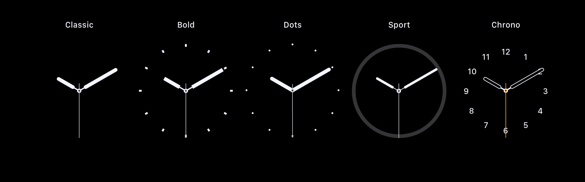

We found opportunities in the digital faces as well. The Extra Large face seemed like a missed opportunity, so we doubled down on its extra-largeness and celebrated the numbers in the same series of styles created by the Numerals (analog) face. In our system, we allowed Extra Large to be somewhat of an exception – filling the entire grid without room for complications (and without the alternative layout allowed by the current execution).

At the same time, we sized down the Numerals face to fit within the same grid as the other analog faces. Where the current execution allows for a single complication that bounces around depending on the time (and therefore location of the big numeral), our execution enables the user to select multiple complications that will always appear in predictable locations.

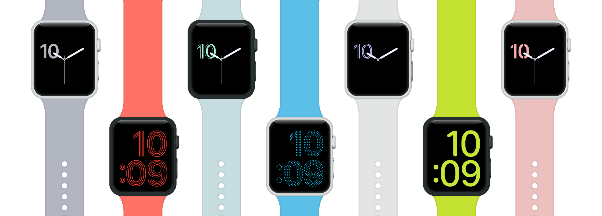

## Infusing color with meaning

The Apple Watch’s color story is a confusing one. The HIG has a small number of recommended colors which are widely used, but also widely broken. The green used to show activity, for example, is close to but not quite the green used to show battery, which uses the official green from the palette. To add to the confusion, the watch faces with customizable colors come in more colors than the watch has bands, with palettes that vary per face.

We audited the colors used across WatchOS, and then created a new extended system of colors based on the original palette and inclusive of key colors that fell outside that palette. Our palette also uses white and a number of opacities not shown here.

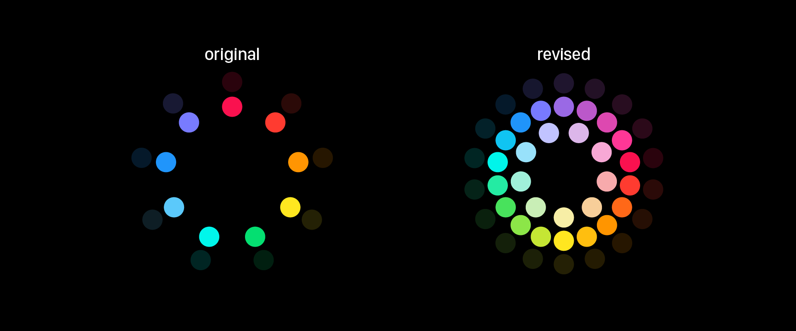

A broader palette creates opportunity for misuse, so we created a meaningful system to color coordinate the default complications. This system takes into account the user’s existing color vocabulary established by current color coding, iOS app coloring, and cross-platform standards (such as weather).

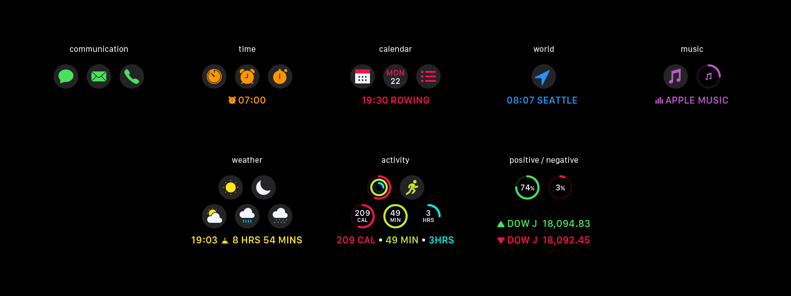

We also looked at each individual watch face to see how color might best enhance it. For the most part, we used the existing system here, though our new detailed analog faces required some new rules.

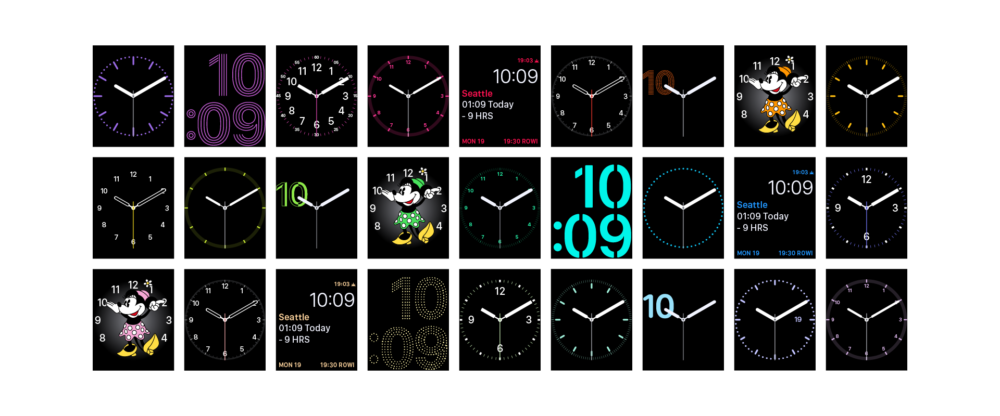

## Making more with less

To create a new watch face, the user must first select a face type. We have sixteen (one fewer than Apple). For faces like Photo, Photo Album, Timelapse, or Motion, the user selects a background before choosing a digital time layout – top or bottom, long or short. For analog faces, the user adjusts the complexity of the style. Both analog and digital faces have multiple complication layouts. The user first selects the layout, and then chooses which complications occupy the available spaces. Lastly, for those faces that allow it, the user customizes the color.

Design systems allow users to have more power often with less complexity. Our Apple Watch face design system increases the number of watch face options users can create while simplifying the process through consistency. Furthermore, a greater possible diversity in watch faces feels less random as all faces work together across a single consistent grid.
