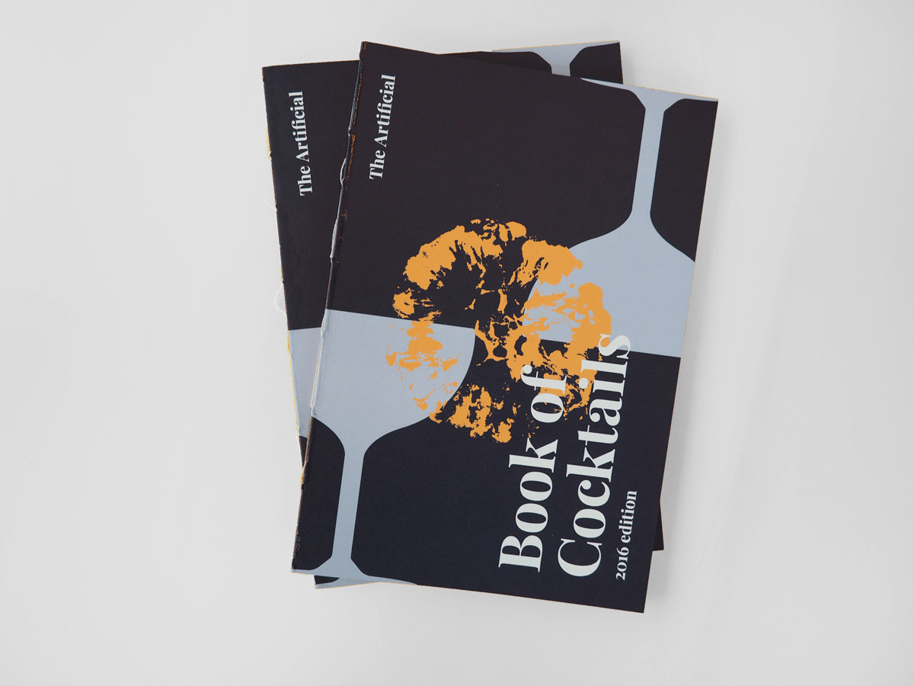
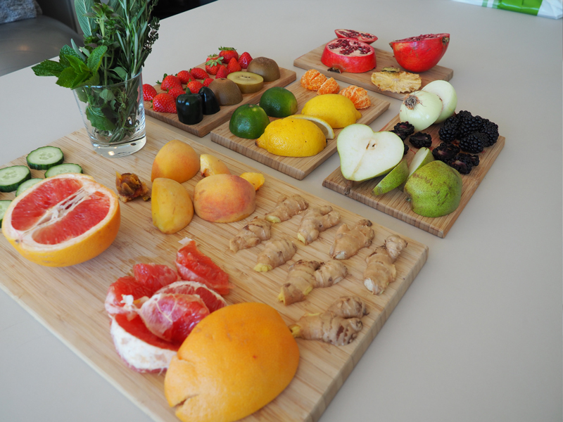
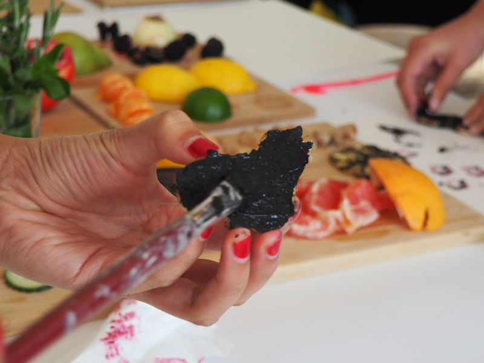
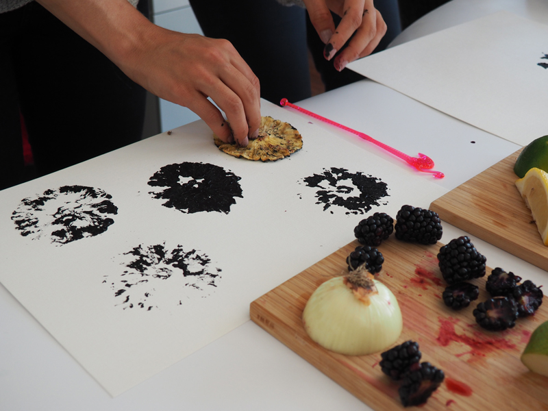
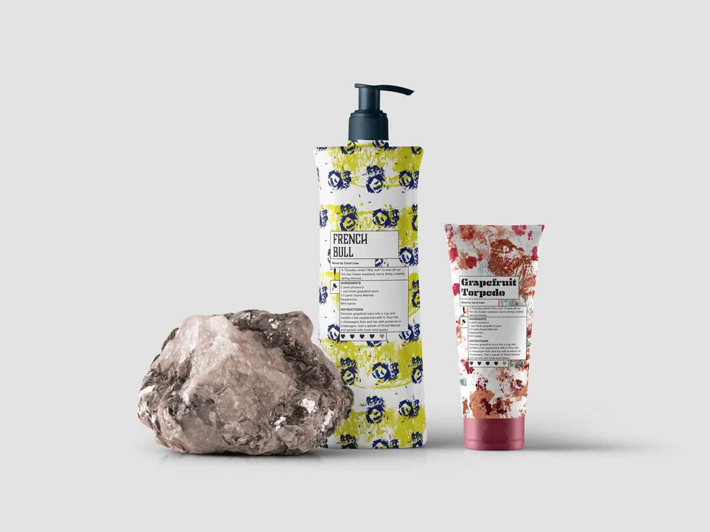
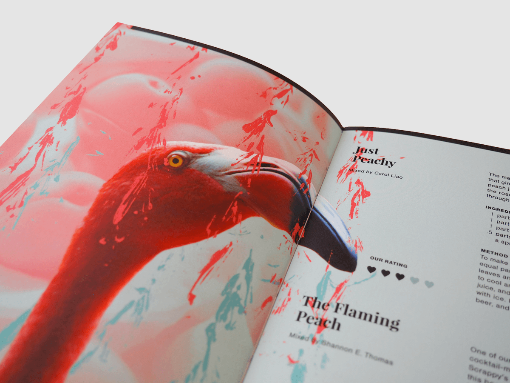
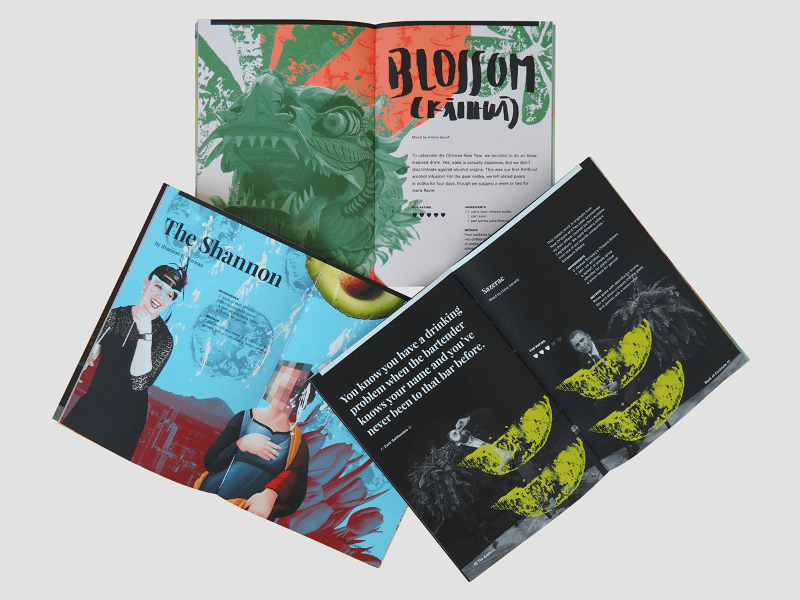

This year, we decided to treat our clients and friends with a very special Christmas gift, a collection of our Friday cocktails.

#This is how we made the book

We started off by analyzing other cocktail books. What works, what not? Which colors? Which typography? How can we make ours different?

We all love cocktails and for us, each one of them has its own personality, the ingredients we use is what makes them unique.

When mixing it, it is very important to have the right amount of each of the ingredients, it is what defines the taste of it. Each ingredient has its own characteristics and once they are mixed they create something tasty and beautiful.

Because we are a UI/UX studio a lot of people would think that we spend most of our time behind the screen, but not at the Artificial. We try to start our projects by doing research, sketching on our notebooks, looking for materials, exploring different ways to show what we want and making decisions together.

In this case, we decided to create patterns using only ingredients we had previously used to mix our cocktails.

After the first round of sketches, we found out that the patterns by themselves were not going to cut it, the spreads looked like soap packaging and that does not represent us as a studio.

So, we decided to add images to make it more personal and to use collage as the technique for creating our book.The beauty of collage is chaos, and how with the right images and proportions you can give the illusion of three-dimensionality to a flat canvas, it also allows you to combine different elements and styles and to create harmony within them.

But creating consistency was a bit of a struggle, as they were not meant to stand alone we had to somehow fit them to one publication. In order to achieve this, we treated the images in the same way and we created a color palette to unify them. We divided the book into three sections: The Experiments, The Classics, and The Signatures.

For me, the biggest challenge was to get to know everyone at the Artificial a bit better, to be able to express our personality throughout the book. We all like whimsy stuff, hand lettering, colors, animals (although some of us have allergies), illustrations, typography, writing and of course, cocktails.
