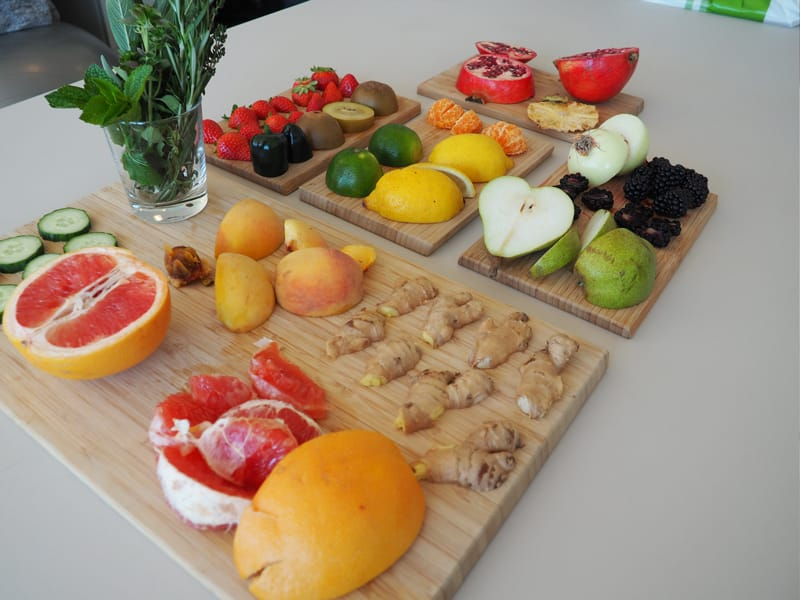
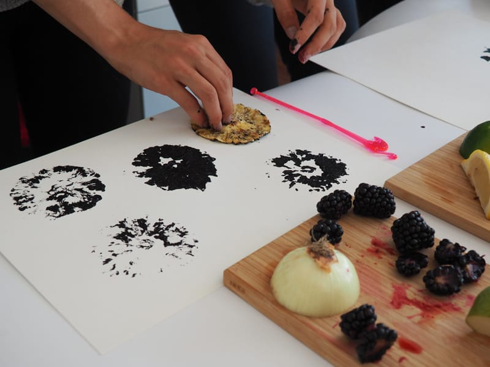
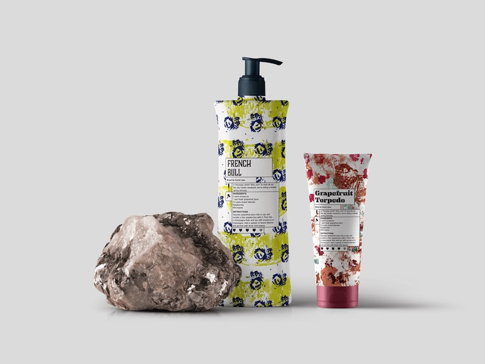

This year we decided to treat our clients and friends to a very special [Sinterklaas](/blog/2014/12/05/stnicholasday.html) gift, a collection of our Friday cocktail recipes.

## Defining a Style

We started off by analyzing other cocktail books. What works and what doesn't? What colors and typography are popular? How do others balance utility with style? Where should we copy, and how could we make our book of recipes different?

Because we are a UI/UX studio a lot of people would think that we spend most of our time behind the screen, but not at The Artificial. We start our projects by doing research, sketching in our notebooks, looking for materials, exploring different ways to show what we want, and making decisions together.

We all love cocktails, and each one of them has its own personality. Our mixology experiments usually start with an ingredient or a flavor we want to try, and we used these ingredients as the foundation for the presentation of each recipe.

In this case, we decided to create patterns using the ingredients we used to mix our cocktails.

## Refining Each Recipe

When mixing, it is very important to have the right amount of each of each ingredient; different proportions result in different tastes. Each ingredient has its own characteristics that need to be considered so that they can be mixed to create something beautiful.

The same can be said for layouts.

After the first round of sketches, we found out that the patterns by themselves were not going to cut it. The spreads looked like soap packaging, a look that does not represent us as a studio.

So we decided to add images to make it more personal and to use collage as the technique. The beauty of collage is chaos, and with the right images and proportions we could give the illusion of three-dimensionality to a flat canvas. It also allowed us to combine different elements and styles and to create harmony within each composition.

## Pulling Everything Together

But creating consistency was a bit of a struggle; as the spreads were not meant to stand alone. We had to somehow fit them into one publication. In order to achieve this, we treated the images in the same way and created a color palette to unify the pages. We then divided the book into three sections: The Experiments, The Classics, and The Signatures.

For me, the biggest challenge was to get to know everyone at The Artificial a bit better, so to express our personality throughout the book. We all like whimsical stuff: hand lettering, colors, animals (although some of us have allergies), illustrations, typography, writing, and of course, cocktails.
