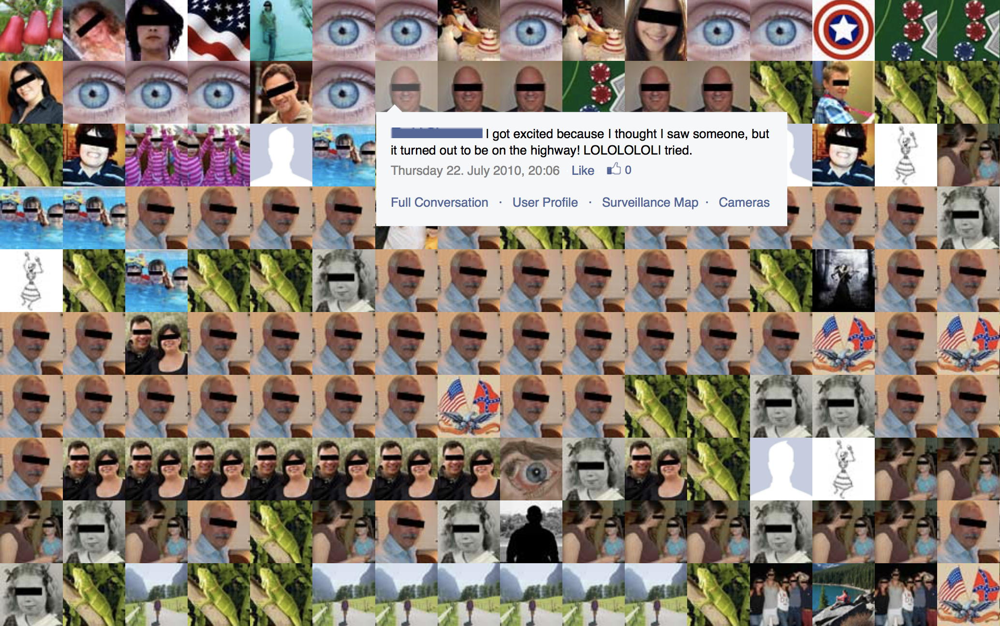

We've just wrapped up a week in Belgrade, a majority of which was spent at [Resonate](http://resonate.io/2017/). Aside from the meta-thoughts about how to run a conference – presentation synopses are helpful, panelists should at least appear to be aware of the panel's topic, and venues should have ample space and WiFi – there were a number of fun facts and provocations that we'll be taking home with us.

# 01

[Régine Debatty](http://we-make-money-not-art.com/about/) spoke about a number of intertwined topics, jumping from one to the next guided by the thread of her curiosity. Most topics had something to do with the unseen or the underground, and she shared many fun facts from the many bunkers of Switzerland disguised and painted to look like chalets to the exploitation of the people in the mineral-rich Democratic Republic of the Congo.

More than any specific thought, Régine's talk left me more determined to follow my curiosity to strange and unforeseen places.

# 02

[Julie Freeman](http://www.translatingnature.org) discussed how poachers can follow safari goers' Instagram posts to find elephants, rhinos, and other creatures with valuable parts, raising the question: _Should animals also have privacy?_

I would take this a step further to ask: _How can we ensure animals' privacy?_ Surely if Facebook's algorithms can protect us from dick pics, they can also protect animals from poachers.

#03

Another fun fact from Julie Freeman's talk is about [naked mole rats](http://rat.systems/colony/), who establish and maintain dominance by running over the tops of other naked mole rats. In a naked mole rat colony, only the queen is able to reproduce. While all female naked mole rats _can_ reproduce, they are forced into sterility by the queen's dominance.

It's a fun fact in itself, but Julie brought up a more interesting thought: _What might happen if our social structure had specific breeders that could take away others' ability to breed?_ I also wonder (perhaps more provocationally): _How do certain members of societies metaphorically "run over" others to suppress their freedom??_

# 04

[Yosuke Ushigome](http://www.yosukeushigo.me) showed a number of his works that deal with the relationship between the human and the user. One of his more amusing speculative design pieces used accent transfer to facilitate a conversation between a Japanese driver and a British passenger. He also looked at how body language is a part of communication.

All of these nuances of human communication made me wonder: _What opportunities are we missing as we design conversational interfaces?_

# 05

Ava Aghakouchak and Maria Paneta showed their thesis work about soft, wearable interfaces that light up and inflate.

This made me think about how wearable interfaces can serve as communication both to the wearer and those around her. How might we design these simultaneous and discrete communications in ways that don't conflict with one another?

# 06

[Alan Warburton](http://alanwarburton.co.uk) showed clips from a variety of CGI productions. Most notably, he distinguished between how the commercial creations benefit from having a lot of money and therefore fidelity, but little flexibility on aesthetic: they must appear real to appeal broadly to audiences. Conversely, more experimental creations have a fidelity that matches the lower investment, but are able to be more experimental when it comes to aesthetic.

When it comes to user interfaces, the same might also be said. Large companies can spend large sums creating reliable interfaces, but they are often held back by needing to create according to established UI patterns. Smaller companies often create less-reliable interfaces but can afford to experiment more. Perhaps we get innovation when the large companies take the patterns established by small companies and codify them into their experiences.

# 07

[Joana Moll](http://www.janavirgin.com) presented work that looked at hacking not only digital and data systems, but also human systems. In her piece [The Virtual Watchers](http://www.virtualwatchers.de/) she looked at the communities of people voluntarily patrolling the US-Mexico border via a crowdsourced video platform, and then interacted with them via Facebook groups.

This project made it clear how easy it is for social hackers to track down and potentially influence those outside the progressive bubble.

# 08

Dimitri Hegemann provoked with a question I've often considered since I left my hometown of St. Louis for the more culturally influential cities of Seattle and then Amsterdam: _How can we convince artists to live in smaller cities and suburbs so that we can more evenly distribute culture?_

Though perhaps a bit misaligned with the panel topic of _algorithms_, the question remains a relevant one, and one related to many of my own thoughts after the politics of the last year. If we continue to be solely focused on smart cities (or making cities smarter), aren't we only exacerbating the current disparity that separates the liberal cities from the conservative everything-else?
