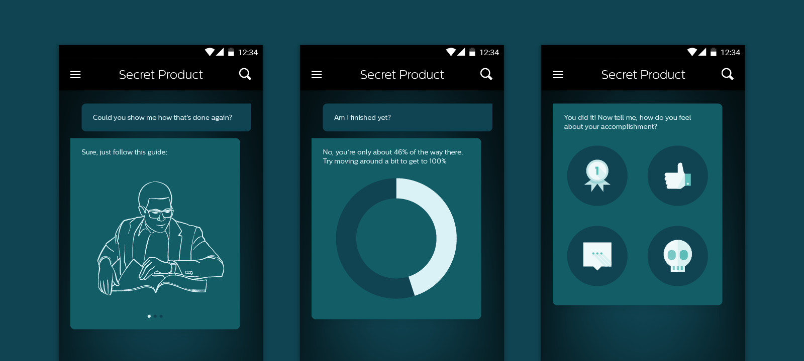

For the past six months, we’ve been designing an app for a product that doesn’t already exist on the market, and that likely won’t be ready for consumers for another year or two. The product itself is understandably super secret, but the story is interesting even if you don’t know the details of the main character.

Our engagement began fairly early in the process. While design was already being iterated on and tested with users, the feature set and hardware were still up for influence. Our first goal was to better understand the relationship between the product and the user, both of which only barely exist.

***Where do you start when there is no competitor to look to for inspiration and when there is no best-in-class experience to beat?***

The product replaces one of the humans in a two-person experience, so we began by observing that experience. We documented the key moments across several users’ experiences and documented their positive or negative affect throughout. We then observed the moments and reactions of users with the existing product. We aggregated and overlaid these experiences to highlight gaps in the new product’s feature set as well as to better understand the deltas in how the users perceived their experiences (with the human versus with the product).

To summarize the experience without giving anything away, the human/product guides and inspires the user through imagery, the human/product performs the service, and at the end the human/product makes sure that the user is happy with the result. Breaking the experience into these discrete pieces made it easier to then look at similar features in other products.

Had we just looked at the individual features, it would have been easy to mash up an instruction manual with an image gallery and a rating system and call it a day. But this experience felt bigger than a simple feature set. The trees were tempting, but the forest was more interesting.

So we stayed focused on the human version of this experience. What does the human provide to the user beyond clearly defined actions? Support. Advice. Reassurance. He convinces. He commiserates. He seeks the user’s feedback. He reacts accordingly.

We experimented with many different approaches, and came to the now-obvious conclusion that the best interface to create a human-like interaction with the user was a conversational UI. Then we ran into a new problem: most of the examples of conversational UI that we found were being used to sell products or to provide customer service.

So we did what we always do, we tried some things and made some mistakes. And then we wrote about our experience so that others could learn from it:

## Know Your User’s Attention Level

One of the biggest misconceptions is that conversational interfaces are chatbots. Chatbots are typically AI that aim to be very human, and like a human on the other side of any text conversation, they require a good amount of attention. When designing interfaces for connected products, it’s common that we don’t have the user’s complete attention. He’s often focused on the product or the experience and not the screen. He may even be using his hands in other ways than tapping on glass.

In needing to optimize for these sorts of scenarios, we found it was important that we carefully consider every demand our algorithm made on the user’s attention (and fingertips). When asking a question, we’d ask _Do we absolutely need this input?_

In most situations, we also decided against free-form text entry, opting instead for pre-set answers. In choosing the potential responses, we asked ourselves _How few choices can we give him and still make it clear that he’s in control?_

Of course there are places in the experience where we wanted to give our user the opportunity to express himself. We made sure that these moments occurred during low-intensity parts of the experience where he could give the interface his full attention. Then we gave him the opportunity to express himself not just with text, but also with photos.

## Communicate beyond Words

It would have been easy to assume that, because we were designing a conversational interface to replace a human, our interface should only communicate as a human would. While our early explorations had much more of the back-and-forth of a traditional conversation, we quickly realized that we should take advantage of having a screen and a computer and data. After all, humans communicate with more than words – we use body language and facial expressions that AI can’t yet compete with.

The conversation we designed with our user became multi-dimensional as we added in data visualizations, 3D renderings, photos, videos, illustrations, and more. We even went so far as to add non-language ways for the user to provide feedback to the interface. But still, the focus was on the steady back and forth, action and response.

## Define Rules of Conversation

Designing a conversational interface goes beyond designing the interactions of having conversations or the look and feel of the bubbles. To design a conversational interface is to design the rules of engagement. Is the AI funny or serious? Does it call the user by his name? Does it pretend to be sad when something goes wrong? Does it use emoji?

And then more broadly, when does the AI communicate what and how? When does it use non-verbal communication? When does it inform, and when does it ask for a response? When does it make the user wait?

Defining the rules around how the AI uses the interface is as important as designing the interface itself. While the interface empowers the AI to communicate in potentially innovative ways, designing a solid ruleset around how that AI engages allows it to live beyond the single interface it was born in. The AI could live on other platforms like Facebook or iMessage and could perform marketing or customer support experiences.

And who knows, the rules that govern the AI could even provide direction to humans performing similar functions.

While we predict that the conversational UI trend will continue to grow, it’s important to remember that not all UI needs to be conversational. Consider the experience you’re trying to create. If it couldn’t be handled through a conversation in real life, it’s probably not going to magically work when translated to a screen.
