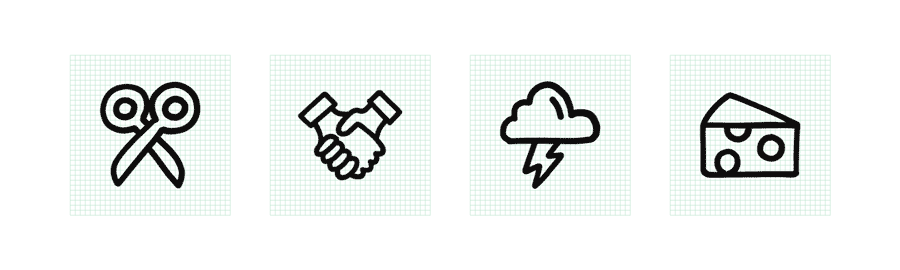
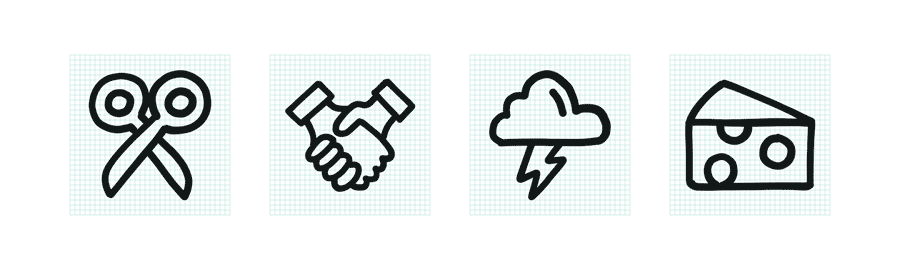

It’s been three years since we launched [to [icon]](http://www.toicon.com/). Since then, we’ve added new features like [collections](http://www.toicon.com/collections/), new series like [Hatch](http://www.toicon.com/series/hatch/) and [Feather](http://www.toicon.com/series/feather/), and even new artists like [Ariane](http://www.toicon.com/authors/ariane/) and [Katinka](http://www.toicon.com/authors/katinka/). But there’s one thing we’ve been putting off: a hand-drawn icon series.

Why are hand-drawn icons such an intimidating endeavor? For to [icon] we’re committed to creating icons that are pixel perfect, series that are internally consistent, and assets that are clear of extraneous anchor points. Hand-drawn forms are inherently not pixel prefect and the anchor points created by hand make for complex assets that aren’t easily tweaked or manipulated. We're also committed to creating series of icons that can be used together, which means balancing the imperfections of the hand with logic and rules to create consistency.

While the final series feels of the same quality of the other icons on to [icon], in almost every way the process of creating a hand-drawn icon series is unique. This is exactly what this tutorial will focus on: creating a series of beautiful and consistent icons in your own hand.

_Note: We used an iPad Pro, Apple Pencil, and  [Adobe Illustrator Draw](https://www.adobe.com/products/draw.html). There are other tools you could use, but we found these the best at capturing the hand’s inconsistencies in pressure, direction, and speed._

# 1. Collect and Trace
When doing a traditional icon series, it’s common for us to spend up to 50% redrawing and perfecting icons. That work has to be done up front for a hand-drawn series, where digital editing is not only difficult, but often results in spoiling the essence of hand-drawing. Starting strong is a must.

**Create a reference sheet with existing icons.** Select the metaphors you’d like in your series, and choose forms that follow similar rules (flat versus dimensional, round versus pointy , narrow versus wide, etc.). You might find multiple forms for a single metaphor – the more the merrier!

Resize all of the icons to fit the grid you’re designing to. If you’re working small (32px or smaller), consider sizing your base icons at 200% to make it easier to trace them.

Pull this reference sheet into your vector sketching tool and begin tracing.

# 2. Curate and Iterate
Once you’ve traced all of the forms on your reference sheet, make the reference sheet invisible and print your sketches at the actual size you’d like the icons to be – for example, if you drew at 200%, print at 50%.

**Review the sketches for the strongest metaphors and the best executions.** Which are working and which aren’t? When it comes to curation, it’s a good rule of thumb to cut 20% of what you create. I tend to cut closer to 50%.

Repeat steps 1 and 2 until you’re happy with the set of metaphors you’ve collected.

# 3. Create Rules
Take a look through your initial sketches to identify what’s working and what’s not working, and **decide on a series of rules for the final icon series.** Some things to consider:

- Level of detail
- Open vs. closed shapes
- Line quality
- Icon angles
- Use of flourishes (dots, dashes)
- Representation of light
- Representation of depth
- Repeatable forms (arrows, hands)

Once you’re confident in your rules, it’s time to draw what will become your final icons.

# 4. Trace Multiple Versions
**Create a new reference sheet using the sketches from steps 1 and 2.** On this sheet, copy and paste each sketch at least twice, adjusting angles and sizes as necessary. Pull the reference sheet into your vector drawing tool and begin tracing, this time following the rules you established in step 3.

Drawing each icon multiple times not only allows you to try different things, it also ensures that the weaker drawings won’t make their way into your final icon series.

# 5. Select the Best
Make your reference sheet invisible and print your forms again. **Examine them as a series and as individual metaphors.** Allow your intuition to make snap judgements about which icon drawings are weakest and remove those first. Then review all of the remaining drawings systematically and choose the strongest of those that you drew.

**This is a good point to invite a friend into the process** so that you can have a second point of view for the tougher selections.

If you like different parts from multiple icon drawings, try combining them. Sometimes this works better than others.

# 6. Resize
**Combine shapes into single forms and place each icon onto your final pixel grid.**

Snap to pixel in each icon’s largest direction. Some icons might need to be larger or smaller depending on their overall weight. The line weights might get a bit inconsistent here. Don’t worry, we’ll get to that.

# 7. Final Edits
One last time, print out your icon series. This time, pay careful attention to line weight. Resizing to the pixel grid may have left some icons’ lines feeling heavier and others feeling lighter. **Use Illustrator’s Offset Path function to make the icon’s lines slightly thicker or thinner.**

Review your work over a few days so that your fresh eyes can find new problems and inconsistencies. Once you’re no longer seeing problems, **it’s time to save and share!**
