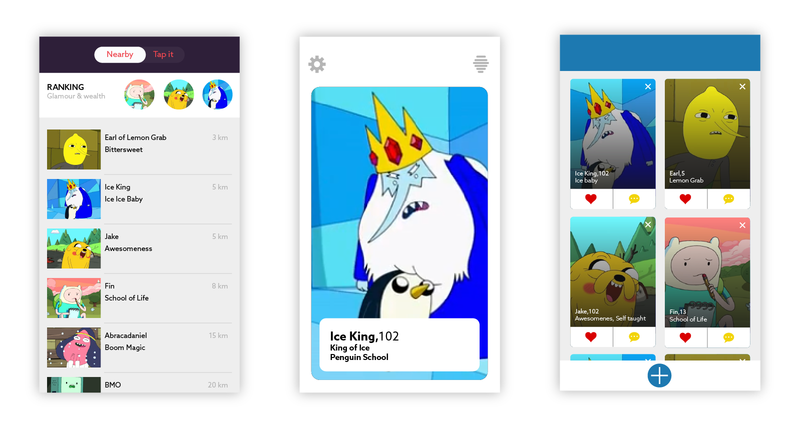

Nowadays, dating app services ease the search of the right person for whatever relationship you are seeking. As designers, we felt the need to research about the dating apps massive democratization. We choose 8 popular apps and some features we considered interesting from a user experience perspective.

| | | |
|-|-|-|
| | [**Appetence**](https://www.appetence.co/)| Fall in love |
| | [**Bumble**](https://bumble.com/en-us/)| Women empowered |
| | [**Grindr**](https://www.grindr.com/)| Hookup with gay and bi nearby |
| | [**Happn**](https://www.happn.com/en)| Find people you've crossed path with in real life |
| | [**Inner Circle**](https://www.theinnercircle.co/)| Selective dating |
| | [**OkCupid**](https://www.okcupid.com/)| Find someone compatible |
| | [**Sudy**](https://www.sudyapp.com/)| Match with sugar daddy / mummy, or babies|
| | [**Tinder**](https://www.gotinder.com/)| Meet new people |

## 1. Aesthetics and Perception

**Colors and Fonts Play an Important Role in Presenting the Dating Service**
Color defines the personality of a brand and it is an aspect of design that is constantly overlooked and ignored, as designers, we value this aspect more than anything, we believe it is one of the core values that define if a design is successful or not.

There are many misconceptions about color psychology. The idea that colors can evoke a super specific emotion, is as accurate as what horoscope predict about your love life. Sorry, we know you thought the planets were finally aligned in your favor. Choosing the right colors is not an easy task, the fact is, colors should support the brand personality and it is the feeling that the brand creates what is more important, while some brands choose to play it safe which in our opinion is using white and blue, some other get more involved with what they are trying to provoke. Take Grindr as an example, if you open that app you immediately get the feeling of quick and dirty, and yes we are not fond of the design but it serves it purpose, all the actions are highlighted in yellow, how more easy can it get?

As for contrast, we believe accent colors can help the user get to a specific action, like super likes or sending candy, which Tinder and Sudy do very well. Apps like Appetence could benefit from a more varied color palette because, in our opinion instead of setting the mood for something fun and exciting, they went for a very dry look and feel which doesn’t set the mood for discovery. Tinder and Sudy make use of a very bold color palette, to capture the users attention, and while we do not know for sure Sudy’s success we can say that Tinder is the king of dating apps so, we are not against keeping the whole business clean but we are sure we would rather tap on a pink button than in a grey one.

The typography and symbols influence the perception of the seriousness or frivolity you are bound to find. Most of the dating apps we checked out are using similar boring sans serif fonts. Some of them dared to add some CAPS. There is a big opportunity, not only for dating apps, to start being a bit more creative when it comes to their font selection. We understand that the font needs to be readable and optimized for screens but some headers could use some design. Maybe, the person you are about to meet deserves a fancy serif on his or her name. This would help to create a hierarchy, and focus the user’s attention to a specific section of the profile. Appetence did try, with rounded fonts and a slab for its logo, but something about that font combo throws us off.

**Symbols and Metaphors Communicate About the Service**

Symbols and metaphors also play an important role when defining the brand identity, while some symbols are explicit some others need a second or even a third look. The most obvious one in our opinion is Appetence, which uses the heart as its symbol and that is universal for love, and that's what distinguishes it from the other apps, it is only for serious relationships DUH!. Happn uses a less obvious symbol which is the thunderbolt and it makes perfect sense if you consider what Plato suggested in Timaeus, he described the thunderbolt as the consequence of a close approach between two planetary cosmic bodies, which in our opinion if a body is not cosmic whats the point in even bothering.

Perhaps Bumble is the one that confuses us the most, while we know that the bee represents the perfect community, for each colony of bees there are only one or a few drones (male bees) that can make the queen bee preggers so for an app that gives power to the queen bee, it should consider also the availability of drones, no one wants to fight with a million of horny bees.

Another good example of a symbol supporting the brand's values is Grindr, who uses a mask which allows its wearer to emphasize a facet of themselves, or submerge themselves and perform acts that are totally out of their character. Grindr lets you flirt, and to make as many moves as you want whether you want a hookup, networking, or a serious relationship. It even lets you choose between different emojis i.e. colors of aubergines (Dutch for eggplant) so you don't have to worry about words.

**Layouts Affect the Perception of One Potential Candidate**

The most current practices to present potential matches are full-screen cards, and comparative grids. Tinder, Bumble, Appetence, and OkCupid present people on a single card. This format values one individual at the time. Tinder and Bumble use a very similar layout and hierarchy of information. The card consists of one main large picture, name, age, and for Bumble, educational background. OkCupid presents in one card, 4 pictures of your potential crush, and provides a little bit more details, like the compatibility percentage, the height, the astrological sign, and a short description.

Appetence, adds distance and hashtags with interests. But as mentioned before, the picture is partly hidden and will be revealed as the conversation goes. Tinder Elo score (desirability rank considers the time you spend looking at a picture before swiping. The more time you spend examining someone and considering the option, the higher your score will be. OkCupid's and Inner Circle gives you flexibility in the presentation modes. You may modify the layout from the full card to the comparative grid, either with a tab bar (different modes), or a toggle button.

Grids are very efficient if you want to scan through the meat market in a quick way. Grinder chat room shows 14 men pictures, giving lots of boys to choose from… but the ones you starred, are presented in a reduced number of 6 pictures. Gentlemen, please, some curation! Happn and Inner Circle grids show 4 people at the time. In the hero screen, another interesting detail is the green dot notifying online users so for those who want it NOW or want to assure a quick response.

Sudy has a function to view one person at the time, but the main screen to find someone is a very detailed list. If you feel you’d like to shop around… you’ll find lots of details about one person, including its distance from you, and the yearly gross income… a bon entendeur!

**Hierarchy is Key to Highlight What Matters**

As humans tend to judge quickly, making a great first impression is important. While most of the apps give more importance to the name of the person, apps like Sudy highlight other things like yearly income. As you dive in on the people’s profiles, some tend to give importance to distance and description, while others go straight to availability.
Which brings us to the question, how much can you dive in and read about someone? Hey, stalkers!  … Bumble does not let you read further. If you want to know more, start a conversation.

Appetence users remain quite mysterious as their picture is partly hidden. The only pieces of information displayed are distance, age, and a few keywords.

In Tinder, Happn, Grinder, InnerCircle, and OkCupid, to reveal more details about one person, you have to tap on its picture, and then, to scroll down. The mastering apps for stalkers, or should we say, for people who want to find out more before starting a conversation, are OkCupid and InnerCircle. OkCupid’s main card contains long (sometimes endless) descriptions, and you can dive even deeper by tapping on the card. Data include answers to some questions, and personality tags. InnerCircle also gives quite some clues about the person you are dealing with. You can see the last location on a map, attending events, which Facebook friends can connect you, tags about lifestyle questions and more…

## 2. Interaction and Choice

**A Successful Dating App Understands its User’s Desires**

Datings apps provide millions of options for individuals to connect. Out there in our Human Jungle, there are almost as many possibilities for relationships as there are for beers in a Dutch brown café. To make a match happen, apps should let its users express their desires.

Grindr, a niche for a very targeted audience, expresses the user’s need through its service description. Grindr is a chat for “sexy, attractive, and interesting” gay, and bisexual people. No need to say more. Everyone knows Grindr is a hit for gay hookups, however, you can still filter your research by what you are ‘looking for’. The list goes from “Networking”, to “Right Now”.

In the dating apps market, plenty of other apps understood specific desires. You find niche apps focused on bold body shapes, beards, pets, or more precisely horse lovers, gluten-free diets, farmers, similar-politic orientation or religious beliefs, air travelers, or big age-gap relationships, like Sudy. One of Sudy’s first screen asks if the user would like to be a sugar daddy/mummy or a sugar baby.

At the beginning of the experience, Appetence also asks its users to pick some keywords to describe the type of relationship they are interested in. OkCupid goes a little beyond simple keywords, by asking about the gender, age, and the duration of the relationship sought.

Tinder, Happn, and Bumble are not asking what their users are looking for.  Instead, they propose light filters of gender and age to narrow down the massive waiting list of aspirants. Inner Circle is asking less, users may adjust the age range but not the gender. If you are not straight, this is not your app.

**Completing a Dense Profile Requires Involvement and Set Expectations Higher**

The more you input, the more you expect. If you are looking for a soul mate or a perfect hookup, you are probably ready to provide some information about yourself, and even to answer some personal questions.

All reviewed apps are collecting basic user information such as name or pseudo, gender, age. Most apps are also providing a job title and educational background. Bumble and Tinder profile creation are light, but they are missing key elements … height !

Appetence, OkCupid, Inner Circle, and Sudy ask for the most information to define yourself, or who you are looking for. They include lifestyle information, cultural background, physical traits (fair for apps putting the emphasis on appearances).  Appetence asks you to pick a handful of keywords in a lot of different categories like music, gastronomy, movie, fashion, etc. It feels very heavy to get started. OkCupid doesn’t let you access to the potential match until you answer a set of 15 questions. These apps are perfect if you have time, and if you are willing to connect emotionally, but, not sure, it is not the most efficient way to find a one night stand.

Grindr does not require lots of information to let you access to the chat room, but you may enhance your profile with very personal details such as relationship status, preferred position, HIV status and the date of the last test.

**Some Gestures Have an Emotional Impact When it Comes to Judging Potential Matches**

Swiping left and right among a huge number of potential dates removed the negative emotions about rejecting someone drastically. For instance, if you would have to “throw someone to the bin”, or be yourself “thrown to the bin”, you might experience a little more guilt, uneasiness. The fear of being rejected also vanishes with the number of people you’ve swiped left yourself. The focus or the celebratory moments are emphasized more than the rejections. How happy do you feel when a match is revealed! Bumble, Tinder, and Inner Circle celebrate these special moments.

**Types of Shareable Content Speak About the Seriousness of a Relationship**

While all apps let you exchange texts to let you know each other on a 1-1 chat, some apps considered a more substantial exchange of material. Inner circle and Tinder integrates third-party apps like Spotify and Instagram. In Inner Circle, you can also discover how many Facebook friends could lead you to your potential date, and which music he or she enjoys. Grinder parti-pris is stronger. In the chat, on top of the basic text, you can share photos, videos, music, and the amazing emojis to help someone read your mind with explicit metaphors like with different aubergine colors. You can also share your location… the intention is clear. Let’s meet right NOW.

## 3. Mechanics and Trust

**Explicit Algorithms aren’t Especially the Most Trustworthy**

We have personally, not experienced any magical matching solutions in any of the apps we reviewed. It is obvious that matching algorithms are hidden to the user. The first assumption is that revealing the math behind the candidates can hurt the mechanic of the app and the user’s feelings; The second one is that it may be the real gold of their businesses, and this is preciously protected. It seems that in Grindr and Happn, location is a key parameter to favor one person over another. Some other apps are more evasive about the information they correlate to try to match people. Tinder and Bumbles raise interesting questions, who is deciding for you what card should be pushed first? You may feel it’s getting out of control, when so many individuals, one after the other is presented to you. Switching cards of so many faces may make you feel tired, or even, depressed. You may also receive OkCupid as a disappointment because it asks a lot of questions, and yet, you can feel overwhelmed with a flow of messages from people that are absolutely not fitting your desires. It seems that it is not the quantity of the information that helps you find a match, but rather how the app uses your information. If suggestions are not taking into account the information you took time the to input, the app is a big fail.

Filters are a very efficient way to refine a list of candidates. Bumble, Happn, Sudy are proposing very few criteria, basically age range, and gender. Appetence and Tinder use the same few filters but add the location, and for Sudy (the last online). InnerCircle allows you to adjust your list a bit more by adding height, education level, smoking, and children. Grindr is also doing a great job at organizing the chat room with two sets of filters: My Type, Online Now, or Photos only, Age range, Looking For and Tribes. Advanced filters (Height, Weight, Position, Ethnicity…) are reserved for premium users. OkCupid search is quite powerful with its categories organization. The user can adjust a lot of parameters in different categories: Looks, Background, availability, personality, vices, specific questions and more. It is quite interesting that the apps that favor the instantaneous hook up include filters for when a person was last online.

**The User With the Right to Start a Conversation is Empowered**

OkCupid, Sudy, Inner Circle and Grindr are not using pre-conversation mutual consent. This results in 200 notifications within a few days of trial. While some people might feel it’s flattering their ego, some others might feel overwhelmed, disgusted, harassed, or even, depressed by these first points of contact… Mutual consent before chatting solves the problem of unwanted conversations. Appetence, Happn, Tinder, and Bumble do require a match before a conversation starts. But there are other ways to let someone know they have a special place in your heart. Tinder has special features to “super like” someone or to “skip the line” but you have to pay for these options. In Happn, there is a special “Say Hi” button, that will notify to someone you would like to start chatting. Bumble claims to “weed out jerks online”, by allowing only ladies to start a conversation. Refreshing mentality! Bumble’s policy about the woman starting the conversation seems like a good idea, but it could lead to frustrations for some men, or for some women that would prefer when a man makes the first move. The app gives a 24-hours deadline to start conversing with your match, otherwise, it disappears. Inner Circle emphasis on the privilege to chat with someone by making this option available if you pay the one time fee of 5 euros, or if you invite friends to use the app.

**Transparency About who Likes me Boost my Confidence to talk to Someone**

Inner circle takes the LinkedIn approach and allows you to see who has viewed your profile. If you are not a hundred percent sure you want to talk to someone, you can send a “wink” to check if the other person is interested.

**Gamification Plays Down Dating but Also Discredits Serious Dating**

Sudy makes it feels like finding someone is a game. The mechanic of the game is frustrating because you need some candies to be able to chat with someone. You can either earn them or buy them. It seems like quite some efforts to play before being able to exchange with someone.

Happn also has some bits of gamification with some coins/credits to earn or to pay for, that allow you to start talking with someone without their approval.

Isn’t it already a game to swipe left or right to meet someone? Dating has considerably changed in the digital era. It became a giant game. It is both funny and scary to think about this considerable behavioral change.

Conclusion goes here
