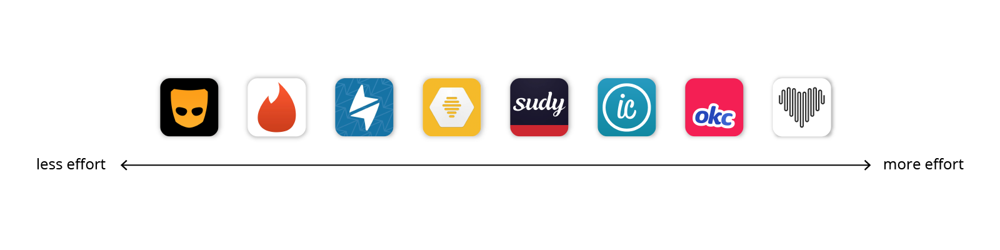

Nowadays, dating app services ease the search for the right person, you have a wide range of apps to find whatever type of relationship you are looking for, from I want to get married soon to I want free drinks and a one night stand.

As designers, we felt the need to research about the dating apps massive democratization and the so called dating apocalypse. We choose 8 popular apps and we analyzed some features we considered interesting, all from a user experience perspective.

| | | |
|-|-|-|
| | [**Appetence**](https://www.appetence.co/)| Fall in love |
| | [**Bumble**](https://bumble.com/en-us/)| Women empowered |
| | [**Grindr**](https://www.grindr.com/)| Hookup with gay and bi nearby |
| | [**Happn**](https://www.happn.com/en)| Find people you've crossed path with in real life |
| | [**Inner Circle**](https://www.theinnercircle.co/)| Selective dating |
| | [**OkCupid**](https://www.okcupid.com/)| Find someone compatible |
| | [**Sudy**](https://www.sudyapp.com/)| Match with sugar daddy / mummy, or babies|
| | [**Tinder**](https://www.gotinder.com/)| Meet new people |

## 1. Aesthetics and Perception

**Colors and Fonts Play an Important Role in Presenting the Dating Service.**

Color defines the personality of a brand. It is a constantly overlooked aspect of design. We value color and fonts, because we believe they participate to create a successful design.

There are many misconceptions about color psychology. The idea that colors can evoke a super specific emotion, is as accurate as what horoscope predict about your love life. Sorry, we know you thought the planets were finally aligned in your favor. Choosing the right colors is not an easy task. The fact is, they should support the brand personality, and set a favorable atmosphere to meet a goal. Dating apps want you to find someone matching your desire, so their colors should set the scene. Are you in for networking in a corporate environment, an intense sunset on the beach, or a dark and shiny swinger room? Yes, some brands play safe by using white and blue, while other are communicating a stronger point of view. Take Grindr as an example, it is provoking a different kind of feelings. Opening the app for the first time, gave us an impression of a quick and dirty evening. We are not fond of their graphical charter, but it serves the purpose. All actions are highlighted in yellow, quick intercourses, within a few tap reach.

We believe accent colors, by contrast, drive the user towards specific action, like ‘super swipe’ in Bumble, or sending ‘candies’, in Sudy. Apps like Appetence could benefit from a more varied color palette. Instead of setting the mood for something fun and exciting, they went for a very dry look and feel. Where is the big-jump feeling of letting a new face enter in your life? Tinder and Sudy use a very bold color palette, to capture the users attention. We are not against keeping the whole dating app business sober and clean, but we are sure we would rather tap on a pink button than in a grey one.

The typography influence the perception of the seriousness or frivolity you are bound to find. Too many dating apps are using dull sans serif fonts. Some of them dared to add some CAPS. When it comes to font selection, there is a big opportunity to start being a bit more creative, and this is also true for non-dating-related apps. We hear that the font needs to be readable and optimized for screens, but some words could use some special treatment. Maybe, the person you are about to meet deserves a fancy serif on his or her name. This would help to create a hierarchy, and focus the user’s attention to a specific section of the profile. Appetence did try, with rounded fonts and a slabbed logo, but something about that font combo throws us off.

**Symbols and Metaphors Speak about Relationship Goals.**

Aside from contributing to define the brand identity, symbols and metaphors also play a role in showing what types of relationship you may find in a dating app. The most self-explanatory is Appetence’s heart. Well, heart is the universal symbol for love and compassion, and Appetence is for serious relationships only. DUH! Happn uses a thunderbolt. It makes perfect sense. Plato described the thunderbolt as the consequence of a close approach between two planetary cosmic bodies. In our opinion, if a body is not cosmic, whats the point in even bothering.

Perhaps Bumble is the one that confuses us the most. No doubt that bees represent balanced communities, but in reality, in each colony, there are only one or a few drones that can make the queen bee preggers. For an app that gives power to the queen bee, they should have considered the availability of drones. No queen bee wants to be constrained by so little options, neither to be fighting among a million of female honey-craving bees.

Another good example of a symbol supporting the relationship purpose is Grindr’s mask. Masks help their wearer to emphasize with a facet of themselves, or to hide behind and perform acts that are totally out of their character. Grindr lets you freely and anonymously flirt, and make as many strikes as you want. It also let you choose between different emojis and their colorful variations. Thanks to these very edible metaphors, you don't have to worry about words.

**Layouts Affect the Perception of One Potential Candidate.**

The most current practices to present potential matches are full-screen cards, and comparative grids. Tinder, Bumble, Appetence, and OkCupid present people on a single card. This format values one individual at the time. Tinder and Bumble use a very similar layout. The card consists of one main large picture, name, age, and for Bumble, educational background. OkCupid presents in one card, 4 pictures of your potential match, and provides a little bit more details, like the compatibility percentage, the height, the astrological sign, and a short description.

Appetence, adds distance and hashtags with interests. But as mentioned before, the picture is partly hidden and will be revealed as the conversation goes which makes us think; can love starts without physical attraction? True that not-so-handsome people with a great personality might turn out very attractive, but do you really want to put all these efforts to find out if the person is hot… naah.

Tinder Elo score (desirability rank) considers the time you spend looking at a picture before swiping. The more time you spend examining someone and considering the option, the higher your score will be. OkCupid and Inner Circle give you some flexibility in the presentation modes. You may switch between full cards to the comparative grid, either with a tab bar (different modes), or a toggle button. Are you feeling emotional and want to spend time examining one person, or, do you feel like comparing options?

Grids are very efficient if you want to scan through the meat market in a quick way. Grinder chat room shows 14 men pictures, giving lots of boys to choose from… but the ones you starred, are presented in a reduced number of 6 pictures. Gentlemen, please, some curation! Happn and Inner Circle grids show 4 people at the time. Another interesting detail is the green dot notifying online users so for those who want it right here right now it is perfect, though if they don’t reply you know they are ignoring you.

Sudy has a function to view one person at the time, but the main screen to find someone is a list, that way sugar babies, who we assume care more about the income than the face, can scan quickly to find the wealthiest. If you feel like to shopping around… you’ll find lots of details about one person, including the distance separating you… a bon entendeur!

**Hierarchy is Key to Highlight What Matters.**

As humans tend to judge quickly, making an outstanding first impression is important. While most of the apps give more importance to the name of the person, apps like Sudy highlight other data like the yearly income. As you dive in on the people’s profiles, some tend to give importance to distance and description, while others go straight to availability.
Which brings us to the question, how much can you dive in and read about someone? Hey, stalkers!  … Bumble does not let you read further. If you want to know more, start a conversation.

Appetence users remain quite mysterious as their picture is partly hidden. The only pieces of information displayed are distance, age, and a few keywords.

In Tinder, Happn, Grinder, InnerCircle, and OkCupid, to reveal more details about one person, you have to tap on their picture, and then, to scroll down. The mastering apps for stalkers, or should we say, for people who want to find out more before starting a conversation, are OkCupid and InnerCircle. OkCupid’s main card contains long (sometimes endless) descriptions, and you can dive even deeper by tapping on the card. Data include answers to some questions, and personality tags. InnerCircle also gives quite some clues about the person you are dealing with. You can see the last location on a map, attending events, which Facebook friends can connect you, tags about lifestyle questions and more…

## 2. Interaction and Choice

**A Successful Dating App Understands its User’s Desires.**

Dating apps provide millions of options for individuals to connect. Out there in our Human Jungle, there are almost as many possibilities for relationships as there are for beers in a Dutch brown café. To make a match happen, apps should let their users express their desires.

Grindr, a niche for a very targeted audience, expresses the user’s needs through their service description. Grindr is a chat for “sexy, attractive, and interesting” gay, and bisexual people. No need to say more. Everyone knows Grindr is a hit for gay hookups, however, you can still filter your research by what you are ‘looking for’. The list goes from “Networking”, to “Right Now”. In the dating apps market, plenty of other apps understood specific desires. Other niche apps focus on bold body shapes, beards, pets, or more precisely horse lovers, gluten-free diets, farmers, similar-politic orientation or religious beliefs, air travelers, or big age-gap relationships, like Sudy. One of Sudy’s first screen asks if the user would like to be a sugar daddy/mummy or a sugar baby.

At the beginning of the experience, Appetence also asks users to pick some keywords to describe the type of relationship they are interested in, which later appear as hashtags on your profile. OkCupid goes a little beyond simple keywords, by asking about the gender, age, and the duration of the relationship sought. The last one may sound a bit odd because how the hell would you know how long you want your relationship to be?
Tinder, Happn, and Bumble are not directly asking what their users are looking for. Instead, they propose light filters of gender, age and distance to narrow down the massive waiting list of aspirants. Inner Circle is asking less, users may adjust the age range but not the gender. If you are not straight, this is not your app.

**Completing a Dense Profile Requires Involvement and Set Expectations Higher.**

The more you input, the more you expect. If you are looking for a soul mate or a perfect hookup, you are probably ready to provide some information about yourself, and even to answer some personal questions. All reviewed apps are collecting basic user information such as name or pseudo, gender, age. Most apps are also providing a job title and educational background. Bumble and Tinder profile creation are light, but they are missing key elements like height, there’s nothing worse than going on a date with someone to find out they are to tall or too short for you.

Grindr does not require lots of information to let you access to the chat room, but you may enhance your profile with very personal details such as relationship status, preferred position, HIV status and the date of the last test.

Appetence, OkCupid, Inner Circle, and Sudy ask for the most information to define yourself, or who you are looking for. They include lifestyle information, cultural background, physical traits (fair for apps putting the emphasis on appearances). Appetence asks you to pick a handful of keywords in a lot of different categories like music, gastronomy, movie, fashion, etc. It feels very heavy to get started. OkCupid doesn’t let you access to the potential match until you answer a set of 15 questions. These apps are perfect if you have time, and if you are willing to connect emotionally, but, not sure, it is not the most efficient way to find a one night stand.

Dense profiles are an easy way to narrow down your search and to decide if you are interested or not before chatting, but by setting too many requirements, you might miss the most wonderful thing in dating : surprising encounters.

**Some Gestures Have an Emotional Impact When it Comes to Judging Potential Matches.**

Dating apps involve people and their load of emotions. It is interesting to see how feelings are translated into gestures.

Swiping left and right among a huge number of faces removed the negative emotions about rejecting someone drastically. For instance, if you would have to “throw someone to the bin”, or be yourself “thrown to the bin”, you might experience a little more guilt or uneasiness. The fear of being rejected also vanishes with the number of people you’ve swiped left yourself. The celebratory moments are emphasized more than the rejections. How happy do you feel when a match is revealed! Bumble, Tinder, and Inner Circle celebrate these special moments.

Bumble ranked taping on a higher interest level than swiping right. To stand out for the people you really like, you should tap on a heart button (premium button).

**Types of Shareable Content Speak About the Seriousness of a Relationship.**

While all apps let you exchange texts to get to know each other on a 1-1 chat, some apps considered a more substantial exchange of material. Inner circle and Tinder integrate third-party apps like Spotify and Instagram. Sudy lets you send voice messages, much like a hot line. In Inner Circle, you can also discover how many Facebook friends could lead you to your potential date, and which music he or she enjoys. Grinder parti-pris is stronger. In the chat, on top of the basic text, you can share photos, videos, music, and the amazing emojis to help someone read your mind with explicit metaphors like with different aubergine colors. You can also share your location… the intention is clear. Let’s meet right NOW.

## 3. Mechanics and Trust

**Explicit Algorithms aren’t Especially the Most Trustworthy.**

We have personally, not experienced any magical matching solutions in any of the apps we reviewed. It is obvious that matching algorithms are hidden to the user. The first assumption is that revealing the math behind the candidates can hurt the mechanic of the app and the user’s feelings; The second one is that it may be the real gold of their businesses, and this is preciously protected. It seems that in Grindr and Happn, location is a key parameter to favor one person over another. Some other apps are more evasive about the information they correlate to try to match people. Tinder and Bumble raise interesting questions, who is deciding for you what card should be pushed first? You may feel it’s getting out of control, when so many individuals, one after the other is presented to you. Switching cards of so many faces may make you feel tired, or even, depressed. You may also receive OkCupid as a disappointment because it asks a lot of questions, and yet, you can feel overwhelmed with a flow of messages from people that are absolutely not fitting your desires. It seems that it is not the quantity of the information that helps you find a match, but rather how the app uses your information. If suggestions are not taking into account the information you took time the to input, the app is a big fail.

Filters are a very efficient way to refine a list of candidates. Bumble, Happn, Sudy are proposing very few criteria, basically age range, and gender. Appetence and Tinder use the same few filters but add the location, and for Sudy (the last online). InnerCircle allows you to adjust your list a bit more by adding height, education level, smoking, and children. Grindr is also doing a great job at organizing the chat room with two sets of filters: My Type, Online Now, or Photos only, Age range, Looking For and Tribes. Advanced filters (Height, Weight, Position, Ethnicity…) are reserved for premium users. OkCupid search is quite powerful thanks to a numerous categories of filters. The user can adjust a lot of parameters in different categories: Looks, Background, Availability, Personality, vices, specific questions and more. It is quite interesting that the apps that favor the instantaneous hook up include filters for when a person was last online.

**The User With the Right to Start a Conversation is Empowered.**

OkCupid, Sudy, Inner Circle and Grindr are not using pre-conversation mutual consent. This results in 200 notifications within a few days of trial. While some people might feel it’s flattering their ego, some others might feel overwhelmed, disgusted, harassed, or even, depressed by these first points of contact… Mutual consent before chatting solves the problem of unwanted conversations. Appetence, Happn, Tinder, and Bumble do require a match before a conversation starts. But there are other ways to let someone know they have a special place in your heart. Tinder has special features to “super like” someone or to “skip the line” but you have to pay for these options. In Happn, there is a special “Say Hi” button, that will notify to someone you would like to start chatting. Bumble claims to “weed out jerks online”, by allowing only ladies to start a conversation. Refreshing mentality! Bumble’s policy about the woman starting the conversation seems like a good idea, but it could lead to frustrations for some men, or for some women that would prefer when a man makes the first move. The app gives a 24-hours deadline to start conversing with your match, otherwise, it disappears. Inner Circle emphasis on the privilege to chat with someone by making this option available if you pay 20 euros per month, or if you invite friends to use the app.

**Transparency About who Likes me Boost my Confidence to talk to Someone.**

Inner circle takes the LinkedIn approach and allows you to see who has viewed your profile. If you are not a hundred percent sure you want to talk to someone, you can send a “wink” to check if the other person is interested. Happn also lets you see who wants to talk to you or basically who paid to talk to you. We think this feature is very interesting, while in the previous paragraph we discussed about feeling overwhelmed when people can talk to you with out matching, sending a wink or pushing a request to talk to you steel makes you feel in control and somehow it takes some weight off the….. (need to finish it)

**Gamification Plays Down Dating but Also Discredits Serious Dating.**

Gamification plays an important part in UI and UX design, many apps incorporate games to their mechanics to either bring the seriousness down or to keep the user hooked. Most of the dating apps we analyzed incorporate one or more gamified features to their mechanics. Sudy brings it to the next level by making it feel like finding someone is a game, they took the sugar metaphor to do so, their game currency: candy. The mechanic of the game is frustrating because you need some candies to be able to chat with someone but then again if you are looking for someone who will pay your bills for the upcoming X time, it is worth investing. You can either earn them or buy them. The sugar daddy’s with the most coins make it to the leader board which brings the competition on, we wonder if it would be wise to incorporate a Pokemon-like battle field so sugar babies can fight for their daddy.

Happn and Tinder also have some bits of gamification with some coins/credits you can buy or earn, Happn uses the coins to allow you to talk to someone without their approval and Tinder uses credits to let you super-like someone, you get a limited amount of super-likes per day and if you want you can buy more. By letting the users spend this coins/credits how they want, gives them a sense of achievement, and they are encouraged to log in on a daily basis to claim their credits.

We think there is a big opportunity for dating apps to incorporate more gamification to their mechanics, perhaps they could benefit from challenges like “be the one who says hi first, and win X amount of coins” to push people to actually start a conversation. But truth be told, swiping left or right to meet someone is already a game. And weather we like it or not dating apps have changed dating for good. It has become a giant game. It is both funny and scary to think about this considerable behavioral change.

Conclusion goes here
