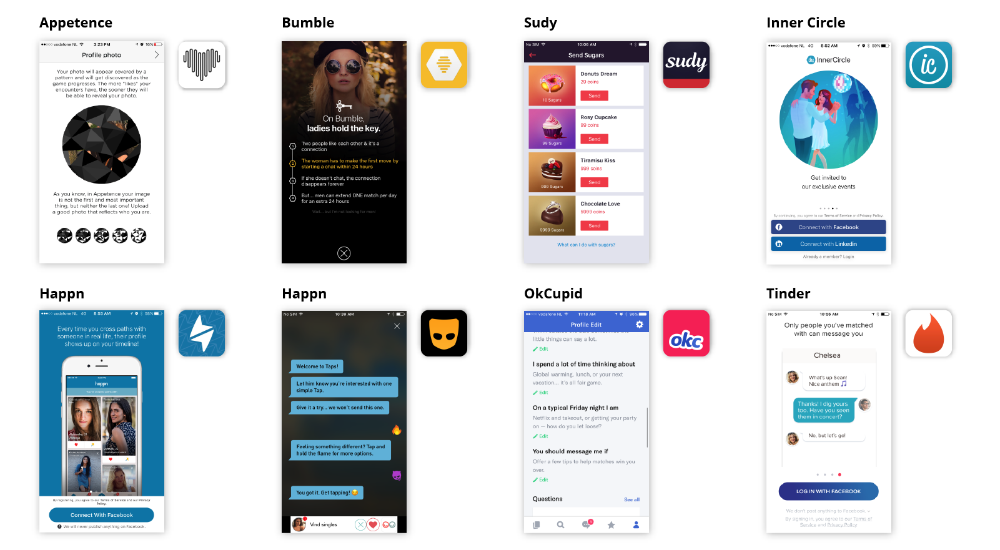

In this day and age, digital products help us to be more efficient, more social, more self-promoting, and more informed. We can hop online to find everything from the best-performing power drill to the perfect piece of pre-loved furniture. With our always-connected, always-needing culture, it’s no surprise the number of products and services that are devoted to finding the right person for the right relationship has increased.

As designers of experiences, we felt the need to research the mass democratization of dating and the so-called dating apocalypse. We chose 8 popular apps and focused on 12 features we consider the most interesting from a user experience perspective.

---

## Aesthetics and Perception

###Colors play a crucial role in setting the mood.

While it’s important that the palette supports the brand’s personality, it’s even more essential that it set the right tone for the user’s experience. When it comes to desire, color can play a big role in setting the mood.

Is the user looking for love in a corporate environment, along the beach at sunset, or in a dark and shiny swinger room? **Grindr** and **Sudy** know just what its users want. Sporting a dark palette, it provides the perfect space for a little something nefarious. Highlighting actions with little pops of yellow or pink is not only a usability win, it also adds to the feel of quick and dirty.

On the opposite end of the spectrum, **Appetence** and **Inner Circle** have a monochrome color scheme that makes the likelihood of red-hot passion feel even more distant than its boring grey buttons.

While certain colors might be associated with common reactions, the idea that a particular color can evoke a specific emotion is about as accurate as the horoscope of your love life. Sorry – we know you thought the planets were finally aligned in your favor.

### Typographic hierarchy draws the user’s attention to the important bits.

When meeting someone new, what’s the first thing you look at? Their eyes? Their smile? Their…something else? Well we looked at their typography.

Typography creates hierarchy and helps to focus the user’s attention on what’s most important. Most apps, including **Bumble** and **OKCupid** use type size and weight to highlight the user’s on name only, while **Appetence** and **Tinder** include age and distance in more prominent typographic styles.

While most apps use sans-serif fonts with little personality, **Appetence** tries to set itself apart with an awkward coupling of rounded fonts and a slabbed logo. While it might be attention getting, it definitely falls short of a superlike.

### Symbols and metaphors set a tone for relationship goals.

Aside from contributing to the brand identity, symbols and metaphors play a vital role in foreshadowing the type of relationship you might find in a dating app.

**Appetence** went with the obvious, the heart symbol. Fortunately, the other apps in this review got more creative with their self-expression.

**Happn** uses a thunderbolt, perhaps referencing Plato’s description of what occurs when two cosmic bodies collide. Even without the ancient greek, it’s obvious that a little spark can go a long way.

Apropos to its name, **Bumble** uses a bee as its icon, no doubt referencing the power of the queen. Yet it’s hard to imagine any queen being satisfied, considering the limited number of drones on the service.

Speaking of drones, there’s **Grindr**’s iconic mask, which is perfect for a land of anonymous flirtation, unlimited strikes, and peach emoji in every skintone.

With app icons often replacing logos in our mobile-first world, it’s no surprise that a simple metaphor choice could completely change a service’s demographics. In a world of bad boys and puppy love, perhaps the safe guy is truly the way to go.

### Layouts help define the field.

When shopping for love, the presentation of goods can significantly affect your ability to make a choice.

The most popular ways to present possible mates is on full-screen cards, a method that **Tinder**, **Bumble**, **Appetence**, and **OKCupid** all use. With this method, you focus on one person at a time, reviewing a few key details before saying yay or nay. **Appetence** has an added twist where the user’s photo is partially hidden until you get to know each other – putting the brains before the beauty.

For the comparison shopper, **Happn**, **OKCupid**, **Inner Circle**, and **Grindr** provide grids of potential matches. The most extreme grid award goes to **Grindr**, which shows a whipping 14 men at a time. Gentlemen please, some curation! When viewing starred profiles, **Grindr** presents only 6 pictures at once.

**Sudy** the Sugar Daddy app uses a list to present potential matches, which is conveniently sortable by income. Of course there are other important details, like the distance separating the two of you…a bon entendeur!

---

## Interaction and Choice

### A successful dating app understands the user’s desires.

In the human jungle of dating apps, there are millions of opportunities for individuals to connect. To get from connections to matches, it’s important to understand what users want from each other.

Services like **Grindr** and **Sudy** create meeting grounds for specific groups by virtue of the audiences they target: sexy, attractive, and interesting gay people and sugar daddies or babies respectively. There are apps for almost every niche imaginable – from religious groups to body shapes and people who love horses to those with gluten-free diets.

Services that cater towards a less specific audience have other techniques for segmenting their users. **Appetence** asks users to pick keywords about the type of relationship they’re interested in, and then highlights those hashtags on each user’s profile. **OKCupid** goes beyond simple keywords and asks about gender, age, and desired duration of the relationship.

**Tinder**, **Happn**, and **Bumble** provide the user with a way to filter down based on traits like age and gender and distance. **Inner Circle** only allows the user to filter based on age range… making it an app for strait folks only.

### Completing a dense profile creates a sense of commitment.

The more you invest, the more you expect. For example, the woman looking for the perfect hookup is likely to care less about her match’s pet preferences than the guy seeking a soulmate.

All apps in this review ask for the basics – name, nickname, gender, and age. Most with the exceptions of **Appetence** and **Grindr** suggest their users to add their job title and educational background. Apps like **Tinder** and **Bumble** could benefit from user details like height – there’s nothing worse than going on a date with someone who’s too tall or short for you!

**Grindr** gets deep into details with specifics like preferred position and HIV status (and even the date of the last test).

**Inner Circle** and **Sudy** all ask a bit more about the user and what they’re looking for. When signing up for these services, expect to answer questions about lifestyle, cultural background, and physical traits. **Appetence** takes things a step further, asking for musical, gastronomical, film, and fashion preferences. **OKCupid** requires the user to answer at least 15 questions before seeing potential matches. That’s a lot of investment to see what fish are in the sea!

Dense profiles are an easy way to narrow down your search and to decide if you are interested or not before chatting, but by setting too many requirements, you might miss the most wonderful thing in dating : surprising encounters!

### Gestures can lighten the load of saying “no thanks.”

Browsing one profile after another can be an emotional experience. Finding a diamond in the rough can give the user a surge of positive energy, while a lack of diamonds can lead to a feeling of hopelessness. The interface around these elements can help keep the user swiping, even through the rough times

Let’s start with the legendary swipe, which **Tinder** popularized in 2012, and now apps like **OkCupid** and **Sudy** incorporate it in their mechanics. Swiping left and right helps to remove the negative emotions around rejecting someone. Imagine if you were instead tapping a trashcan icon –symbolically throwing another person away. The guiltless swipe gesture makes rejection as easy as closing a tab in your browser.

When a match is made, it’s time to celebrate. To keep the user in high spirits, these moments are often more dramatic than the rejections. **Bumble** celebrates the matches with a boom and the picture of both parties, while **Inner Circle** just puts them under a tab in your Activity section. The fear of being rejected vanishes with each joyful match.

### How you share indicates how serious you are.

What happens after the initial flutter of a match? Every app treats taking things to the next level a bit differently.

While all of the reviewed apps have basic text exchanges to allow users go get to know each other on a 1:1 chat, a few took things to the next level. **Inner Circle**, **Happn**, and **Tinder** integrate third-party services like Spotify and Instagram. **Sudy** lets users send each other voice messages so you can feel that hotline bling.

**Grindr**’s parti-pris makes its way into its users’ conversations with a series of custom emoji… some more subtle than others. Along with flesh-colored aubergines, users can also share photos, videos, music, and location. Let’s meet RIGHT NOW.

With all of this sharing, educating users about safety is a must. **Tinder** does this with their Safety Tips section which provides users with useful about online behavior, offline behavior, and health. **Grindr** also has a help center with a sexual health resource section.

---

## Mechanics and Trust

### Knowing the truth doesn’t always lead to trust.

The magic behind matching algorithms ranges from more to less explicit across different apps. Surprisingly, the most transparent mechanics aren’t the most efficient in matching people.

**Grindr** and **Happn** make clear that location is a key parameter to promote one person over another. It meets the purpose of finding someone nearby, but it is not proven that your neighbor is your soul mate.

**OKCupid** asks their users a set of questions to generate a matching percentage. After the user rejects a few profiles, new questions pop in. However, this exercise feels futile when the service allows users to start conversations without mutual consent.

**Tinder** and **Bumble** are more elusive about their prioritization of profiles. They cross reference more information to find out who their users are more likely to match with. **Tinder** uses a score, called Elo. It may be hidden to protect the user’s feelings. We wonder, to what extent is this hidden ranking responsible for the success of **Tinder**?

### Filters are a very efficient way to find THE needle in a haystack.

To determine a range of candidates or to fine-tune a list of potential matches, dating apps (like other apps) use filters, which very efficient way limit results.

Some apps like **Bumble**, **Tinder**, and **Sudy** offer very few criteria like age range and gender. **Appetence** and **Happn** use the same few filters but add current location. InnerCircle allows users to be more picky by adding height, education level, and some other optional filters.

**Grindr** narrows the search even more by organizing the chat room into: My Type, Online Now, Photos Only, Age Range, Looking For, and Tribes. Advanced filters such as Height and Favorite Position are reserved for premium users.

**OKCupid** search is the most powerful. It includes categories like: Looks, Zodiac Sign, Availability, Personality, and Vices.

The more filters, the better the user can refine their search. We hope that the heavy-filter-users will still catch surprising butterflies.

### The user with the right to start a conversation is empowered.

Mutual consent prior to chatting is key to prevent the user feeling embarrassed, overwhelmed, harassed, or even depressed by these first points of contact.

In the one hand, apps like **OKCupid**, **Sudy**, **Inner Circle**, and **Grindr** allow every user to start a conversation, resulting in thousands of notifications within a few days of trial. While this might sound ego-flattering for some users, others might experience uneasy feelings.

On the other hand, **Appetence**, **Happn**, **Tinder**, and **Bumble** do require a match before a conversation starts. This mechanic prevents unwanted conversations from happening. **Bumble** claims to “weed out jerks online”, by allowing only ladies to start a conversation. What a refreshing mentality! But woman starting the conversation could lead to frustration among those men really eager to make the first move. The app gives a 24-hour deadline to start conversing, otherwise the match disappears. You'd better be quick!

**Inner Circle** takes a different approach by emphasizing on the privilege to chat with someone. The one-to-one chat is only available to users that have invited 3 friends or who pay for a 20-euro monthly subscription.

### Gamification keep users playing.

Gamification plays an important part in UX and UI design, and many apps incorporate game mechanics to either reduce the seriousness of their experience or to encourage users to return for more. Most of the dating apps we analyzed incorporate one or more game mechanics into their product.

**Happn** and **Tinder** also use coins that can be either bought or earned to motivate the user through scarcity. **Happn** uses coins to allow one user to talk to another without mutual approval, while **Tinder** uses them to super-like someone. With **Tinder**, the limited number of super-likes per day keeps users coming back regularly.

**Sudy** extends the game beyond just a currency, posting leaderboards of the hottest and wealthiest sugar daddies.

There are plenty of other ways dating apps could use rankings to motivate users. Imagine leaderboards for the men who swipe right the most, or for the ladies with the most courage to make the first move.

---

Truth be told, maybe dating is enough of a game without all of these additional mechanics.

Aesthetics, interaction, and mechanics play an important role in defining the success of a connected dating service. These 3 elements give the users the chance to experience excitement, joy, and trust through the adventure of meeting someone new.

When talking about online dating, the experience should be polished so the user gets the sense that the service is right for them. The beauty of the interface, from colors to typography, creates a mood for the experience. The iconography and the metaphors they convey also communicate a tone for relationship goals. The layout acts as a matchmaker, presenting potential candidates.

Interactions are also key in defining a pleasant user experience. An empathic dating app lets their users express their desires and allows them to commit to the level of engagement they want. Using gestures to like or dismiss someone reduces the emotional weight of the fear of being rejected or the guilt of liking someone. And the different sharable content give freedom to the user to define their wishes.

Dating apps use a variety of mechanics to earn the user's trust. Fine-tuning by filtering is an obvious and efficient way to help users find the rare pearl and to feel confident that the service is listening to their needs. Explicit algorithms aren’t necessary the best way to earn a user's confidence. What's more valuable is a service that says less, or at least that respects what the user has taken the time to define. A thoughtful chat experience gives power to the user, while gamification motivates and rewards them.

In our connected era, dating apps have revolutionized the way people meet. Furthermore, they have changed the perception of relationships and contributed to the transformation our society. Taboos shift toward more acceptance , and the possibilities of meeting new lovers increases regardless of age, sexual preference, or relationship goal.
