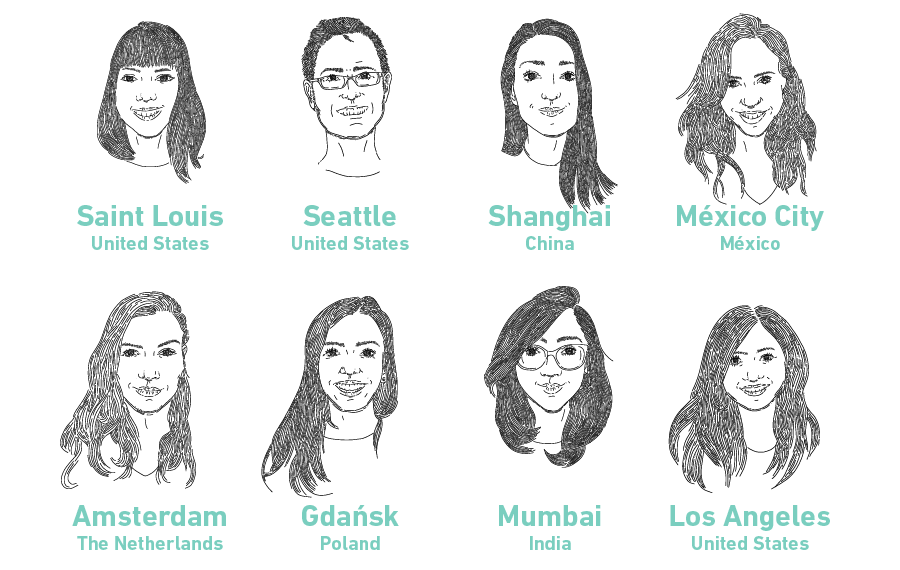
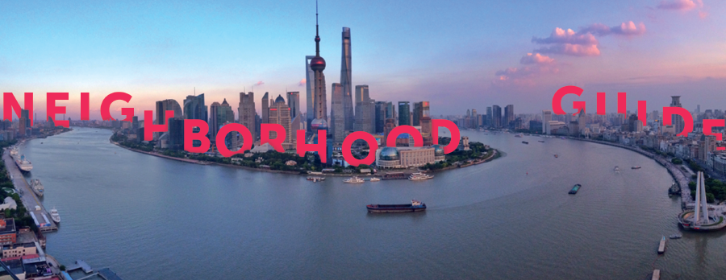
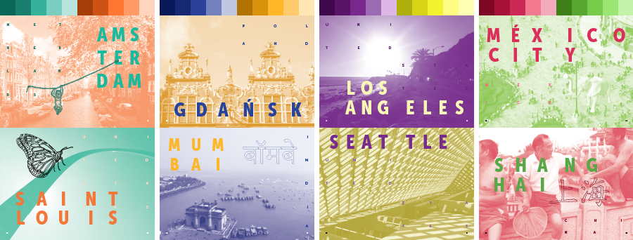
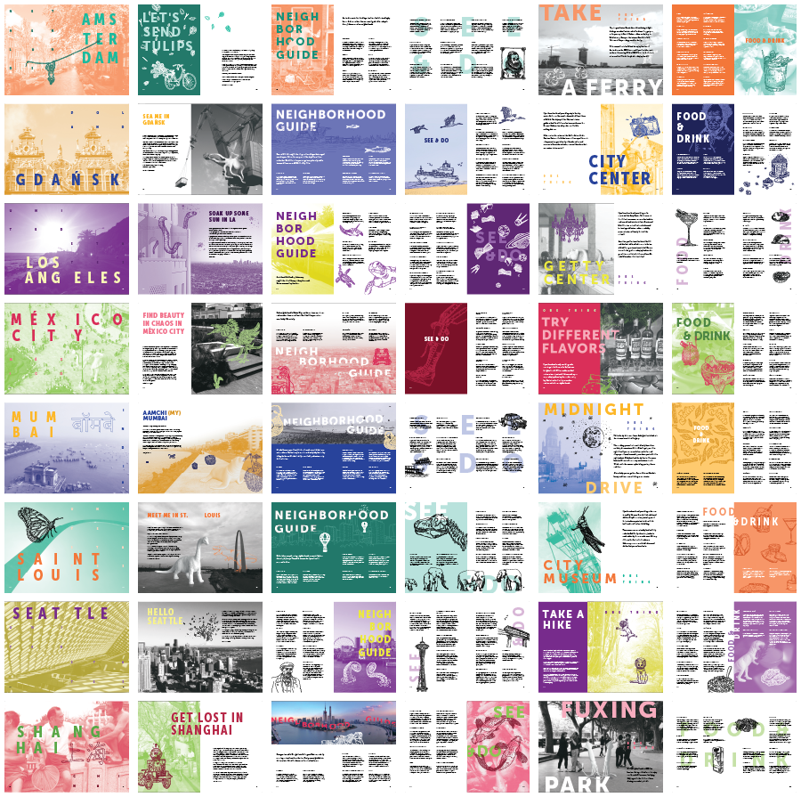

For the second year in a row, we decided to create a Sinterklaas book for our clients and partners. Last year the book was all about [cocktails](https://theartificial.com/blog/2017/01/16/sinterklaas-book.html). This year, we celebrated our many varied origins and influences by creating a city travel guide. Each of us selected a city we've called home, and we curated our top travel tips and food and drink recommendations.

The annual print project gives us an opportunity to set aside usability and to prioritize graphic expression. We get to forget about OS patterns and imagine our own patterns. And as much as we like to see our apps built, the book is a welcome opportunity to push our graphic skills beyond the constraints of implementation.

For the guide's style, we decided to create thoroughly integrated compositions of photography, illustration, typography, and our whimsical white animals. Rather than sitting in rectangles on discrete spatial plans, our goal was to have all of these elements interwoven with each other to create rich and engaging compositions.

Without the guidelines of any OS to constrain us, it was important that we create our own constraints. We started with color: each city has its own complimentary color scheme based on The Artificial Palette. Then we selected the [Museo Sans] (https://www.exljbris.com/museosans.html) font family – including Condensed for plenty of flexibility.

Less visually obvious choices also hold the book together, including the common grid and baseline grid, the type sizes and layout patterns, and the uniform illustration style.

Perhaps most challenging aspect of this year's design was establishing the careful cadence of elements that transcends any individual spread. While we wanted some pages, like titles, to have a common thread, we also wanted to avoid templates that lead to a uniform appearance. To do this, it was important to look at the book composition as a whole, rather than as pages in a series.

From this view of everything, we could be sure to balance overall use of color, the cadence of light and dark, and pages dominated by photography or typography or illustration. Most importantly, we could ensure that the reader of our city guide never went too long without a bit of humor popping up across the spreads.

The guide is a limited edition, but we don't want anyone to miss out. If you want to get our travel tips, visit [our lists on Foursquare](https://foursquare.com/veryartificial?all=lists).
