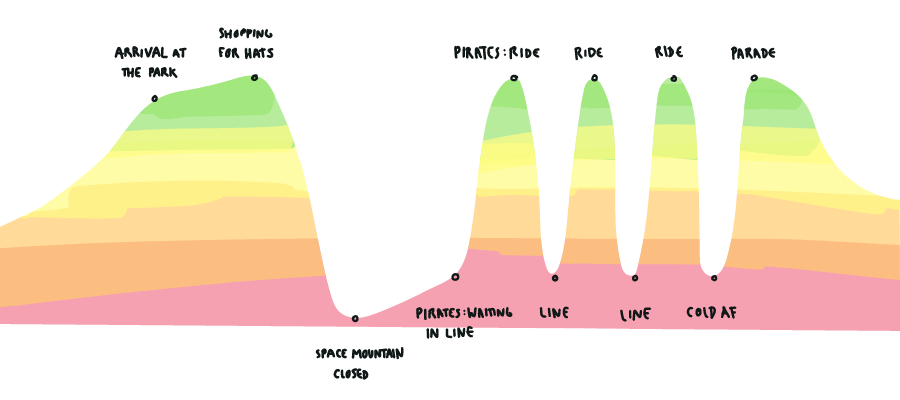

This year’s Artificial holiday trip was to Disneyland Paris. The Disney theme parks are more than simple fun – they provide many examples for experience designers to study and learn from.

Our experience went something like this:

We arrived excited, and left exhausted. We rode roller coasters, spun in teacups, and watched pepper’s ghosts dance before us. We drank hot chocolate and kept our ears warm with Minnie Mouse hats. All in all, it was a good day. But one thing stood out to us in the cold, rainy Parisian winter: the lines.

While waiting in line may seem a necessary evil to the theme park adventure, it might be better seen as an opportunity. Just like any onboarding flow in the digital realm, the line provides Disney with an opportunity to set expectations, engage users with their brand, and build excitement for the experience to come.

## Set Expectations

Users have a lot of questions when it comes to onboarding experiences: How long is it going to take? What’s expected of me? Am I moving faster or slower than expected? Are we there yet?

Whether our user is waiting in line to ride Pirates of the Caribbean or setting up a connected coffee machine, it’s usually the experience at the end of onboarding that they’re looking forward to. Our user might be in a time crunch. Maybe the park is going to close in an hour or perhaps they have an upcoming appointment they can’t be late for. Either way, it’s imperative that experience designers communicate how long an onboarding experience is going to take.

### Our Experience

Disneyland Paris does in a few different ways. Some rides have official signs while others have haphazard paper signs. In a few circumstances, we had to ask an employee standing at the front of the ride how long our wait would be. In most cases, the execution of the communication left us lacking confidence in the time estimate.

Once we were in line, it was often hard to tell if we were moving at the expected pace. We often couldn’t see what was coming next, and frequently thought we were further along than we actually were.

### Our Takeaway

It’s important to communicate clearly and confidently to users how long an onboarding process will take. If onboarding has multiple steps, communicate how long each will take.

Let users know up front what they need so that they’re prepared. For example, if a user needs to charge the connected product, tell her before she begins the onboarding flow so she can wait until she’s ready to begin.

It’s important not only to set the user’s expectations at the beginning, but to continue setting expectations throughout the experience. Feeling like she’s moving forward will help the user feel like the process is less long, and showing her how close she is to the end will help her stay engaged to the finish.

## Engage Users

Waiting in line is no fun and setting up a new product is often frustrating. These truths hold because both experiences are treated in utilitarian ways. Is this because experience designers spend all of their effort on the primary experience and forget about the experience leading up to it? Perhaps if we thought of experiences more as stories, we’d realize how important it is that we use these first few chapters to introduce the user to our brand’s character.

### Our Experience

The lines at Disney were exceptionally frustrating because they made up 75% of our experience and were, for the most part, undesigned. Those parts that were designed focused on decoration over storytelling.

Pirates of the Caribbean had small still lifes set up throughout the course of the line to capture our interest, but these vignettes added little to the story (which has been extensively fleshed out over five films). Had Disney used this as an opportunity to provide the user with more backstory, the overall feeling may have been intrigue rather than fatigue.

### Our Takeaway

Onboarding should be designed alongside and as a part of the experience, not just as an add-on once the experience has already been defined. Not only should the first ten minutes of setup look look every day use, it should also feel like every day use.

Avoid your user’s attention timeout by giving her something to do. Gather information while she waits for her product to calibrate or provide her with a small game to play instead of a spinning loading indicator. Engage her with story to help her understand why her experience is so great, and she’ll carry this positivity into her every day use.

## Build Excitement

While waiting in line or onboarding may not be the most exciting part of an experience, it is still a part of the experience. In both cases, this can be used to create a feeling of anticipation for what's to come. Will it be scary? Will it be exhilarating? Will you learn something about yourself you didn't know before? Onboarding is the moment to get the user excited about what's to come.

### Our Experience

As one of the few Artificers who has never been to Disney, I had little idea what to expect. I had only the excitement of those around me to understand what was to come. In many cases, I suspect childhood memories were more bright than the experiences we had as adults.

Nonetheless, had Disney been more strategic about sight lines or teasers, I would have had a greater sense of anticipation. Take for example _Indiana Jones™ et la Temple du Péril_. We spent almost the entire ride thinking it would be a fairly boring roller coaster with no up-side-down loops. Spoiler: there is an up-side-down loop!

### Our Takeaway

In onboarding, it’s important not only to engage users in the moment, but also to build excitement for what’s to come. Giving the user glimpses into what she can expect will help her look forward not only to her first use, but also to many subsequent uses.

Gaming trailers do an excellent job of this. They help the user see what items, features, or moves they can unlock if they stick with the experience. These teasers of the future help the novice user struggling to get through the tutorial of a game keep at it with anticipation of what his character will eventually achieve.

Providing peeks into the future will help your user imagine herself in that future, ensuring a longer and more fulfilling engagement with your product.

---

As experience designers, it’s important to give onboarding as much consideration as we give to everyday use cases. For Disney, neglecting to design the line meant leaving users with confused expectations while also missing opportunities to generate loyalty and excitement. For experiences with connected lightbulbs and toothbrushes, we know the outcomes of a poor onboarding experience to be much worse. After all, Disney has a magic that helps them deliver an always-spectacular experience despite the most critical of eyes.
