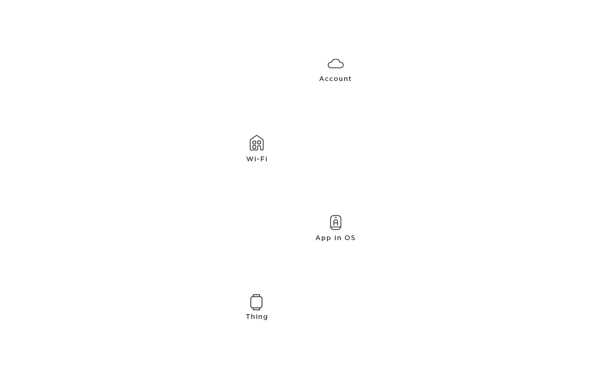
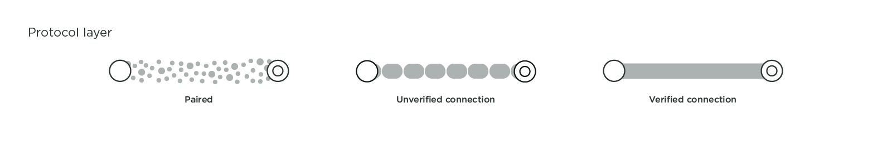
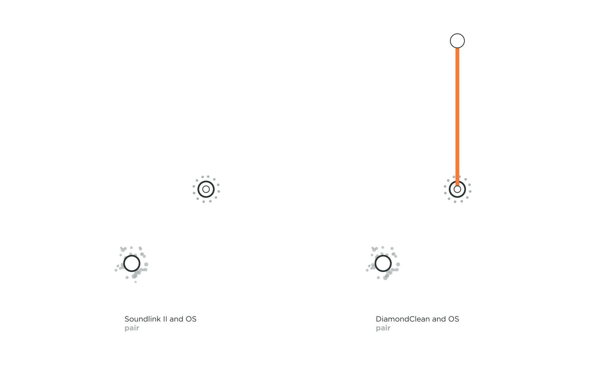
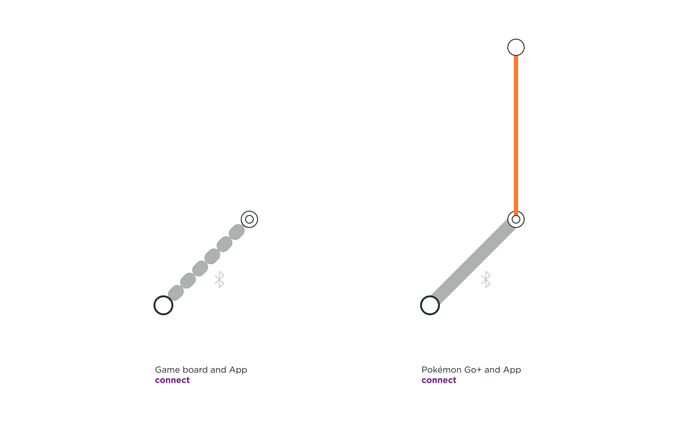
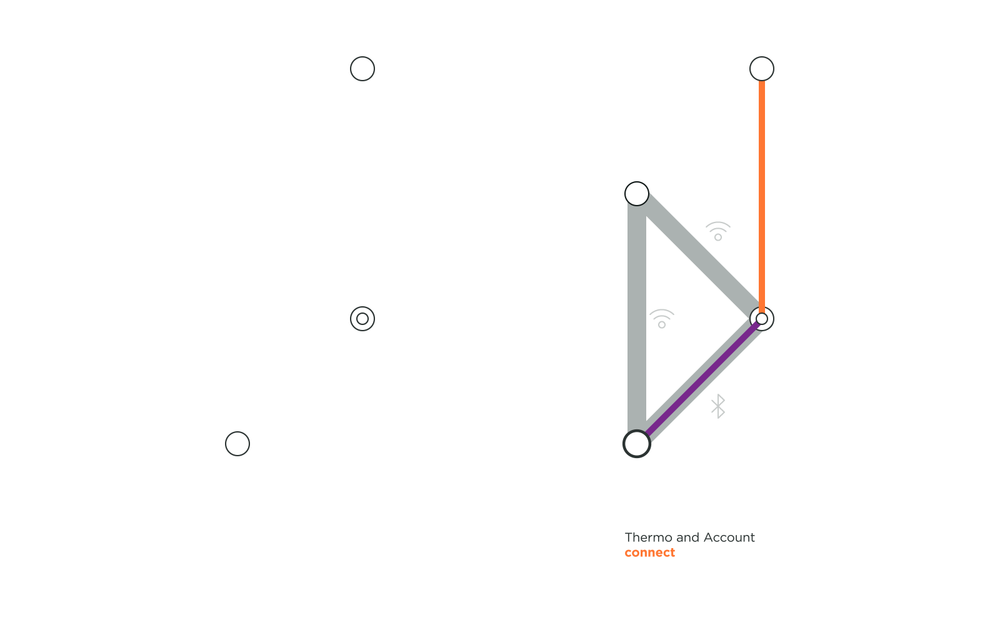
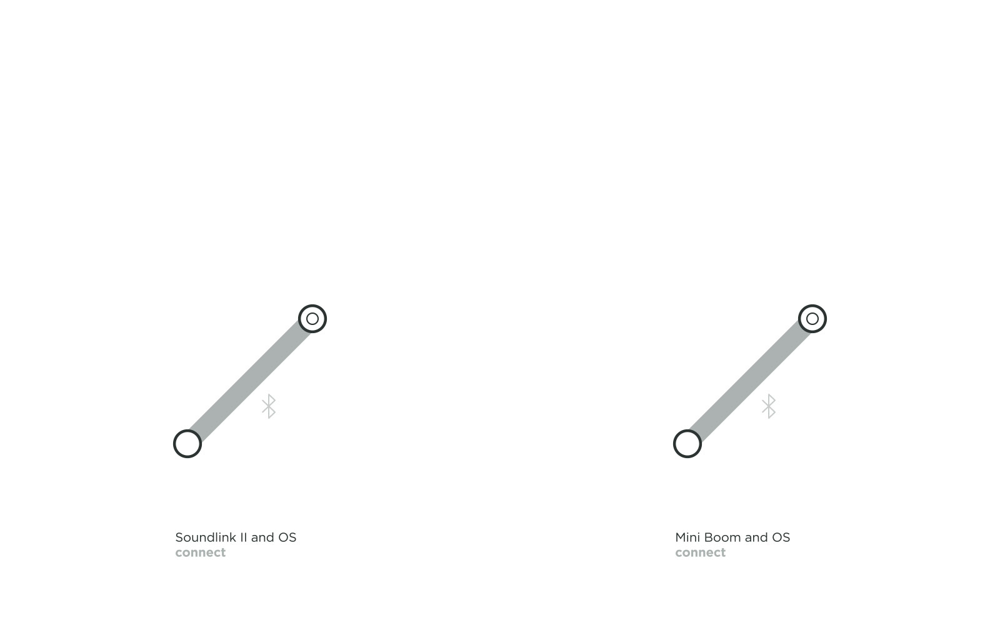
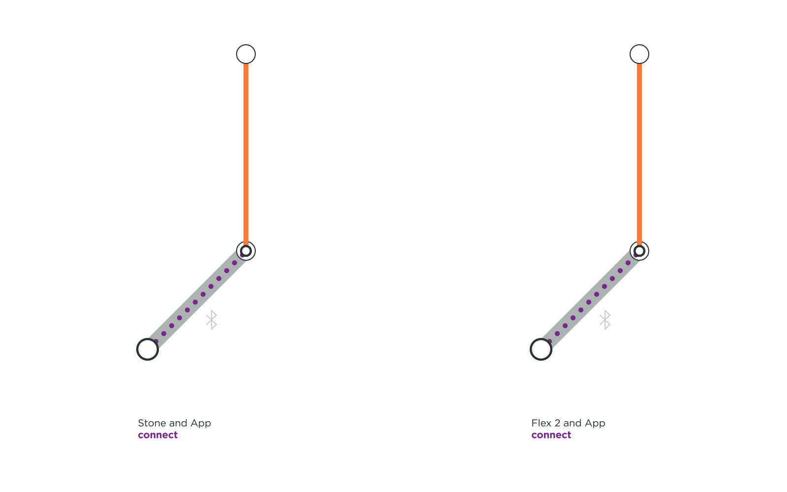
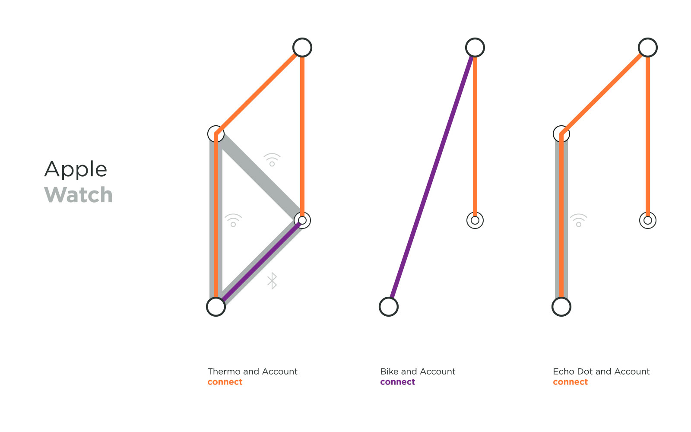
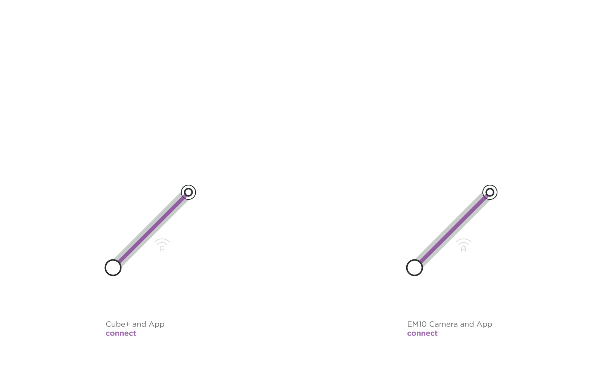
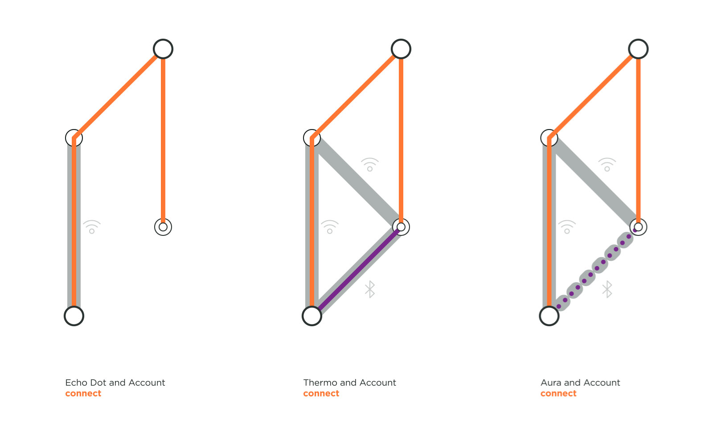

To design magical connection experiences that seem smooth and effortless to users, we believe that there is a value in understanding the technology running behind it. Not only would this help designer make better UX decisions, but also have us recommend best practices when choosing a way of connecting a product. Today, many network infrastructures and protocols exist to establish a connection. We wondered why certain products use a particular technology (such as Bluetooth over Wi-Fi) or why the experience of connecting some products seems easier as compared to others. So, we familiarized ourselves with the technical steps occurring when a user establishes a connection with a product while manipulating an interface or the product itself.

As we were researching around twenty connected products, we established a framework so we could communicate our understanding of connections flows and identify patterns. Hopefully, this summary of findings creates more awareness about the technical details of a connected product and eventually inspire other designers to design better connection experiences.

| | | | |
|-|-|-|-|
|  |  |  |  |
|  |  |  |  |
|  |   |  |  |
|  |  |  |  |
|  |  |  |  |

---

## The actors
### Introducing the actors
Searching for 'connection topology' online should bring up many technical diagrams. Very few of these are designer or user friendly, which could discourage anyone to pierce the mysteries of the black box of magic or of the floating cloud. When we began building our framework, we established who our actors were, but also when and how they were speaking to each other. After a few iterations on our system visualization, we reduced our actors to five essentials.

| | |
|-|-|
| | **The Thing:** Also known as the connected product, it is the object the user is trying to connect to. It could be a camera, a speaker, a toothbrush, a bicycle, a wearable, and many more other Things…|
| | **The OS:** Sometimes, Things need devices to connect. In most cases, it refers to the user's smartphone, but it could also be a tablet or a desktop. The real actor is the operating system (OS) that lives in these devices that the Thing is speaking with.|
| | **The App:** The App is separated from the OS, even though it is residing within the OS. There is a difference when a Thing connects to an OS, or to an App. While not all Things require an App to function, some do, especially when there is a need for a Thing to communicate to a user account.|
| | **The Wi-Fi:** While we have chosen not to show which network an App uses to connect to an account, we did see the importance in showing when a Thing needs to establish a Wi-Fi network connection. With the smart home boom, more and more home connected Things require a Wi-Fi network to function.|
| | **The Account:** Not all connected Things really require a user account to function, but many services ask their user to create an account prior to a Thing connection. There are many ways a Thing can connect to an account, through a wireless network at home or at a local coffee shop as well as through a device's cellular data. Hence, we did not concentrate on how an App connects to an account, but only if it does or not.|

### Setting the stage

Now that you know our actors, here is how you can identify them on stage. Each actor has a unique static position so that it is easier to compare the connection flows. If the actor does not play a part in the connection flow, it is not shown in the layout. From the bottom to the top, you'll find the Thing, the OS with the App, the Wi-Fi, and the account.

## The two acts
Things connect at two distinct layers - the protocol layer and the software layer. A connection at each layer implies different steps that happen over time in the connection process.

### The protocol layer
  

Connecting at the protocol layer usually comes first in the play. This connection is between a device's OS and a Thing that can happen over Bluetooth or a Wireless network such as Wi-Fi ad hoc. To check if a Thing is connected at the protocol layer, just head to the Bluetooth accessories or to the Wi-Fi settings in the OS. Here you will find the name of your Thing and its paired and connection status. During a Bluetooth connection, if the OS asks the user to confirm the pairing, it leads to a verified connection. An unverified connection occurs when the OS and Thing connect without the user's permission. With a Wi-Fi and a Wi-Fi ad hoc connection, if a password is exchanged, a verified connection is established leading to a thick solid grey line in our framework. If no password or code is exchanged, an unverified connection is established, which is represented by the dotted grey line in our framework.

  

For example in the above topology, we can view the connection flow of Bose SoundLink II, a portable Bluetooth speaker by Bose. It pairs with the mobile's OS to form a verified connection. We know it is verified because the speaker gives a light feedback indicating that it is connected and it also tells out loud that it is now associated with your device by naming it. You can also see the name of your SoundLink II under 'paired devices' in your OS.

An unverified protocol connection can be observed with the Philips Sonicare DiamondClean toothbrush, an electric toothbrush that connects to an App for assisted brushing. If the Sonicare App is installed and its user logged in, it automatically detects the toothbrush in use. Neither the product nor the OS needs permission with the connection, it just automatically does so.

### The software layer

A software connection is built upon a protocol connection. Only after a protocol handshake, does a Thing connect to an App. A software layer connection can also be a verified connection, where the Thing or the App acknowledge the connection, or it can be an unverified connection, where either the Thing or the App do not acknowledge the connection.

Beasts of Balance is a game in which several players stack as many artifacts as possible on a connected game board. A user only needs to turn on the game board for the OS and the App to connect. The OS does not ask for permission to pair, nor does it confirm that the user is pairing the right game platform, leading to an unverified connection at the protocol layer and at the software layer. The connection flow is quick but what if the user expect their game to be more secure?

Pokémon Go+ is an accessory created for the location-based and augmented reality game Pokémon Go. This optional gadget helps players detecting and catching Pokémons while walking around, without having to constantly look into their smartphone. It has a verified software connection, involving the user to press a button on the Thing and to select it in the App to connect.

When a user account connects to an App, or when it registers the uniqueness of their Thing, it is a user identified connection at the software layer. This is represented by an orange connection line in the framework. In all the flows we reviewed, login to an account is always verified, as a user inputs a password to identify themselves.

VanMoof created an electric city bike with location tracking and a connected lock to give riders a peace of mind and to dodge thieves. On the left, we can see that the user needs to be securely logged into their account on the App in order to access their Bike. The riders' profile contains the unique IMEI and frame number of their bike, making the connection secured. On the right, we can see a part of Nokia Thermo topology. Nokia Thermo measure temperature from user's forehead and automatically syncs readings with the dedicated app. In this section of the animation, the user is already logged in to his account in the Nokia app, and Thermo registers to the user account through home Wi-Fi.

## The play

### Understanding the script

Actors can follow different scripts to reach the end goal of connectivity. Twenty products are a short list, but it is a start to identifying similar practices. We could already observe patterns emerging from our animations based on the technology, the function of the objet and the data exchange. We imagine that the more connection flows we create, the more patterns we will spot.

**Broadcasting to authenticate**
To connect, no matter the technology used, the Thing and the other concerned actor need to talk, one emits a signal and the other one listens. There are different methods to have a Thing to broadcast. The signal can be constant or triggered. Philips Sonicare smart toothbrush called DiamondClean wakes up when the handle is moved thanks to an accelerometer sensor. Apple Airpods wireless earplugs start emitting when their charging case opens. Some other products use a button like Polaroid Cube+ camera or UE MiniBoom portable speaker. On the other hand, some Things are constantly broadcasting if they have power. This is the case of Spire, a wearable that tracks the user breathing pace to reduce stress, that does not need an action from the user to broadcast. For the topology to feel lighter, we just show when broadcasting is relevant to the story. For the same reason, we don't show either that home Wi-Fi also constantly broadcasts.

**Basic Connection**
Some connected Things which do not any hold sensible user data adopt a lower-level security connection. Here the Bose SoundLink II and the UE Mini Boom speakers, and the Apple Pencil allowing to sketch on an iPad Pro, are only connecting the object with the OS via Bluetooth. The main advantage is that users perform least actions to start playing or drawing. Another particularity of this simple connection on the protocol layer is that the product is easily accessible to multiple users, as they do not require a code or password exchange. To add a nuance to the simplicity, in these topologies, the connection is verified because the users manipulate the Thing as well as the OS at the time of connection, ensuring that users are connecting to the right product and that their neighbors won't connect without warning them. In facts, the Apple Pencil has to be plugged into the iPad before a Bluetooth connection at the software layer is established. The Lightning connector ensures that no other iPad accidentally connect to the Apple Pencil.

**Secured Data Connection**
 We were surprised to discover that the health monitoring wearables like Fitbit and Spire do not require to register to the user's account in order to send personal data to their respective App. As shown above, the Things are not verified by the user account. This practice unveils a risk. Flex 2 bracelet and Spire Stone can connect to strangers account without asking any form of password or even deregistering the initial owner. To make it worst, when this happens, the previous user is not even informed that his or her Thing is used by a stranger. So if you forgot your Fitbit Flex 2 at the gym, whoever finds it can start using it without any hiccups.

**Account Connection**
Some services holding confidential data adopt a more intermingled connection system. In the above examples, users need to register their object to their account, so that their data is more secure, and also accessible from multiple devices. Product registration in the account was endorsed by some health wearables such as the Apple Watch, and by Amazon's voice assistant product like Echo Dot and Echo Show. VanMoof goes so far as to allow an unverified protocol connection because it establishes a secure account connection with the bike IMEI number and frame number. We recommend registering the connected Things to user account because it associates the user with his object. Then if a Thing gets lost or stolen, this best practice could help finding it and or securing the data associated with it.

**High Bandwidth Data Connection**
Polaroid Cube+ and Olympus EM10 are two cameras that happen to use a Wi-Fi ad-hoc to connect at the protocol and at the software layer. A camera would want a Wi-Fi connection rather than a Bluetooth connection as the former transfers heavy data faster, and more securely with an optional password exchange. While Wi-Fi ad hoc is an appropriate technology for image transfer, it disrupts both other apps running on the device and the connection flow because a device cannot be connected to Wi-Fi and the Thing's ad hoc Wi-Fi simultaneously. It means that the user would need to disconnect their OS from an existing Wi-Fi infrastructure network in order to connect to a Wi-Fi ad-hoc network.

**Home Connection**
Connected home Things such Amazon's Echo Dot, Nokia's Withings Aura, and Thermo do not actually need to be connected to an OS for continued use. An OS and an App are used but only to set up a secured connection with a home Wi-Fi in order to register the objects with a user account. Once this connection and registration are established, a user can access their connected object via any OS that is logged into the same user account.

## The End

As we stumbled upon various observations and patterns, we hope to study more products to analyze their connection flows. A study by Gartner claims that in 2020, the number of connected Things would more than double from 2017 to reach over 20.4 billion objects (1). Hopefully, these products functions will evolve to become more and more meaningful to entertain us, facilitate communication, make our life more comfortable, diagnose us, cure us, help us to commute... etc. We hope that this framework raises awareness on the different choice of connections and the risk they imply, and that it creates considerations to design better experiences not only on the App but also on the connected Things.

(1)http://www.zdnet.com/article/iot-devices-will-outnumber-the-worlds-population-this-year-for-the-first-time/

---
