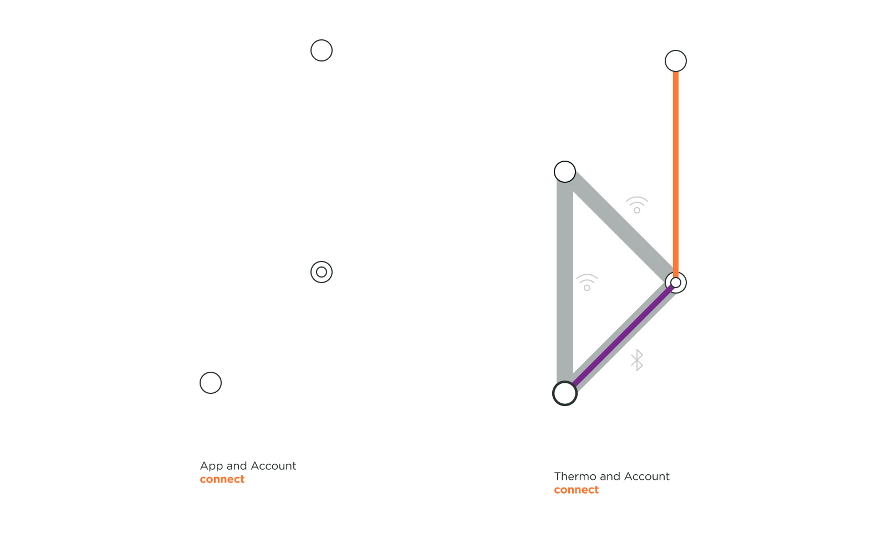

TODO: Double check that glossary. Some of the "official" terms are different than those we discussed, and as a result end up meaning a very different thing. For example – "wifi infrastructure" is something very different than "infrastructure wifi". Knowing the right words is probably even less important than being able to identify and discuss why the wrong terms are wrong.

You should also be able to identify industry terms versus those that we needed to make up so we could do this exercise.

Understanding a thing goes hand-in-hand with understanding how to talk about a thing. Do let your curiosity get the best of you!

As designers in the Era of the Internet of Things, we worked for various connected objects accompanying users in their leisure time, with their city commutes, and with their health. We familiarized ourselves with the technical steps occurring when a user establishes a connection with a Thing while manipulating an interface or the object itself. To design magic connection experiences that seem extremely smooth and effortless to users, we believe that there is a value in understanding the technology running behind. Not only would this help us make better UX decisions, but also have us recommend best practices when choosing a way of connecting a product. As we were researching around twenty connected Things, we established a framework so we could communicate our understanding of connections flows and identify patterns. Hopefully this summary of findings creates more awareness about the technical details of a connected object and eventually inspire to design better connection experiences.

/ hero image (of the matrix of framework) goes here /

---

## Actors

### Introducing the actors
We identified four recurrent actors playing a role in the connections of Things.

| | | |
|-|-|-|
| | **The Thing:** Also known as the connected product, it is the object the user is trying to connect to. It could be a camera, a speaker, a toothbrush, a bicycle, and many more other Things ... |
| | **The OS:** In most cases it refers to the user smartphone, but it could also be a tablet or a desktop. The real actor is the operating system, either from Android or Apple that the Thing is speaking with. |
| | **The App:** The App is separated from the OS, it is, in fact, residing within the OS. A Thing connecting to an OS, or to an App is different. While not all Things require an App to function, some do, especially in the case of a need to establish a communication between your Thing and your user account. |
| | **The Wi-Fi:** Many homes connected Things require a Wi-Fi network. Though, aside from objects relating to the home automation, many connection flows do not require Wi-Fi to establish a connection. |
| | **The Account:** Not all connected Things require a user account, but many services requires an account prior to a Thing connection. There are many ways your Thing can connect to an account, through a wireless network at home or at your favorite coffee shop and through your device cellular data. Hence, we did not concentrate on how an App connects to an account, but only if it does or not. |

### Setting the stage
  
Now that you know our actors, here how you can identify them on stage. Each actor has a unique static position so comparison between Things are scannable. If the actor does not play a part in the connection flow, it is not shown in the layout. From the bottom to the top, you'll find the Thing, the OS with the app, the Wi-Fi, and the account.

## Layers
Connecting a Thing can occur at the protocol layer and at the software layer. The distinction matters to designers because different layers of connections imply different steps in the connection process. Connecting at the protocol layer comes first in the play. This connection is exclusively between a device's OS and a Thing. You can easily identify it if you are able to find your Thing in the list of your Connected objects in the OS setting of your mobile. This connection can be an end by itself, but in most cases, where the Thing is aiming to connect to an app, this protocol layer connection can be the first act of the whole play. The second act of the play, after the intermission, is the connection at the software layer that can rarely occur before the protocol connection. To spot this connection, you can imagine any connected product that has an app. If we take VanMoof Electrified bicycle for instance, the fact that you can see the bike connected in the VanMoof app means you can probably guess it is connected both at the protocol layer and the software layer. To verify this second point, you'll probably see the bicycle in your Bluetooth paired objects in the OS settings. These two layers of connection sometimes seem to occur in one act on the UI but don't mix them up. To provide the right guidance to your user in an interface to connect a Thing to an OS or to an app, you will need to distinguish these two layers.

### The protocol layer
  

TODO: Make sure this is clear. What are the different protocol layers that we established and how are each use? Try leading with what it is, followed by how it's represented, and then adding detail — different types of, exceptions, how a designer can tell it's a protocol layer, etc.

TODO: different step in the connection = different state for a Thing = different UI

A Thing connects to the OS or to a Wi-Fi infrastructure through the protocol layer. In our framework, the protocol layer is represented by the grey color. A Thing can pair with a device on the protocol layer via Bluetooth but it can also authenticate at the protocol layer with other technologies like Wi-Fi ad hoc, or Wi-Fi direct. These connections at the protocol layer can be verified if the Thing is recognized as a unique item that can not be mistaken with another similar Thing and, for an authentication with the Wi-Fi if it is protected by a password.

  

For example in the above topology, we can see the Bose SoundLink II pairs with your OS to form a verified connection. We know it is verified because not only does the speaker give a light feedback indicating that it is connected, but the speaker also tells that it is now associated with your device by naming it and you can see the name of your SoundLink II under paired devices in your OS.

An unverified protocol connection can be observed with the Philips Sonicare Diamond Clean toothbrush. If you have an app installed and logged in, it automatically detects a toothbrush in use when it is activated. The product nor the OS need to be paired with a connection, it just automatically does so.

### The software layer

When your Thing connects to an App, it does so through the software layer, which is indicated in purple in the framework. This connection can also be a verified connection, where your Thing or the App acknowledge the connection, or it can be an unverified connection, where either your Thing or the App do not acknowledge the connection.

When an App connects to an account or when the account registers your Thing, it is a user identified connection at the software layer. This is represented by an orange connection line in the framework. In all flow we reviewed, login to an account is always verified, as a user inputs a password to identify themselves.

Beasts of Balance is a great party game in which users stack creatures on a connected Plinth. A user only needs to turn on the Plinth for the OS and the App to connect to it. The OS never asks for the user's permission to pair, leading to an unverified connection, not just at the protocol layer but also at the software layer. The connection flow is quick but do you expect your game to be more secured?

Pokemon Go+ has a verified software connection, involving the user to press a button on the Thing and to select it to connect to the App.  

For VanMoof, the user needs to have registered their bike frame number and IMEI number with their account in order to be able to login to their account in an app.

## Identifying patterns

TODO: Continue the extended metaphor into this section.

As we animated our Things connection flows, we saw patterns of practices emerging. Twenty products make a short list, but it is a start and we imagine the more connection flows we create, the more patterns we will find. What was satisfying was that we could already identify certain connection patterns based on the type of the Thing.

TODO: Write this section

**When Things only require connection to an OS**
/gif of UE mini boom, Bose sound link, Apple pen?/
Contrary to the health wearables like Fitbit and Spire, the speakers do not connect to an app, but only to the protocol layer. They don't need an app to function. UE Mini Boom does require an app to play music on multiple speakers but not for one.

**When Pairing occurs once and later allows faster connection**
/gif of UE mini boom, Bose Sound Link II, Spire Stone, Fitbit Flex 2/
UE mini boom, Bose Sound Link II, Spire Stone, and Fitbit Flex 2 only require to be paired once so they can connect automatically later. Though, when the first pairing was established, the Thing would just directly connect.
TO DO : are these only Bluetooth? If so Why?

**When Things require a Wi-Fi ad hoc connection**
/gif of polaroid cube and Olympus/
The two camera we looked at where using a Wi-Fi ad hoc connection because the data exchange is heavy and a Bluetooth connection would be to slow.

**App is used to connect to products as well as to register the product to the user account**
/fitbit, spire, apple watch/
Health wearables connected to an account, so that a user can sync and access the data through any OS.

**When an OS connection is required to give credentials to connect to a home Wi-Fi infrastructure**
(gif of Echo dot, Aura, thermo)

**When Things require Bluetooth and Wi-Fi connection**
(Apple watch, echo dot)

/ Matrix of all stories together /

---
