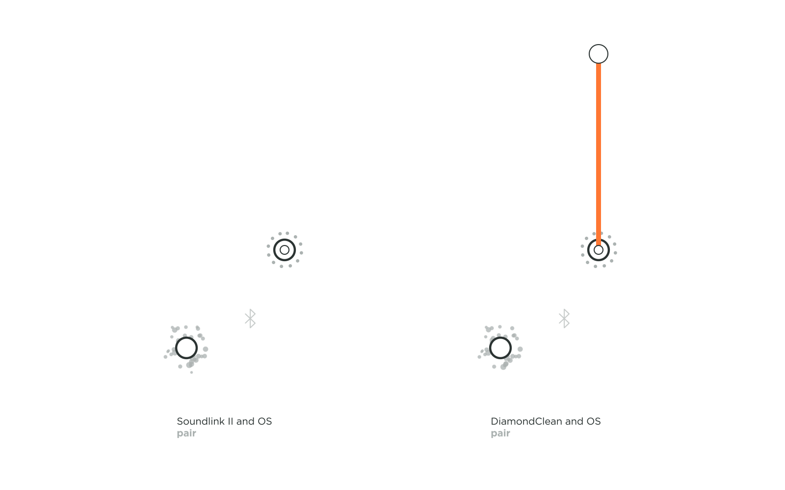
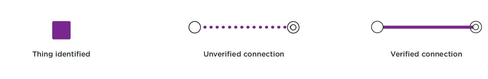

To design magical connection experiences that seem smooth and effortless to users, we believe that there is a value in understanding the technology running behind it. Not only would this help designer make better UX decisions, but also have us recommend best practices when choosing a way of connecting a product. Today, many network infrastructures and protocols exist to establish a connection. We wondered why certain products use a particular technology (such as Bluetooth over Wi-Fi) or why the experience of connecting some products seems easier as compared to others. So, we familiarized ourselves with the technical steps occurring when a user establishes a connection with a product while manipulating an interface or the product itself.

As we were researching around twenty connected products, we established a framework so we could communicate our understanding of connections flows and identify patterns. Hopefully, this summary of findings creates more awareness about the technical details of a connected product and eventually inspire other designers to design better connection experiences.

TODO: / hero image of the matrix of frameworks goes here /

---

## The actors
### Introducing the actors
Searching for 'connection topology' online should bring up many technical diagrams. Very few of these are designer or user friendly, which could discourage anyone to pierce the mysteries of the black box of magic or of the floating cloud. When we began building our framework, we established who our actors were, but also when and how they were speaking to each other. After a few iterations on our system visualization, we reduced our actors to five essentials.

|               |              |
| :------------- |:-------------|
| | **The Thing:** Also known as the connected product, it is the object the user is trying to connect to. It could be a camera, a speaker, a toothbrush, a bicycle, a wearable, and many more other Things…|
| | **The OS:** Sometimes, Things need devices to connect. In most cases, it refers to the user's smartphone, but it could also be a tablet or a desktop. The real actor is the operating system (OS) that lives in these devices that the Thing is speaking with.|
| | **The App:** The App is separated from the OS, even though it is residing within the OS. There is a difference when a Thing connects to an OS, or to an App. While not all Things require an App to function, some do, especially when there is a need for a Thing to communicate to a user account.|
| | **The Wi-Fi:** While we have chosen not to show which network an App uses to connect to an account, we did see the importance in showing when a Thing needs to establish a Wi-Fi network connection. With the smart home boom, more and more home connected Things require a Wi-Fi network to function.|
| | **The Account:** Not all connected Things really require a user account to function, but many services ask their user to create an account prior to a Thing connection. There are many ways a Thing can connect to an account, through a wireless network at home or at a local coffee shop as well as through a device's cellular data. Hence, we did not concentrate on how an App connects to an account, but only if it does or not.|

### Setting the stage
  
Now that you know our actors, here is how you can identify them on stage. Each actor has a unique static position so that it is easier to compare the connection flows. If the actor does not play a part in the connection flow, it is not shown in the layout. From the bottom to the top, you'll find the Thing, the OS with the App, the Wi-Fi, and the account.

## The two acts
Things connect at two distinct layers - the protocol layer and the software layer. A connection at each layer implies different steps that happen over time in the connection process.

### The protocol layer
  

Connecting at the protocol layer usually comes first in the play. This connection is between a device's OS and a Thing that can happen over Bluetooth or a Wireless network such as Wi-Fi ad hoc. To check if a Thing is connected at the protocol layer, just head to the Bluetooth and Wi-Fi settings in the OS. Here you will find the name of your Thing and its paired and connection status. During a Bluetooth connection, if the OS asks the user to confirm the pairing, it leads to a verified connection. An unverified connection occurs when the OS and Thing connect without the user's permission. With a Wi-Fi and a Wi-Fi ad hoc connection, if a password is exchanged, a verified connection is established leading to a thick solid grey line in our framework. If no password or code is exchanged, an unverified connection is established, which is represented by the dotted grey line in our framework.

  

For example in the above topology, we can view the connection flow of Bose SoundLink II, a portable Bluetooth speaker by Bose. It pairs with the mobile's OS to form a verified connection. We know it is verified because the speaker gives a light feedback indicating that it is connected and it also tells out loud that it is now associated with your device by naming it. You can also see the name of your SoundLink II under 'paired devices' in your OS.

An unverified protocol connection can be observed with the Philips Sonicare DiamondClean toothbrush, an electric toothbrush that connects to an App for assisted brushing. If the Sonicare App is installed and its user logged in, it automatically detects the toothbrush in use. Neither the product nor the OS needs permission with the connection, it just automatically does so.

### The software layer

A software connection is built upon a protocol connection. Only after a protocol handshake, does a Thing connect to an App. A software layer connection can also be a verified connection, where the Thing or the App acknowledge the connection, or it can be an unverified connection, where either the Thing or the App do not acknowledge the connection.

Beasts of Balance is a great party game in which users stack creatures on a connected game board. A user only needs to turn on the game board for the OS and the App to connect to it. The OS never asks for the user's permission to pair, leading to an unverified connection, not just at the protocol layer but also at the software layer. The connection flow is quick but do you expect your game to be more secure?

Pokemon Go+ is an optional accessory that lets you play Pokemon Go when you are walking about the city, without having to constantly look into your smartphone. It has a verified software connection, involving the user to press a button on the Thing and to select it to connect to the App.  

When a user account connects to an App, or when it registers the uniqueness of your Thing, it is an user identified connection at the software layer. This is represented by an orange connection line in the framework. In all the flows we reviewed, login to an account is always verified, as a user inputs a password to identify themselves.

VanMoof created the perfect connected city bike that tells you your bikes location at all times, and also let's you lock and unlock your bike with a user App. On the left, we can see that the user needs to be securely logged into their account on the App in order to access their Bike. On the right, we observed Nokia Thermo, a smart thermometer, that registers the Thing to the users account, after an App log in.

## The play

### Understanding the script

We understood that actors can follow different scripts to reach the end goal of connectivity. We know twenty products are a short list, but it is a start and we imagine the more connection flows we create, the more patterns we will find. What was satisfying to learn was that we could already identify certain connection common practices based on the technology, the type of the Thing and the data exchanges

**Basic Connection**
/gif of UE Mini Boom, Bose sound link, Apple pen/
Connected Things which do not any hold valuable user data follow a low-level security connection. They aim for least action required by the user to establish a connection. These Things are also easily accessible to different users, as they do not require a code or password exchange.

We found that home entertainment systems like the Bose SoundLink II and the UE Mini Boom follow this play. They do add a level of verified connection security, by having the users manipulate the Thing as well as the App at the time of connection, ensuring that you are connecting to the right product and that your neighbor won't be able to connect to your speakers through the walls. The Apple Pen has a basic Bluetooth connection as well but establishes that only after a direct connection with your iPad, again ensuring no other iPad accidentally pairs with it.

**Secured Data Connection**
/gif of Fitbit, Spire/
This was a surprising pattern to find. While Fitbit and Spire both monitor user health data and connect to an app for secure data showcasing, the Thing itself is never secured to the user's account. The Flex 2 and Spire Stone can be connected to a strangers account without requiring any form of password exchange or even deregistering from the initial owner's account. So if you forgot your Fitbit Flex 2 at the Gym, whoever finds it can start using it without any hiccups.

**High Bandwidth Data Connection**
/gif of polaroid cube and Olympus/
The Polaroid Cube+ and the Olympus EM10 were two cameras we looked at, that happens to use a Wi-Fi ad-hoc connection. We understood why a camera would want a Wi-Fi connection rather than a Bluetooth connection as the former can transfer heavy data faster, and more securely with an optional password exchange. While this is a good connection flow for image data transfer, the risk you run into is that you are asking the user to disconnect their OS from an existing Wi-Fi infrastructure network in order to connect to a Wi-Fi ad-hoc network, which might disrupt other Apps running on that OS.

**Account Connection**
/Apple Watch, VanMoof, Thermo, Echo dot/
Connected Things that hold valuable user data follow a more strict connection flow. A user needs to register their Thing to their account, so that their data is always secured, and also accessible from multiple devices. Not only is this practice seen with health wearables such as the Apple Watch, but also home devices such as Amazon Echo dot and Nokia Thermo. VanMoof goes so far as to not require a secure OS connection because it establishes a secure account connection with the bike IMEI number and frame number.

This is a great connection practice to secure user data and Thing. A secure account connection lets the user be at peace that even if their Thing gets lost or stolen, it can be tracked or that their data can be secured.

**Home Connection**
/gif of Echo dot, Aura, Thermo/
Connected home Things such as Amazon's Echo dot, Nokia's Withings Aura, and Thermo, do not actually need to be connected to an OS for continued use. These Things do use an OS and an App, but only to set up a secure connection with a Wi-Fi infrastructure to register with a user account. Once this connection is established, a user can access these Things via any OS that is logged into the same user account.

##End

While there are many smaller patterns that we stumbled upon, we hope to study more product connection flows to be able to write them up here. A study by Gartner claims that there will be 8.4 billion connected things in 2017(1). These are connected products that are diagnosing us, entertaining us, curing us, as well as driving us. We hope that designers can use this framework to study connection flows on their own, equipping themselves with vital knowledge on how each connection requires different design and security aspects. They might even be able to influence smoother connections not only on the App but also on the product itself.

(1)http://www.zdnet.com/article/iot-devices-will-outnumber-the-worlds-population-this-year-for-the-first-time/

---
