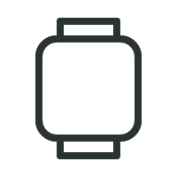
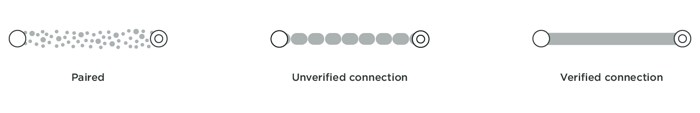
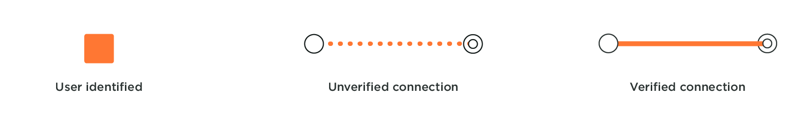

Being a designer in the era of the internet of things can be challenging. When designing for connecting things, it's important to understand the technology that enables it. Today, there are so many network infrastructures and protocols that exist to establish a connection. We wondered why certain products use a particular infrastructure (such as Bluetooth over Wi-Fi) or why the experience of connecting some products seems so smooth as compared to others. So, we familiarized ourselves with the technical steps occurring when a user establishes a connection with a product while manipulating an interface or the product itself. To design magical connection experiences that seem extremely smooth and effortless to users, we believe that there is a value in understanding the technology running behind it. Not only would this help us make better UX decisions, but also have us recommend best practices when choosing a way of connecting a product.

As we were researching around twenty connected products, we established a framework so we could communicate our understanding of connections flows and identify patterns. Hopefully, this summary of findings creates more awareness about the technical details of a connected product and eventually inspire other designers to design better connection experiences.

/ hero image (of the matrix of framework) goes here /

---

## Introducing the actors
If you search 'connection topology' online, there will be many technical diagrams that come up. Very few of these are made with a designer or a user in mind, increasing the myth that technology is a little black box of magic. When we began building our framework, it was important to establish who our actors were and exactly when and how they were speaking to each other. Wanting to keep it simple, we identified five main actors that we believe are essential.

| | |
|-|-|
| | **The Thing:** Also known as the connected product, it is the object the user is trying to connect to. It could be a camera, a speaker, a toothbrush, a bicycle, and many more other Things…
|| **The OS:** Things need devices to connect, or to connect to. In most cases, it refers to the user's smartphone, but it could also be a tablet or a desktop. The real actor is the operating system (OS) that lives in these devices that the thing is speaking with. |
| | **The App:** The App is separated from the OS, even though it is residing within the OS. We did this because there is a difference when a Thing connects to an OS, or to an App. While not all Things require an App to function, some do, especially when there is a need for a Thing to communicate to a user account. |
| | **The Wi-Fi:** While we have chosen not to show which network an App uses to connect to an account, we did see the importance in showing when a thing needs to establish a Wi-Fi network connection. With the smart home boom, more and more home connected Things require a Wi-Fi network to function. |
|]]]]]]| **The Account:** Not all connected Things require a user account, but many services require an account prior to a Thing connection. There are many ways a Thing can connect to an account, through a wireless network at home or at a local coffee shop as well as through a device's cellular data. Hence, we did not concentrate on how an App connects to an account, but only if it does or not. |

## Setting the stage
  
Now that you know our actors, here is how you can identify them on stage. Each actor has a unique static position so that it is easier to compare the connection flows. If the actor does not play a part in the connection flow, it is not shown in the layout. From the bottom to the top, you'll find the Thing, the OS with the app, the Wi-Fi, and the account.

### Layers
Things connect at two distinct layers - the protocol layer and the software layer. The distinction matters because connections follow a certain order through the layers. A connection at each layer implies different steps that happen over time in the connection process.

### The protocol layer
  

Connecting at the protocol layer comes first in the play. This connection is between a device's OS and a Thing that can happen over Bluetooth or a Wireless network such as Wi-Fi ad hoc. To check if a Thing is connected at the protocol layer, just head to the Bluetooth and Wi-Fi settings in the OS. Here you will find the name of your Thing and its paired and connection status. During a Bluetooth connection, if the OS asks the user to confirm the pairing, it leads to a verified connection. An unverified connection occurs when the OS and thing connect without the user's permission. With a Wi-Fi and a Wi-Fi ad-hoc connection, if a password is exchanged, a verified connection is established leading to a thick solid grey line in our framework. If no password or code is exchanged, an unverified connection is established, which is represented by the dotted grey line in our framework.

  

For example in the above topology, we can see the Bose SoundLink II pairs with your OS to form a verified connection. We know it is verified because not only does the speaker give a light feedback indicating that it is connected, but the speaker also tells that it is now associated with your device by naming it and you can see the name of your SoundLink II under 'paired devices' in your OS.

An unverified protocol connection can be observed with the Philips Sonicare Diamond Clean toothbrush. If you have an app installed and logged in, it automatically detects a toothbrush in use when it is activated. Neither the product nor the OS needs permission with the connection, it just automatically does so.

### The software layer

A software connection is built upon a protocol connection. Only after a successful protocol pairing or connection, does a Thing connect to an App. A software layer connection can also be a verified connection, where the Thing or the App acknowledge the connection, or it can be an unverified connection, where either the Thing or the App do not acknowledge the connection.

When an App connects to an account or when the account registers your Thing, it is a user identified connection at the software layer. This is represented by an orange connection line in the framework. In all the flows we reviewed, login to an account is always verified, as a user inputs a password to identify themselves.

Beasts of Balance is a great party game in which users stack creatures on a connected game board. A user only needs to turn on the game board for the OS and the App to connect to it. The OS never asks for the user's permission to pair, leading to an unverified connection, not just at the protocol layer but also at the software layer. The connection flow is quick but do you expect your game to be more secure?

Pokemon Go+ has a verified software connection, involving the user to press a button on the Thing and to select it to connect to the App.  

For VanMoof, the user needs to have registered their bike frame number and IMEI number with their account in order to be able to login to their account in an app.

## Understanding the play

TODO: Continue the extended metaphor into this section.

As we animated our Things connection flows, we saw patterns of practices emerging. Twenty products make a short list, but it is a start and we imagine the more connection flows we create, the more patterns we will find. What was satisfying was that we could already identify certain connection patterns based on the type of the Thing.

TODO: Write this section

**When Things only require connection to an OS**
/gif of UE mini boom, Bose sound link, Apple pen?/
Contrary to the health wearables like Fitbit and Spire, the speakers do not connect to an app, but only to the protocol layer. They don't need an app to function. UE Mini Boom does require an app to play music on multiple speakers but not for one.

**When Pairing occurs once and later allows faster connection**
/gif of UE mini boom, Bose Sound Link II, Spire Stone, Fitbit Flex 2/
UE mini boom, Bose Sound Link II, Spire Stone, and Fitbit Flex 2 only require to be paired once so they can connect automatically later. Though, when the first pairing was established, the Thing would just directly connect.
TO DO : are these only Bluetooth? If so Why?

**When Things require a Wi-Fi ad hoc connection**
/gif of polaroid cube and Olympus/
The two camera we looked at where using a Wi-Fi ad hoc connection because the data exchange is heavy and a Bluetooth connection would be to slow.

**App is used to connect to products as well as to register the product to the user account**
/fitbit, spire, apple watch/
Health wearables connected to an account, so that a user can sync and access the data through any OS.

**When an OS connection is required to give credentials to connect to a home Wi-Fi infrastructure**
(gif of Echo dot, Aura, thermo)

**When Things require Bluetooth and Wi-Fi connection**
(Apple watch, echo dot)

/ Matrix of all stories together /

---
