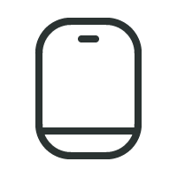

As a UX design agency, we love the era of IoT.  We had the opportunity to design for pioneering companies that created some great connected Things such as VanMoof, Philips Avent, Philips Male Grooming, Philips Sonicare, and more lately Roader. We thrive in these new objects and the service challenges that they bring to their users.

Technology can sometimes be seen as a secret magic portal to designers as well as to its users. We researched around twenty connected devices so that we can have a better technical understanding of connections flows and what implications they might have on UX decisions. Not only would this help us be more insightful when discussing connection flows with our clients but also with corresponding project teams. We explored various frameworks to help us create a mental model of connections that could help us identify patterns in connection practices.

/ hero image goes here /

---

### Introducing the actors

We identified four recurrent actors playing a role in the connections of Things.

| | | |
|-|-|-|
| | **The Thing:** Also known as the connected product, it is the new object you acquired and you are trying to connect |
| | **The OS:** text below |
| | **The App:** text below |
| | **The Wi-Fi:** text below |
| | **The Account:** text below |

**The OS:** While the device is in most cases your smartphone, it could also be any equipment, such as your tablet or your desktop. It could also be an Android device, an Apple device or any others. The real actor is the operating system that your Thing is speaking with.

**The App:** In our framework, the App is separated from the OS, it is, in fact, residing within the OS. A Thing connecting to an OS, or to an App is different. While not all Things require an App to function, some do, especially in the case of a need to establish a communication between your Thing and your user account.

**The Wi-Fi:** A Wi-Fi infrastructure lives as a distinct actor because there are many homes connected Things that require a home Wi-Fi network. Though, aside from Things relating to the home automation, there are many connection flows which do not require the Wi-Fi to establish a connection.

**The Account:** Not all connected Things require an account, but many services do follow the practice of requiring an account to connect to your Thing. An account can play the important role in associating your unique Thing with your name. There are many ways your Thing can connect to an account, through a wireless network at home or at your favorite coffee shop and through your device cellular data. Hence, we did not concentrate on how an App connects to an account, but only if it does or not.  

  
Now that you know our actors, here how you can identify them on stage. Each actor has a unique static position. If the actor does not play a part in the connection flow of a Thing, we don’t show that actor.

### Setting the stage

In the connection of Things, it is important to distinguish two different layers of connection: the protocol layer and the software layer.

**The protocol layer**

  

A Thing connects to the OS or to a Wi-Fi infrastructure through the protocol layer. In our framework, the protocol layer is represented by the grey color. A Thing can pair with a device on the protocol layer via Bluetooth but it can also authenticate at the protocol layer with other technologies like Wi-Fi ad hoc, or Wi-Fi direct. These connections at the protocol layer can be verified if the Thing is recognized as a unique item that can not be mistaken with another similar Thing and, for an authentication with the Wi-Fi if it is protected by a password.

  

For example in the above topology, we can see the Bose SoundLink II pairs with your OS to form a verified connection. We know it is verified because not only does the speaker give a light feedback indicating that it is connected, but the speaker also tells that it is now associated with your device by naming it and you can see the name of your SoundLink II under paired devices in your OS.

An unverified protocol connection can be observed with the Philips Sonicare Diamond Clean toothbrush. If you have an app installed and logged in, it automatically detects a toothbrush in use when it is activated. The product nor the OS need to be paired with a connection, it just automatically does so.

**The software layer**

When your Thing connects to an App, it does so through the software layer, which is indicated in purple in the framework. This connection can also be a verified connection, where your Thing or the App acknowledge the connection, or it can be an unverified connection, where either your Thing or the App do not acknowledge the connection.

When an App connects to an account or when the account registers your Thing, it is a user identified connection at the software layer. This is represented by an orange connection line in the framework. In all flow we reviewed, login to an account is always verified, as a user inputs a password to identify themselves.

Beasts of Balance is a great party game in which users stack creatures on a connected Plinth. A user only needs to turn on the Plinth for the OS and the App to connect to it. The OS never asks for the user's permission to pair, leading to an unverified connection, not just at the protocol layer but also at the software layer. The connection flow is quick but do you expect your game to be more secured?

Pokemon Go+ has a verified software connection, involving the user to press a button on the Thing and to select it to connect to the App.  

For VanMoof, the user needs to have registered their bike frame number and IMEI number with their account in order to be able to login to their account in an app.

## Identifying patterns

As we animated these Things connection flows, we saw patterns emerging. We know twenty products are a short list, but it is a start and we imagine the more connection flows we create, the more patterns we will find. What was satisfying to learn was that we could already identify certain connection patterns based on the type of the thing.

**When pairing and connection happen at the same time**
(gif of UE mini boom, Bose Sound Link II, Spire Stone, Fitbit Flex 2)
These Things need to be paired once to be able to connect automatically everytime the user uses the thing. For the speakers, there is no app connection, but for health wearables like Fitbit and Spire, the things will connect to the app everytime

**When Things only require connection to an OS**
(gif of UE mini boom, Bose sound link)

**When Things require a Wi-Fi ad hoc connection**
(gif of polaroid cube and Olympus)
Because the data they send is heavier and a Bluetooth connection is slow.

**App is used to connect to products as well as to register the product to the user account**
(fitbit, spire, apple watch)
Health wearables connected to an account, so that a user can sync and access the data through any OS.

**When an OS connection is required to give credentials to connect to a home Wi-Fi infrastructure**
(gif of Echo dot, Aura, thermo)

**When Things require Bluetooth and Wi-Fi connection**
(Apple watch, echo dot)

/ Matrix of all stories together /

---
