To design magical connection experiences that seem smooth and effortless to users, we believe that there is a value in understanding the technology running behind it. Not only would this help designer make better UX decisions, but also have us recommend best practices when choosing a way of connecting a product. Today, many network infrastructures and protocols exist to establish a connection. We wondered why certain products use a particular technology (such as Bluetooth versus Wi-Fi) or why the experience of connecting some products seems easier than others. So, we familiarized ourselves with the technical steps that occur when a user establishes a connection with a product while they manipulate an interface or the product itself.

While researching around twenty connected products, we established a framework so we could communicate our understanding of connections flows and identify patterns. Hopefully, this summary of findings creates more awareness about the technical details of a connected product and eventually inspire other designers to design better connection experiences.

<table>
  <tr>
    <td style="width: 20%; border: 1px solid #C8CCCB">
      
    </td>
    <td style="width: 20%; border: 1px solid #C8CCCB">
      
    </td>
    <td style="width: 20%; border: 1px solid #C8CCCB">
      
    </td>
    <td style="width: 20%; border: 1px solid #C8CCCB">
      
    </td>
    <td style="width: 20%; border: 1px solid #C8CCCB">
      
    </td>
  </tr>
  <tr>
    <td style="width: 20%; border: 1px solid #C8CCCB">
      
    </td>
    <td style="width: 20%; border: 1px solid #C8CCCB">
      
    </td>
    <td style="width: 20%; border: 1px solid #C8CCCB">
      
    </td>
    <td style="width: 20%; border: 1px solid #C8CCCB">
      
    </td>
    <td style="width: 20%; border: 1px solid #C8CCCB">
      
    </td>
  </tr>
  <tr>
    <td style="width: 20%; border: 1px solid #C8CCCB">
      
    </td>
    <td style="width: 20%; border: 1px solid #C8CCCB">
      
    </td>
    <td style="width: 20%; border: 1px solid #C8CCCB">
      
    </td>  
    <td style="width: 20%; border: 1px solid #C8CCCB">
      
    </td>
    <td style="width: 20%; border: 1px solid #C8CCCB">
      
    </td>
  </tr>
  <tr>
    <td style="width: 20%; border: 1px solid #C8CCCB">
      
    </td>
    <td style="width: 20%; border: 1px solid #C8CCCB">
      
    </td>
    <td style="width: 20%; border: 1px solid #C8CCCB">
      
    </td>
    <td style="width: 20%; border: 1px solid #C8CCCB">
      
    </td>
    <td style="width: 20%; border: 1px solid #C8CCCB">
      
    </td>
  </tr>
</table>

---

## The Actors

### Introducing the Actors

Searching for 'connection topology' or related terms online brings up many technical diagrams. Very few of these are designer or user-friendly, which could discourage anyone from piercing the mysteries of the black box or of the floating cloud. When we began building our framework, we established who our actors were, but also when and how they were speaking to each other. After a few iterations of our system visualization, we reduced our actors to five essentials.

<table>
  <tr>
    <td style="width: 50px">
      
    </td>
    <td>
      <strong>The Thing</strong>: Also known as the connected product, it is the object the user is trying to connect to. It could be a camera, a speaker, a toothbrush, a bicycle, a wearable, or many other Things…
    </td>
  </tr>
  <tr>
    <td style="width: 50px">
      
    </td>
    <td>
      <strong>The OS</strong>: Sometimes, Things need devices to connect. In most cases, this refers to the user's smartphone, but it could also be a tablet or a desktop. The real actor is the operating system (OS) that lives in these devices that the Thing is speaking with.
    </td>
  </tr>
  <tr>
    <td style="width: 50px">
      
    </td>
    <td>
      <strong>The App</strong>: The App is separated from the OS, even though it is residing within the OS. There is a difference when a Thing connects to an OS, or to an App. While not all Things require an App to function, some do, especially when there is a need for a Thing to communicate to a user account.
    </td>
  </tr>
  <tr>
    <td style="width: 50px">
      
    </td>
    <td>
      <strong>The Wi-Fi</strong>: While we have chosen not to show which network an App uses to connect to an account, we did see the importance in showing when a Thing needs to establish a Wi-Fi network connection. With the smart home boom, more and more home connected Things require a Wi-Fi network to function.
    </td>
  </tr>
  <tr>
    <td style="width: 50px">
      
    </td>
    <td>
      <strong>The Account</strong>: Not all connected Things really require a user account to function, but many services ask their user to create an account prior to a Thing connection. There are many ways a Thing can connect to an account, through a wireless network at home or at a local coffee shop as well as through a device's cellular data. Hence, we did not concentrate on how an App connects to an account, but only if it does or not.
    </td>
  </tr>
</table>

### Setting the Stage

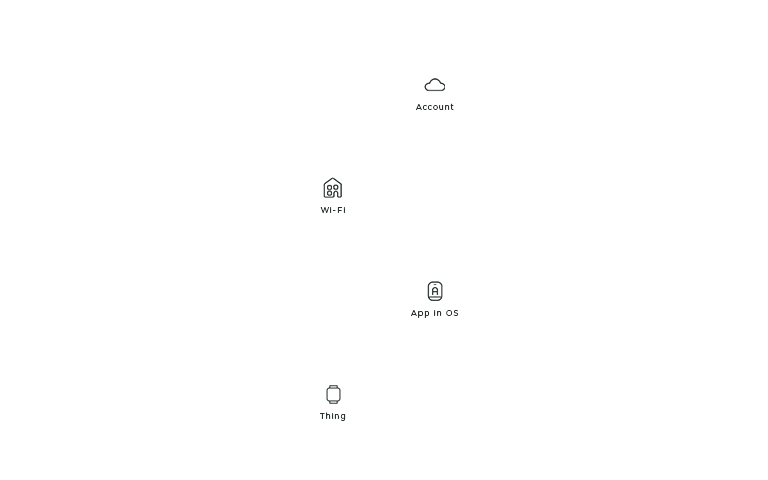

Now that you know our actors, here is how you can identify them on stage. Each actor has a unique static position so that it is easier to compare the connection flows. If the actor does not play a part in the connection flow, it is not shown in the layout. From the bottom to the top, you'll find the Thing, the OS with the App, the Wi-Fi, and the account.

## The Two Acts

Things connect at two distinct layers: the protocol layer and the software layer. A connection at either layer implies different steps that happen over time in the connection process.

### The Protocol Layer

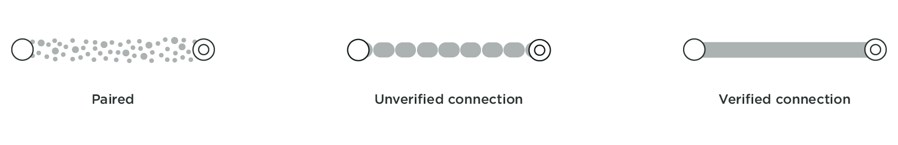

Connecting at the protocol layer usually comes first in the play. This connection is between a device's OS and a Thing that can happen over Bluetooth or a wireless network such as ad-hoc Wi-Fi. To check if a Thing is connected at the protocol layer, just head to the Bluetooth accessories or Wi-Fi settings in the OS. Here you will find the name of your Thing and its paired and connection status. During a Bluetooth connection, if the OS asks the user to confirm the pairing, it leads to a verified connection. An unverified connection occurs when the OS and Thing connect without the user's permission. With a Wi-Fi or an ad-hoc Wi-Fi connection, if a password is exchanged a verified connection is established. This leads to a thick solid grey line in our framework. If no password or code is exchanged, an unverified connection is established, which is represented by the dotted grey line in our framework.

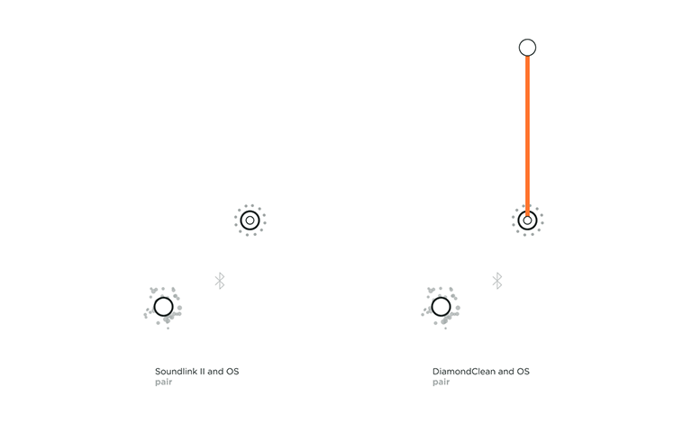

For example in the above topology, we can view the connection flow of the Bose SoundLink II, a portable Bluetooth speaker. It pairs with the device's OS to form a verified connection. We consider it verified because not only do you have to select the Thing from your OS settings to pair but also because the speaker gives a light feedback indicating that it is connected and it also tells out loud that it is now associated with your device by naming it. You then also see the name of your SoundLink II under 'paired devices' in your OS.

An unverified protocol connection can be observed with the Philips Sonicare DiamondClean toothbrush, an electric toothbrush that connects to an App. If the Sonicare App is installed and its user logged in, it automatically detects the toothbrush in use. Neither the product nor the OS needs permission with the connection, it just automatically does so.

### The Software Layer

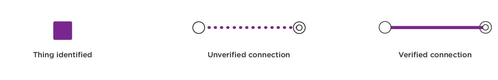

A software connection is built upon a protocol connection. Only after a protocol handshake, can a Thing connect to an App. A software layer connection can also be a verified connection, where the Thing or the App confirm the connection, or it can be an unverified connection, where neither the Thing nor the App confirm.

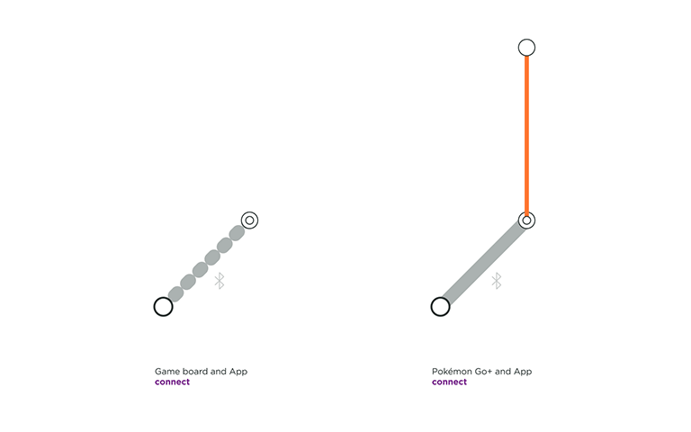

Beasts of Balance is a game in which several players stack as many artifacts as possible on a connected game board. A user only needs to turn on the game board for the OS and the App to connect. The OS does not ask for permission to pair, nor does it confirm that the user is pairing the right game platform, leading to an unverified connection at the protocol layer and at the software layer. The connection flow is quick but this is only apporpriate for a product that needs no security.

Pokémon Go+ is an accessory created for the location-based and augmented reality game Pokémon Go. This optional gadget helps players detecting and catching Pokémon while walking around, without having to constantly look into their smartphone. It has a verified software connection, involving the user to press a button on the Thing and to select it in the App to connect.

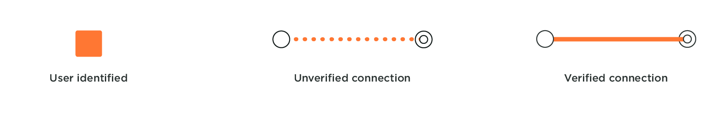

When a user account connects to an App, or when it registers the unique identification of their Thing, it is a user identified connection at the software layer. This is represented by an orange connection line in the framework. In all the flows we reviewed, login to an account is always verified, as a user inputs a password to identify themselves.

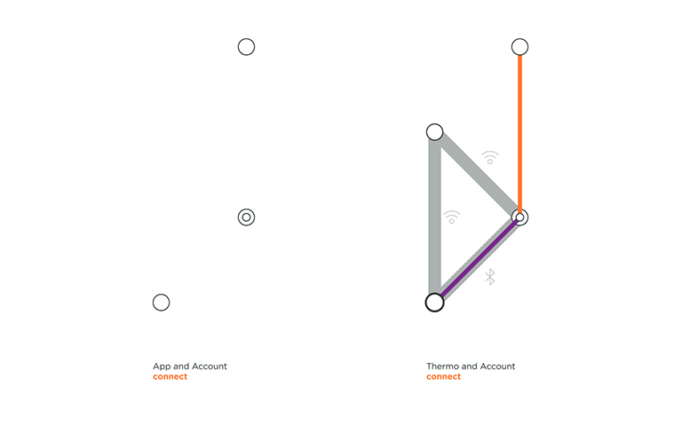

VanMoof created an electric city bike with location tracking and a connected lock to give riders peace of mind and to dodge thieves. On the left, we can see that the user needs to be securely logged into their account on the App in order to access their Bike. The riders' profile contains the unique IMEI and frame number of their bike, making the connection secured. On the right, we can see a part of Nokia Thermo topology. Nokia Thermo measure temperature from user's forehead and automatically syncs readings with the dedicated app. In this section of the animation, the user is already logged in to his account in the Nokia App, and Thermo registers to the user account through home Wi-Fi.

## The Play

### Understanding the Script

Actors can follow different scripts to reach the end goal of connectivity. Twenty products are a short list, but it is a start to identifying similar practices. We could already observe patterns emerging from our findings based on the technology, the function of the object, and the data exchange. We imagine that the more connection flows we analyze, the more patterns we will spot.

**Broadcasting to Authenticate**: To connect, no matter the technology used, the Thing and the other concerned actor need to talk; one emits a signal and the other listens. There are different methods to have a Thing broadcast, and the signal can be constant or triggered. The Philips Sonicare DiamondClean toothbrush wakes up when the handle is moved thanks to an accelerometer. Apple AirPods wireless earbuds start emitting when their charging case opens. Some other products use a button like Polaroid Cube+ camera or UE MiniBoom portable speaker. On the other hand, some Things are constantly broadcasting if they have power. This is the case of Spire Stone, a wearable that tracks the user's breathing pace to help reduce stress, which does not need an action from the user to broadcast. For the topology to feel lighter, we only show when broadcasting is relevant to the story. For the same reason, we also don't show that home Wi-Fi also constantly broadcasts.

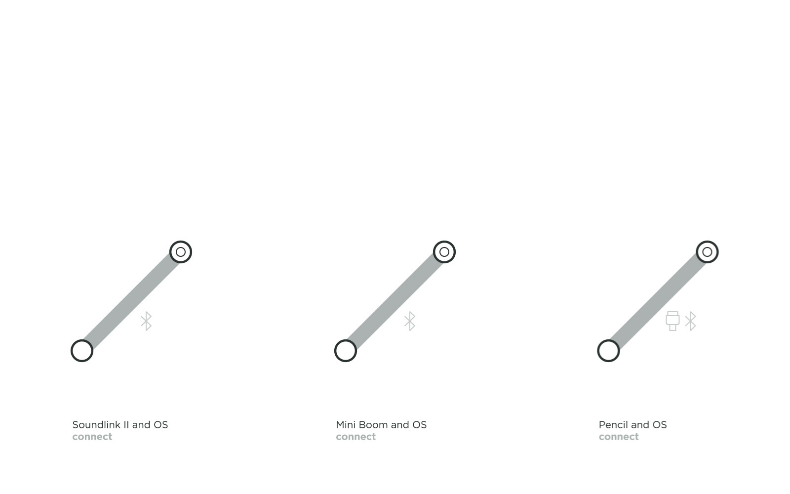
**Basic Connection**: Some connected Things which do not any hold sensitive user data adopt a lower level of security. Here the Bose SoundLink II, the UE Mini Boom speakers, and the Apple Pencil are only connecting the object with the OS via Bluetooth. The main advantage is that users perform fewer actions to start playing or drawing. Another particularity of this simple connection on the protocol layer is that the product is easily accessible to multiple users, as they do not require a code or password exchange. To add nuance to this simplicity, in these topologies the connection is verified because the users manipulate the Thing as well as the OS at the time of connection, ensuring that users are connecting to the right product and that their neighbors won't accidentally connect to their Things. In fact, the Apple Pencil has to be plugged into the iPad before a Bluetooth connection at the protocol layer is established. The Lightning connector ensures that no other iPad accidentally connects to the Apple Pencil.

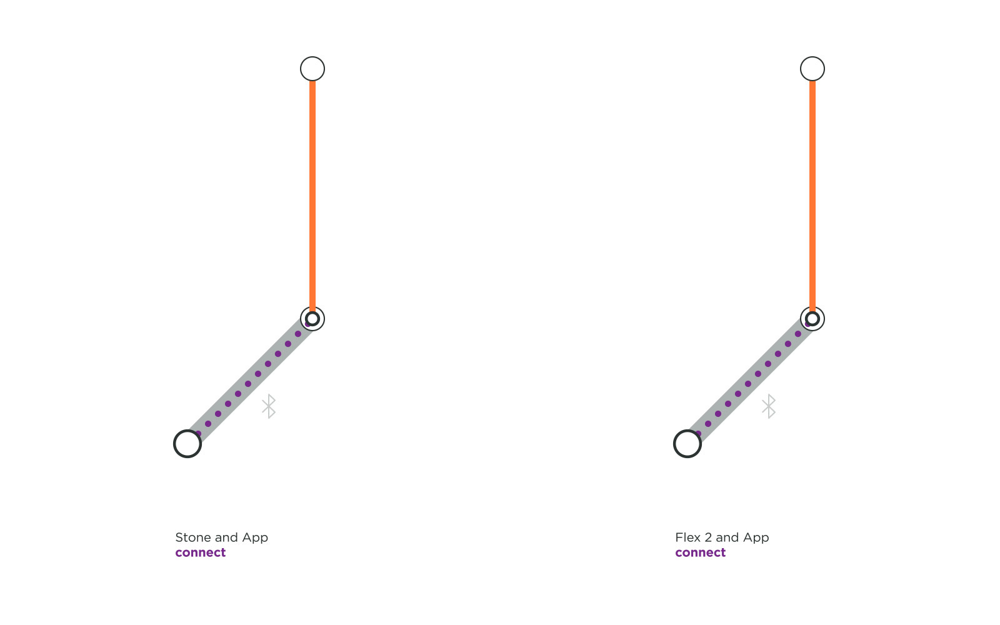
**Secured Data Connection**: We were surprised to discover that the health monitoring wearables like Fitbit Flex 2 and Spire Stone do not require registration to the user's account in order to connect. The user only needs to be logged into their account to connect to their Things and to receive personal data to their respective App. This practice unveils a risk. The Flex 2 bracelet and Spire Stone can connect to a stranger's account without asking for any password or even deregistering the initial owner. To make it worse, when this happens, the previous user is not even informed that their Thing is being used by a stranger. So if you forgot your Fitbit Flex 2 at the gym, whoever finds it can start using it without any hiccups.

**Account Connection**: Some services holding confidential data adopt a more intermingled connection system. In the above examples, users need to register their Thing to their account, so that their data is more secure and also accessible from multiple devices. Product registration in the account was endorsed by some health wearables such as the Apple Watch, and by Amazon's voice assistant products like Echo Dot and Echo Show. It is interesting to notice that Apple adopted a special approach to register Things with iCloud. For AirPods the account login is needed only when a user wants to connect across multiple devices. VanMoof goes so far as to allow an unverified protocol connection because it establishes a secure account connection with the bike IMEI number and frame number. We recommend registering the connected Things to user account because it associates the user with his object. Then if a Thing gets lost or stolen, this best practice could help finding it and or securing the data associated with it.

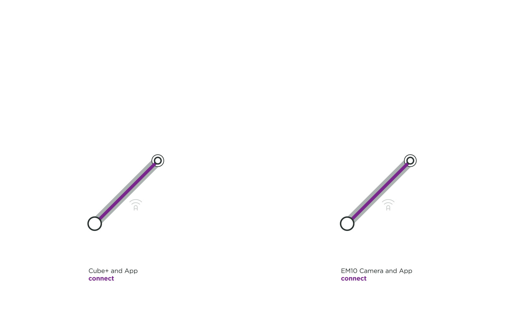
**High Bandwidth Data Connection**: Polaroid Cube+ and Olympus EM10 are two cameras that happen to use ad-hoc Wi-Fi connections at the protocol layer. A camera would want a Wi-Fi connection rather than a Bluetooth connection as the former transfers heavy data faster and more securely with an optional password exchange. While ad-hoc Wi-Fi is an appropriate technology for image transfer, it disrupts other apps running on the device and the connection flow because a device cannot be connected to Wi-Fi and the Thing's ad-hoc Wi-Fi simultaneously.

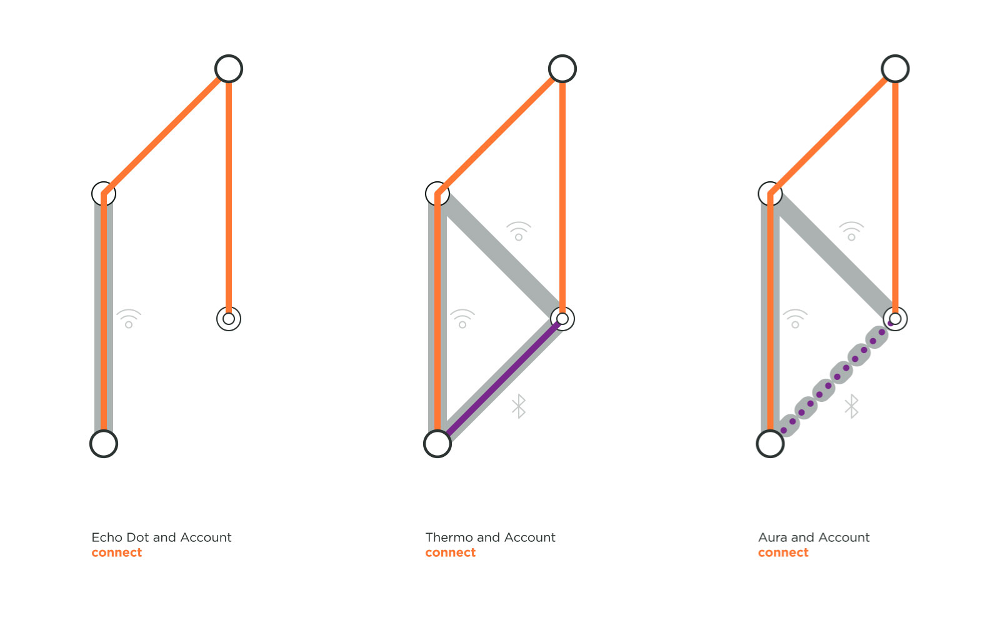
**Home Connection**: Connected home Things such Amazon's Echo Dot and Nokia's Withings Aura and Thermo do not actually need to be connected to an device for continued use. A device's OS and an App are used but only to set up a secured connection with a home Wi-Fi in order to register the objects with a user account. Once this connection and registration are established, a user can access their connected object via any App that is logged into the same user account.

## So Far

As we stumbled upon various observations and patterns, we hope to study more products to analyze their connection flows. A study by Gartner claims that in 2020, the number of connected Things will more than double from 2017 to reach over 20.4 billion objects[^gartner]. Hopefully, these products' functions will evolve to become more and more meaningful to entertain us, facilitate communication, make our life more comfortable, diagnose us, cure us, help us to commute, etc. We hope that this framework can raise awareness of the different connection patterns and the risks they impart. Most of all, we expect it will help product designers understand the complexities of connecting Things so they can consider the full user experience beyond their App UIs.

[^gartner]: http://www.zdnet.com/article/iot-devices-will-outnumber-the-worlds-population-this-year-for-the-first-time/
