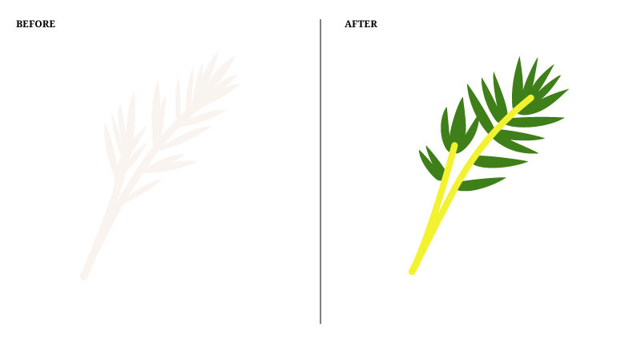
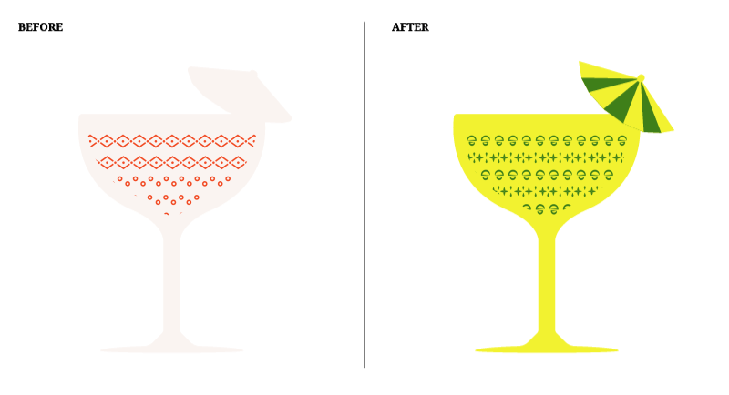
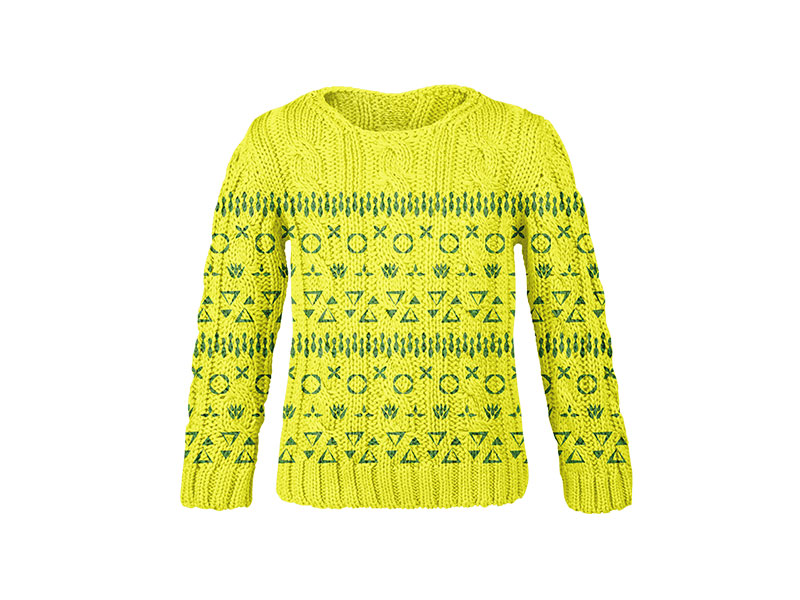
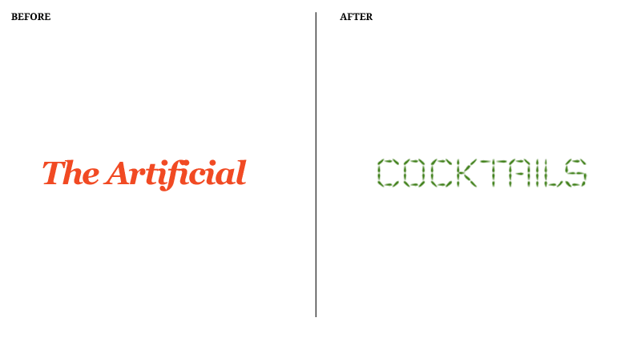

For the past 2.5 years, we’ve been improving and experimenting with our mixing skills by preparing a cocktail each Friday. All these experiments are captured on our [Artificial Cocktails](https://theartificial.com/cocktails/) site and they have become an important part of our studio’s culture, they even have their own [book](https://theartificial.com/blog/2017/01/16/sinterklaas-book.html) and soon they will have their own website. With all of this growth and change, we decided that a redesign was necessary so Kamila and I worked together to bring the new website to life.

## Defining our Target Audience

For us to start designing the new website, it was necessary to identify our new target audience, the previous sub site was aimed to users that were familiar with the Artificial and that were interested in finding out more about the studio culture, or our previous guests that simply wanted to know what they drank on the day they visited the studio. This was not the case anymore, so after analyzing our potential users we came to these conclusions:  

a) The new website’s target audience is more likely to be someone who searched for “cocktail recipes” or “recipe mango firewater bitters”

b) Someone who linked to the page from Instagram or Pinterest.

So this user is:

- unfamiliar with The Artificial
- unfamiliar with the cocktails site
- thirsty
- possibly curious

Establishing this helped us deciding the contents of the website. Before it was just a cocktail catalogue that could be accessed from a section of our site but because our new users where unfamiliar with The Artificial, it was necessary to add an about page with a brief history of why the catalogue exists, and a tools section to accommodate our legend.  This last section was also aimed to un experienced users that want to know what they would need to start making their own experiments.

## Identifying Problems to Come up With Solutions

To create the new website we first analyzed what were the problems that the previous website had, these are the ones we addressed:

a) the site wasn’t on **brand**

b) hover states were too heavily relied upon, making for a boring **mobile experience**

c) the animations weren’t bringing meaning to the **visualizations**

####Brand
For the website to be on brand we first locked down to a single concept, we wanted the website to have the look and feel of a botanical garden.  For this we choose two colors, that are part of our studio’s color palette – yellow for the background and inactive elements and green for accents and active elements.

To tie it closer together with the studio’s culture, we incorporated the masks we use (mostly when drunk) and that are soon to be hanged in our newly decorated office. These represent our spirit animals and they appear in the background of the detail page when a resident bartender mixes a cocktail.

We also added frames to the cocktails to make the hoover state more obvious, and to provide the user with an even more celebratory experience.

####Mobile Experience
To solve the boring mobile experience issue we brought to life the previously flat garnishes by adding some color to them and separating them from the glass which also helped the website feel a bit less monotonous.

####Visualizations
The biggest challenge was to come for a solution for the last issue, the animations. Kamila and I are not exactly pros on after effects but we both love moving images and we wanted to improve our skills by making gifs that represented a bigger challenge. For this, we first made some research on techniques and best practices and we found this [great tutorial by Jake Bartlett](https://www.skillshare.com/classes/Repeating-Patterns-in-After-Effects/46687130/classroom/discussions?via=user-profile&enrolledRedirect=1) that inspired us to create much more playful patterns and animations that were not limited to horizontal movement.

The new animation style brought a new question, on the previous design, we were stacking patterns to show multiple types of alcohol on a single drink but with the new design this felt forced and not organic at all so at the end we decided to break the animations in single rows and to iterate them when the drink had more than one type of alcohol.

Usually we don’t have drinks with more than 2 types of alcohol but we checked for the worst case scenario and found out we have a boozy [ugly Christmas sweater](https://theartificial.com/cocktails/anythingbuttea.html) in our catalogue, very appropriate for the company.

####Logo
Last but not least, we needed a logo that matched the contents of the website, so we took the organic shapes of the patterns as inspiration to create it and decided that it had to be animated like the patterns. Only in this case we thought it was a good opportunity to go beyond a single animation technique and learn how to do it using CSS and SVG animation, to my surprise it isn’t as hard as it seems, once you have the basic knowledge it is fairly intuitive.

We will soon release the new website and we will keep keep adding our experiments to it so we hope you enjoy it! Cheers!
