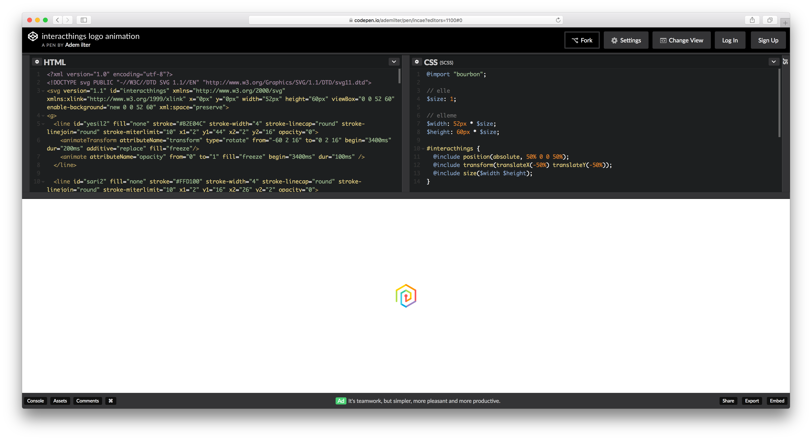
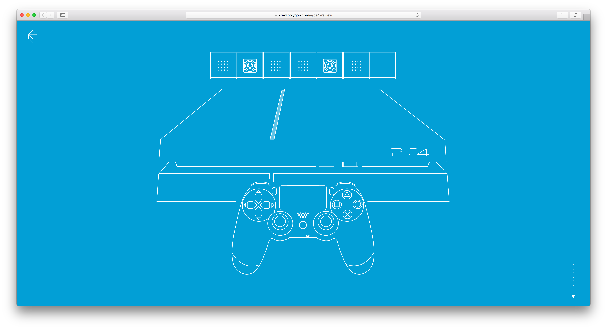

Animation on the web is hardly new. First there were GIFs, then there was Flash, now there's HTML5 and JavaScript and GIFs are retro cool. These techniques are great if you want to create dynamic web pages or small raster graphics. But what if you want to create a vector animation that's lightweight, scales well, and has [broad compatibility](https://caniuse.com/#search=css%20animation)? These circumstances are ideal for animating SVGs with CSS.

This tutorial is an introduction to the basics of SVG animation with CSS. We'll start with the basics before moving on to some samples that utilize multiple techniques. By the end of this tutorial, you will have the foundation to create complex animations.

## Getting started

### SVG

Scalable Vector Graphics or SVG is a 2D vector image format that scales to look sharp at any resolution. SVG and HTML are compatible with each other, and this means that SVGs, just like HTML, are easy to modify and manipulate with CSS.

To create an SVG, you can use design tools like [Illustrator](https://www.adobe.com/fr/products/illustrator.html), [Sketch](https://www.sketchapp.com/), or [InkScape](https://inkscape.org/en/), or you can write SVG directly using the text editor of your choice.

If you're using a design tool, make sure you:

*  Pixel align elements when possible (avoid decimals for size or position)
*  Avoid unnecessary anchor points
*  Avoid overlapping elements
*  Create your image completely within the artboard
*  Export SVG 1.1


Here is a sample of what your SVG should look like. If you follow these pro tips, your artwork is almost animation-ready, but you'll still need to clean up your SVG using a text editor.

In your text editor:

*  Give shapes, paths, and groups you want to animate unique **class** names
*  Make sure your styles are defined within the **style** tags (and not on elements themselves)

To keep things simple in this tutorial, all CSS styles will be contained within our SVG. These styles could also live independently in their own CSS file.


### HTML + CSS

To use a metaphor, HTML and CSS are like Russian dolls. HTML describes the number of dolls as well as the order in which they contain each others. CSS defines all the styles attributes like each doll size and their decorative paintings.

HTML is the acronym of HyperText Markup Language. It is written with plain text that specifies the structure of a webpage. Most elements are wrapped between an opening tag and a closing tag made of brackets like `<div> </div>`.

CSS stand for Cascading Style Sheets. It is used to control how web pages look in the browser. CSS let you style HTML elements or other languages like SVG or XML. Regarding the syntax, CSS rules consist of a selector to target an element to style and a property with its associated value to define the element’s style.

In order to style SVG elements, you have two choices. Either placing the styling tags inline in your SVG code, or using classes to apply to targeted SVG elements. If you use classes, their style attributes can be either between `<style>` tags within your `<svg>` tags, or, in an external stylesheet that is exclusively CSS and that is linked to your file. In these code examples, you will find `<style>` tags within the SVG code, so the styles remain grouped and you can copy and paste the examples blocks without losing the styles of your SVG. These two methods of insertion permit manipulation with CSS (and JS).

```svg
        <svg xmlns="http://www.w3.org/2000/svg" viewBox="0 0 800 300">
            <style> .mouse{fill:#E5E4E3;} .tulip{fill:#CC2954;} </style>
            <rect class="mouse" x="0" y="0" width="800" height="300"/>
            <polygon class="tulip" points="400, 280, 310, 150, 400, 20, 490, 150"/>
        </svg>
```

<svg xmlns="http://www.w3.org/2000/svg" viewBox="0 0 800 300">
    <style> .mouse{fill:#E5E4E3;} .tulip{fill:#CC2954;} </style>
    <rect class="mouse" x="0" y="0" width="800" height="300"/>
    <polygon class="tulip" points="400, 280, 310, 150, 400, 20, 490, 150"/>
</svg>


## Getting started with animations

The two first following concepts are essential to animate with CSS.

1.  Referencing the animation to an HTML or SVG element(s)
2.  Defining at what moment each action should be performed

### 1. Referencing

```css
    .diamond{
        animation-name: diamondMoves;
    }

    @keyframes diamondMoves {
    }
```

In your CSS, after your class name selector, and within `{}` write the property `animation-name:` and add a name for your animation. You can use letters, numbers, underscores and dashes.

### 2. Keyframes

```css
    @keyframes diamondMoves {
        from {transform: translateX(0);}
        to {transform: translateX(400px);}
    }

    @keyframes diamondMoves {
        0% {transform: translateX(0);}
        50% {transform: translateX(100px);}
        100% {transform: translateX(400px);}
    }
```

The `@Keyframes` function contains a list of all the steps along the whole animation sequence. The individual list item controls the aspect of the target element at a given time. Each, element of the list, or keyframe rule, contains a time stamp followed by a property to apply.

As shown in the example, to indicate the state of the target at the beginning and at the end of an animation, you can use the keywords `from` and `to`. They are equivalent to `0%` and `100%`. As the second snippet shows, you can add as many keyframes as you need in between the start and the end steps.

These steps actions play at different times depending on the total duration of an animation that is described by another property.

### 3. Duration

```css
    .diamond{
        animation-name: diamondMoves;
        animation-duration: 6s;
    }
```

The `animation-duration` property specifies the length of time that an animation takes to complete one cycle.

The duration cycle can be specified in seconds `s` or in milliseconds `ms`.

The initial value is `0s`.

### 4. Iteration

```css
    .diamond{
        animation-name: diamondMoves;
        animation-duration: 6s;
        animation-iteration-count: 1;
    }
```

The `animation-iteration-count` property specifies the number of times an animation cycle should be played before stopping.

The possible values are:

* a whole number (integer) or a decimal number like `0,5` or `1`
* the keyword `infinite` to have the animation repeats forever.


The initial value is `1`.

### 5. Easing

```css
    .diamond{
        animation-name: diamondMoves;
        animation-duration: 6s;
        animation-iteration-count: 1;
        animation-time-function: linear;
    }
```

The `animation-easing` property specifies how the animation progresses over the duration of each cycle. It can be specified on individual keyframes.

The possible values are:

* keywords : `ease`, `ease-in`, `ease-out`, `ease-in-out`, `linear`, `step-start`, `step-end`
* Functions like : `frames(10)`.

The initial value is `ease`.

### 6. Delay

```css
    .diamond{
        animation-name: diamondMoves;
        animation-duration: 6s;
        animation-iteration-count: 1;
        animation-time-function: linear;
        animation-delay: 4s;
    }
```

The `animation-delay` property specifies when an animation should start.

The time offset can be specified in seconds `s` or in milliseconds `ms`.

The initial value is `0s`.


## CSS transform animations

CSS transform animations include rotation, translation, scaling, and skewing. We will see in this part, for each of these transform animations, one example, a definition of the animation, and its possible values. Several translations can be chained one after the other. When translations and rotations are chained, they are additive but skewing is not.

The origin point of an SVG element is located at 0, 0 of the artwork. It means that, by default, the reference point around which the transformation is applied is the top left corner and not in the center of the artwork. However, CSS `transform-origin` property lets you change the position of this origin point.

The `transform-origin` property can be defined by one, two, or three values. The first value is by default to the `x-offset`, the second value is for the `y-offset`, and if there is a third value, it always represents the Z offset.

Possible values are:
* a length expressed in `px` or in `cm` like `2px`
* keywords or their corresponding percentages written : `left` or `0%` , `right` or `100%`, `top` or `0%`, `bottom` or `100%`, and `center` or `50%`. If a Z offset is specified, it can only accept a length.

```svg
        <svg version="1.1" xmlns="http://www.w3.org/2000/svg" viewBox="0 0 800 300">
            <rect class="mouse" x="0" y="0" width="800" height="300"/>
            <polygon class="diamondOr tulip" points="400, 280, 310, 150, 400, 20, 490, 150"/>
            <style>
            .mouse{fill:#E5E4E3;}
            .tulip{fill:#CC2954;}
            .diamondOr {
                animation-name: diamondOrigin;
                animation-duration: 4s;
                animation-iteration-count: infinite;
            }
            @keyframes diamondOrigin {
                from {transform: rotate(0deg);}
                to {transform: rotate(360deg);}
            }
            </style>
        </svg>
```

<svg version="1.1" xmlns="http://www.w3.org/2000/svg" viewBox="0 0 800 300">
    <rect class="mouse" x="0" y="0" width="800" height="300"/>
    <polygon class="diamondOr tulip" points="400, 280, 310, 150, 400, 20, 490, 150"/>
    <style>
    .mouse{fill:#E5E4E3;}
    .tulip{fill:#CC2954;}
    .diamondOr {
        animation-name: diamondOrigin;
        animation-duration: 4s;
        animation-iteration-count: infinite;
    }
    @keyframes diamondOrigin {
        from {transform: rotate(0deg);}
        to {transform: rotate(360deg);}
    }
    </style>
</svg>
In this example, the diamond rotates from its default origin point, in the top left corner.

```svg
        <svg version="1.1" xmlns="http://www.w3.org/2000/svg" viewBox="0 0 800 300">
            <rect class="mouse" x="0" y="0" width="800" height="300"/>
            <polygon class="diamondOrCh tulip" points="400, 280, 310, 150, 400, 20, 490, 150"/>
            <style>
                .mouse{fill:#E5E4E3;}
                .tulip{fill:#CC2954;}
                .diamondOrCh {
                    animation-name: diamondOriginChanged;
                    animation-duration: 4s;
                    animation-iteration-count: infinite;
                    transform-origin: 50% 50%;
                }
                @keyframes diamondOriginChanged {
                    from {transform: rotate(0deg);}
                    to {transform: rotate(360deg);}
                }
            </style>
        </svg>
```

<svg version="1.1" xmlns="http://www.w3.org/2000/svg" viewBox="0 0 800 300">
    <rect class="mouse" x="0" y="0" width="800" height="300"/>
    <polygon class="diamondOrCh tulip" points="400, 280, 310, 150, 400, 20, 490, 150"/>
    <style>
        .mouse{fill:#E5E4E3;}
        .tulip{fill:#CC2954;}
        .diamondOrCh {
            animation-name: diamondOriginChanged;
            animation-duration: 4s;
            animation-iteration-count: infinite;
            transform-origin: 50% 50%;
        }
        @keyframes diamondOriginChanged {
            from {transform: rotate(0deg);}
            to {transform: rotate(360deg);}
        }
    </style>
</svg>
In this example, `transform-origin: 50% 50%;` is added. The origin point is set to the center so the diamond rotates from its center.


### Rotate

The `rotate` animation moves an object circularly around an origin point.

The property can use either one, two, or three values if you want to rotate along the Z axis.

Possible values are:

* `x`, `y`, or `z` to name the axis you want to rotate the element around.
* `<angle>` to specify the amount of rotation. The angle value can expressed in degree like `90deg`, in turn from `0` to `1` like `0.25 turn`, or in radius like `1.64rad`.


```svg
        <svg version="1.1" xmlns="http://www.w3.org/2000/svg" viewBox="0 0 800 300">
            <rect class="mouse" x="0" y="0" width="800" height="300"/>
            <polygon class="diamondTu tulip" points="400, 280, 310, 150, 400, 20, 490, 150"/>
            <style>
                .mouse{fill:#E5E4E3;}
                .tulip{fill:#CC2954;}
                .diamondTu {
                    animation-name: diamondTurns;
                    animation-duration: 4s;
                    animation-iteration-count: infinite;
                    transform-origin: 50% 50%;
                }
                @keyframes diamondTurns {
                    0% {transform: rotate(0deg);}
                    50% {transform: rotate(-90deg);}
                    100% {transform: rotate(0deg);}
                }
            </style>
        </svg>
```

<svg version="1.1" xmlns="http://www.w3.org/2000/svg" viewBox="0 0 800 300">
    <rect class="mouse" x="0" y="0" width="800" height="300"/>
    <polygon class="diamondTu tulip" points="400, 280, 310, 150, 400, 20, 490, 150"/>
    <style>
        .mouse{fill:#E5E4E3;}
        .tulip{fill:#CC2954;}
        .diamondTu {
            animation-name: diamondTurns;
            animation-duration: 4s;
            animation-iteration-count: infinite;
            transform-origin: 50% 50%;
        }
        @keyframes diamondTurns {
            0% {transform: rotate(0deg);}
            50% {transform: rotate(-90deg);}
            100% {transform: rotate(0deg);}
        }
    </style>
</svg>
In this example, the diamond starts and ends standing straight, but in the middle keyframe, it rotates counterclockwise from a 90-degree angle.

### Translate

The `translate` animation moves an object in space from a point to another based on the coordinate given along the abscissa and the ordinate axis.
The syntax can use one, two, or three values if you want to move your object along the Z axis. It can be written `translate(tx)` or `translate(tx, ty)`, `translate(tz)`.
Values are specified in lengths in `px` or in `%`. If `t` is unspecified, its default value is `0`.

```svg
        <svg version="1.1" xmlns="http://www.w3.org/2000/svg" viewBox="0 0 800 300">
            <rect class="mouse" x="0" y="0" width="800" height="300"/>
            <polygon class="diamondMo tulip" points="400, 280, 310, 150, 400, 20, 490, 150"/>
            <style>
                .mouse{fill:#E5E4E3;}
                .tulip{fill:#CC2954;}
                .diamondMo {
                    animation-name: diamondMoves;
                    animation-duration: 8s;
                    animation-iteration-count: infinite;
                    transform-origin: 50% 50%;
                }
                @keyframes diamondMoves {
                    0% {transform: translate(0, 0);}
                    20% {transform: translate(0, -200px);}
                    30% {transform: translate(0, 0);}
                    40% {transform: translate(0, 200px);}
                    50% {transform: translate(0, 0);}
                    60% {transform: translate(-200px, 0);}
                    70% {transform: translate(0, 0);}
                    80% {transform: translate(200px, 0);}
                    100% {transform: translate(0, 0);}
                }
            </style>
        </svg>
```

<svg version="1.1" xmlns="http://www.w3.org/2000/svg" viewBox="0 0 800 300">
    <rect class="mouse" x="0" y="0" width="800" height="300"/>
    <polygon class="diamondMo tulip" points="400, 280, 310, 150, 400, 20, 490, 150"/>
    <style>
        .mouse{fill:#E5E4E3;}
        .tulip{fill:#CC2954;}
        .diamondMo {
            animation-name: diamondMoves;
            animation-duration: 8s;
            animation-iteration-count: infinite;
            transform-origin: 50% 50%;
        }
        @keyframes diamondMoves {
            0% {transform: translate(0, 0);}
            20% {transform: translate(0, -200px);}
            30% {transform: translate(0, 0);}
            40% {transform: translate(0, 200px);}
            50% {transform: translate(0, 0);}
            60% {transform: translate(-200px, 0);}
            70% {transform: translate(0, 0);}
            80% {transform: translate(200px, 0);}
            100% {transform: translate(0, 0);}
        }
    </style>
</svg>
In this example, the diamond starts from the center of the canvas, then, the diamond moves 200 pixels to the top, comes back to the center, moves 200 pixels to the bottom, comes back to the center, moves 200 pixels to the left, comes back to the center, finally, it moves 200 pixels to the right and comes back to the center.

### Scale

The `scale` animation resizes an object. Scaling can keep the ration intact, or it can distort the object ratio if the the horizontal and vertical scaling are different.

The expression can use one, two, or three values if you want to scale your object along the Z axis. It can be written `scale(sx)`, `scale(sx, sy)`, or `scale(sx, sy, sz)`, where `s` is your own a whole number (integer) or decimal number ranging from 0 to 1.

```svg
        <svg version="1.1" xmlns="http://www.w3.org/2000/svg" viewBox="0 0 800 300">
            <rect class="mouse" x="0" y="0" width="800" height="300"/>
            <polygon class="diamondSc tulip" points="400, 280, 310, 150, 400, 20, 490, 150"/>
            <style>
                .mouse{fill:#E5E4E3;}
                .tulip{fill:#CC2954;}
                .diamondSc {
                    animation-name: diamondScale;
                    animation-duration: 4s;
                    animation-iteration-count: infinite;
                    transform-origin: 50% 50%;
                }
                @keyframes diamondScale {
                    0% {transform: scale(0.5);}
                    50% {transform: scale(1.5);}
                    100% {transform: scale(0.5);}
                }
            </style>
        </svg>
```

<svg version="1.1" xmlns="http://www.w3.org/2000/svg" viewBox="0 0 800 300">
    <rect class="mouse" x="0" y="0" width="800" height="300"/>
    <polygon class="diamondSc tulip" points="400, 280, 310, 150, 400, 20, 490, 150"/>
    <style>
        .mouse{fill:#E5E4E3;}
        .tulip{fill:#CC2954;}
        .diamondSc {
            animation-name: diamondScale;
            animation-duration: 4s;
            animation-iteration-count: infinite;
            transform-origin: 50% 50%;
        }
        @keyframes diamondScale {
            0% {transform: scale(0.5);}
            50% {transform: scale(1.5);}
            100% {transform: scale(0.5);}
        }
    </style>
</svg>
In this example, the diamond starts and ends with half its defined size. In the middle of the animation, it grows to reach 1,5 times its defined size.

### Skew

The `skew` animation transforms an object along an oblique angle. It distorts each point of the SVG element that is not directly located on the X and Y axises by a certain angle in the horizontal and vertical directions. The greater the value is, the most distorted the object will be.

The expression can use one or two values. Each value represents the amount of skewing in one direction. It can be written `skew(ax)`, `skew(ax, ay)`, `skewX(a)`, or `skewY(a)`, where `a` is an `<angle>`.

The amount of skewing is defined by the values of an `<angle>`. The angle value can expressed in degree like `90deg`, in turn from `-1` to `1` where 0 is neutral, like `0.25 turn`, or in radius like `1.64rad`. If you are using degrees, a positive skew angle lies between 0 and 90 degrees, and a negative skew angle lies between -90 degrees and 0 degree.

```svg
        <svg version="1.1" xmlns="http://www.w3.org/2000/svg" viewBox="0 0 800 300">
            <rect class="mouse" x="0" y="0" width="800" height="300"/>
            <polygon class="diamondSk tulip" points="400, 280, 310, 150, 400, 20, 490, 150"/>
            <style>
                .mouse{fill:#E5E4E3;}
                .tulip{fill:#CC2954;}
                .diamondSk {
                    animation-name: diamondSkew;
                    animation-duration: 4s;
                    animation-iteration-count: infinite;
                    transform-origin: 50% 50%;
                }
                @keyframes diamondSkew {
                    0% {transform: skew(0);}
                    25% {transform: skew(-35deg);}
                    50% {transform: skew(0);}
                    75% {transform: skew(35deg);}
                    100% {transform: skew(0);}
                }
            </style>
        </svg>
```

<svg version="1.1" xmlns="http://www.w3.org/2000/svg" viewBox="0 0 800 300">
    <rect class="mouse" x="0" y="0" width="800" height="300"/>
    <polygon class="diamondSk tulip" points="400, 280, 310, 150, 400, 20, 490, 150"/>
    <style>
        .mouse{fill:#E5E4E3;}
        .tulip{fill:#CC2954;}
        .diamondSk {
            animation-name: diamondSkew;
            animation-duration: 4s;
            animation-iteration-count: infinite;
            transform-origin: 50% 50%;
        }
        @keyframes diamondSkew {
            0% {transform: skew(0);}
            25% {transform: skew(-35deg);}
            50% {transform: skew(0);}
            75% {transform: skew(35deg);}
            100% {transform: skew(0);}
        }
    </style>
</svg>
In this example, the diamond starts and ends undistorted. In the middle of the animation, the diamond points are equally skewed from a negative 35-degrees angle based on the X axis and the Y axis. Then, the diamond comes back to its original shape before skewing from a positive 35-degrees angle based on the X and Y axises.

## Other CSS animations

Aside from transform properties, CSS animation also include color, fill mode, stroke, opacity, and direction. We will see in this part, for each of this animation, one example, a definition of the animation, and its possible values.

### Color

The `color` attribute speaks for itself as it defines the fill color of an element.

Possible values:

* keywords like `pink`
* color code like RGB `rgb(204, 41, 84)`, RGBA `rgba(204, 41, 84, 0.5)`, or Hex like `#CC2954`


```svg
        <svg version="1.1" xmlns="http://www.w3.org/2000/svg" viewBox="0 0 800 300">
            <rect class="mouse" x="0" y="0" width="800" height="300"/>
            <polygon class="diamondCo tulip" points="400, 280, 310, 150, 400, 20, 490, 150"/>
            <style>
                .mouse{fill:#E5E4E3;}
                .tulip{fill:#CC2954;}
                .diamondCo {
                    animation-name: diamondColor;
                    animation-duration: 4s;
                    animation-iteration-count: 1;
                }
                @keyframes diamondColor{
                    0% {fill:#CC2954;}
                    100% {fill:#F2F230;}
                    }
            </style>
        </svg>
```

<svg version="1.1" xmlns="http://www.w3.org/2000/svg" viewBox="0 0 800 300">
    <rect class="mouse" x="0" y="0" width="800" height="300"/>
    <polygon class="diamondCo tulip" points="400, 280, 310, 150, 400, 20, 490, 150"/>
    <style>
        .mouse{fill:#E5E4E3;}
        .tulip{fill:#CC2954;}
        .diamondCo {
            animation-name: diamondColor;
            animation-duration: 4s;
            animation-iteration-count: 1;
        }
        @keyframes diamondColor{
            0% {fill:#CC2954;}
            100% {fill:#F2F230;}
            }
    </style>
</svg>
In this four second animation played only once, the color of the diamond changes from tulip to lime. When the animation finishes, he first keyframe is shown with the diamond in tulip color.

### Fill Mode

The `fill-mode` property remembers the first state at the beginning of the animation and the last state at the end of the animation. It is useful in case you would like your animation to start or end with a specific state.

The `fill-mode` animation can have four different values: `none`, `forwards`, `backwards`, and `both`. With `forwards`, the target will be like the last keyframe played. `forwards` can be influenced by `animation-direction` and `animation-iteration-count`. `Backwards` applies the value of the first keyframe at the end of the animation. It is influenced by `animation-delay` and `animation-direction`.

The initial value is `none`.

```svg
        <svg version="1.1" xmlns="http://www.w3.org/2000/svg" viewBox="0 0 800 300">
            <rect class="mouse" x="0" y="0" width="800" height="300"/>
            <polygon class="diamondFi tulip" points="400, 280, 310, 150, 400, 20, 490, 150"/>
            <style>
                .mouse{fill:#E5E4E3;}
                .tulip{fill:#CC2954;}
                .diamondFi {
                    animation-name: diamondFillMode;
                    animation-duration: 4s;
                    animation-iteration-count: 1;
                    animation-fill-mode: forwards;
                }
                @keyframes diamondFillMode{
                    0% {fill:#CC2954;}
                    100% {fill:#F2F230;}
                }
            </style>
        </svg>
```

<svg version="1.1" xmlns="http://www.w3.org/2000/svg" viewBox="0 0 800 300">
    <rect class="mouse" x="0" y="0" width="800" height="300"/>
    <polygon class="diamondFi tulip" points="400, 280, 310, 150, 400, 20, 490, 150"/>
    <style>
        .mouse{fill:#E5E4E3;}
        .tulip{fill:#CC2954;}
        .diamondFi {
            animation-name: diamondFillMode;
            animation-duration: 4s;
            animation-iteration-count: 1;
            animation-fill-mode: forwards;
        }
        @keyframes diamondFillMode{
            0% {fill:#CC2954;}
            100% {fill:#F2F230;}
        }
    </style>
</svg>
In this four second animation played only once, the color of the diamond changes from tulip to lime. When the animation finishes, the last keyframe is shown with the diamond in yellow color. The animation remembers the last keyframe because of the property `animation-fill-mode: forwards;`.

### Stroke

The `stroke` defines the color attributes of an element outline.

Possible values:

* keywords like `pink`
* color code like RGB `rgb(204, 41, 84)`, RGBA `rgba(204, 41, 84, 0.5)`, or Hex like `#CC2954`

The default value for the color of the `stroke` attribute is `none`.

The `stroke-dasharray` attribute specifies on a dashed strokes the length of the dashes and of the gaps. The values of a dash and a gap are separated with a white space or a comma. The length values can be a

The `stroke-dashoffset` attribute indicates the length before the first dash of the series starts.

```svg
        <svg version="1.1" xmlns="http://www.w3.org/2000/svg" viewBox="0 0 800 300">
            <rect class="mouse" x="0" y="0" width="800" height="300"/>
            <path class="diamondSt pathTulip" d="M400,280l-90-130l90-130l90,130L400,280z"/>
            <style>
                .mouse{fill:#E5E4E3;}
                .pathTulip{
                    fill:#E5E4E3;
                    stroke:#CC2954;
                    stroke-width: 10px;
                    stroke-linejoin: round;
                    stroke-linecap: round;
                    stroke-dasharray: 1000;
                    stroke-dashoffset: 1000; }
                .diamondSt {
                    animation-name: diamondStroke;
                    animation-duration: 4s;
                    animation-iteration-count: infinite;
                }
                @keyframes diamondStroke {
                    0% {stroke-dashoffset: 1000;}
                    50% {stroke-dashoffset: 0;}
                    100% {stroke-dashoffset: 1000;}
                }
            </style>
        </svg>
```

<svg version="1.1" xmlns="http://www.w3.org/2000/svg" viewBox="0 0 800 300">
    <rect class="mouse" x="0" y="0" width="800" height="300"/>
    <path class="diamondSt pathTulip" d="M400,280l-90-130l90-130l90,130L400,280z"/>
    <style>
        .mouse{fill:#E5E4E3;}
        .pathTulip{
            fill:#E5E4E3;
            stroke:#CC2954;
            stroke-width: 10px;
            stroke-linejoin: round;
            stroke-linecap: round;
            stroke-dasharray: 1000;
            stroke-dashoffset: 1000; }
        .diamondSt {
            animation-name: diamondStroke;
            animation-duration: 4s;
            animation-iteration-count: infinite;
        }
        @keyframes diamondStroke {
            0% {stroke-dashoffset: 1000;}
            50% {stroke-dashoffset: 0;}
            100% {stroke-dashoffset: 1000;}
        }
    </style>
</svg>
In this animation, the diamond stroke has very long dashes and gaps. You can only see a continuous stroke because the dash is longer than the length of the diamond stroke. Keyframes are animating the dash offset to simulate that the path is drawn from a point to all the other points forming the shape. Once the dash reaches the original point, it goes back to the original offset value.

### Opacity

The `opacity` attribute defines the transparency of an element.

The possible values for the amount of transparency are written by a whole number (integer) or decimal number from `0` to `1`, or with a percentage like `50%`.`

```svg
        <svg version="1.1" xmlns="http://www.w3.org/2000/svg" viewBox="0 0 800 300">
            <rect class="mouse" x="0" y="0" width="800" height="300"/>
            <polygon class="diamondOp tulip" points="400, 280, 310, 150, 400, 20, 490, 150"/>
            <style>
                .mouse{fill:#E5E4E3;}
                .tulip{fill:#CC2954;}
                .diamondOp {
                    animation-name: diamondOpacity;
                    animation-duration: 4s;
                    animation-iteration-count: infinite;
                }
                @keyframes diamondOpacity {
                    0% { opacity: 1; }
                    50% { opacity: 0.1; }
                    100% {opacity: 1; }
                }
            </style>
        </svg>
```

<svg version="1.1" xmlns="http://www.w3.org/2000/svg" viewBox="0 0 800 300">
    <rect class="mouse" x="0" y="0" width="800" height="300"/>
    <polygon class="diamondOp tulip" points="400, 280, 310, 150, 400, 20, 490, 150"/>
    <style>
        .mouse{fill:#E5E4E3;}
        .tulip{fill:#CC2954;}
        .diamondOp {
            animation-name: diamondOpacity;
            animation-duration: 4s;
            animation-iteration-count: infinite;
        }
        @keyframes diamondOpacity {
            0% { opacity: 1; }
            50% { opacity: 0.1; }
            100% {opacity: 1; }
        }
    </style>
</svg>
In this example, the shape starts and ends with a 100% percent opacity. In the middle of the animation, the diamond reaches a transparency of 10%.

### Direction

The `animation-direction` property specifies whether an animation should play forwards, backwards, or alternating back and forth. This property is very useful to create looping animations without too many efforts.

The `animation-direction` has has four different values: `normal`, `reverse`, `alternate`, and `alternate-reverse`.

The initial value is `normal`.

```svg
        <svg version="1.1" xmlns="http://www.w3.org/2000/svg" viewBox="0 0 800 300">
            <rect class="mouse" x="0" y="0" width="800" height="300"/>
            <polygon class="diamondMoBa tulip" points="400, 280, 310, 150, 400, 20, 490, 150"/>
            <style>
                .mouse{fill:#E5E4E3;}
                .tulip{fill:#CC2954;}
                .diamondMoBa {
                    animation-name: diamondMovesBack;
                    animation-duration: 4s;
                    animation-iteration-count: infinite;
                    transform-origin: 50% 50%;
                    animation-direction: alternate-reverse;
                }
                @keyframes diamondMovesBack {
                    0% {transform: translate(0, 0);}
                    100% {transform: translate(200px, 0);}
                }
            </style>
        </svg>
```

<svg version="1.1" xmlns="http://www.w3.org/2000/svg" viewBox="0 0 800 300">
    <rect class="mouse" x="0" y="0" width="800" height="300"/>
    <polygon class="diamondMoBa tulip" points="400, 280, 310, 150, 400, 20, 490, 150"/>
    <style>
        .mouse{fill:#E5E4E3;}
        .tulip{fill:#CC2954;}
        .diamondMoBa {
            animation-name: diamondMovesBack;
            animation-duration: 4s;
            animation-iteration-count: infinite;
            transform-origin: 50% 50%;
            animation-direction: alternate-reverse;
        }
        @keyframes diamondMovesBack {
            0% {transform: translate(0, 0);}
            100% {transform: translate(200px, 0);}
        }
    </style>
</svg>
This animation iteration is set to `infinite`, and the animation direction is set to `alternate-reverse`. That is why the animation is looping even if the start and the end keyframes are not similar.

## CSS animations common use

### Hover states

Hover states usually indicate to a web page visitor using a pointing device that an element is interactive. CSS animations are very convenient to create animations when the user hovers on SVG elements. CSS would easily allow changing the color of a button, scaling the clickable element, or even morphing an icon to another shape.

In [to icon](https://www.toicon.com/) project for instance, hover states use the CSS scaling property on SVG. To [icon] is a site where you can download high quality icons series for free.

?Place here the live example?


### Logo animations

You may want to add animations to your logo to make it feel unique and personal.
In this [animated logo](https://codepen.io/ademilter/pen/incae) from Adem Ilter, the colorful logo progressively appears.

?Place here the CodePen?


### Illustrated animations

You may want to use CSS animation on line drawings like [Polygon did with a ps4](https://www.polygon.com/a/ps4-review/ps4-review/), or for looping sceneries wether they are abstract or figurative sequences.

?Place here the live example?



## Conclusion

CSS animations are not ideal to animate photo-realistic and organic effects, or for designing a complex sequence of interactions but they provide an easy solution for scalable vectorial animation on the web. It is a lightweight technology, broadly supported on the web that is also future-proof. CSS provides an easy way to control time features like keyframes, duration, iteration, easing, and delay. The language easily allows transformations such as rotations, translations, scaling, and skewing. Changing styles, and animating a stroke are also easy with straightforward expressions.

<p data-height="265" data-theme-id="dark" data-slug-hash="BxPgRB" data-default-tab="css,result" data-user="agaroff" data-embed-version="2" data-pen-title="CSS Direction Animation" class="codepen">See the Pen <a href="https://codepen.io/agaroff/pen/BxPgRB/">CSS Direction Animation</a> by Ariane (<a href="https://codepen.io/agaroff">@agaroff</a>) on <a href="https://codepen.io">CodePen</a>.</p>
<script async src="https://static.codepen.io/assets/embed/ei.js"></script>
You can see more examples based on the basic concepts of this tutorial on our [CodePen collection](https://codepen.io/collection/DbqLwL/)

We wish you a very good luck to create your own CSS animation on SVG. Don't hesitate to send us your feedback on this tutorial, or to share your CSS animation creations!
